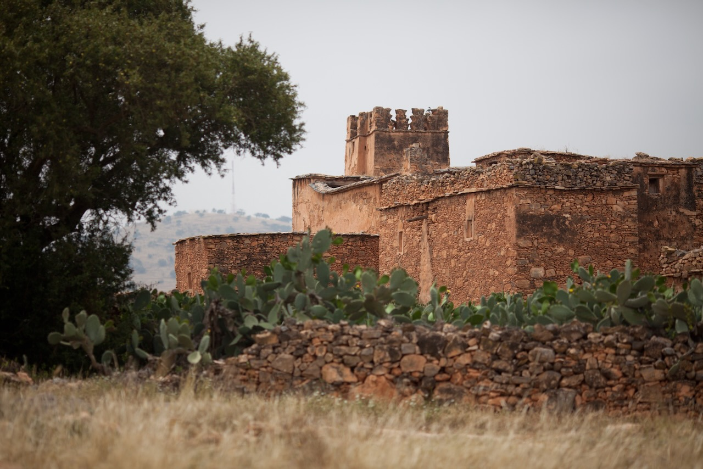
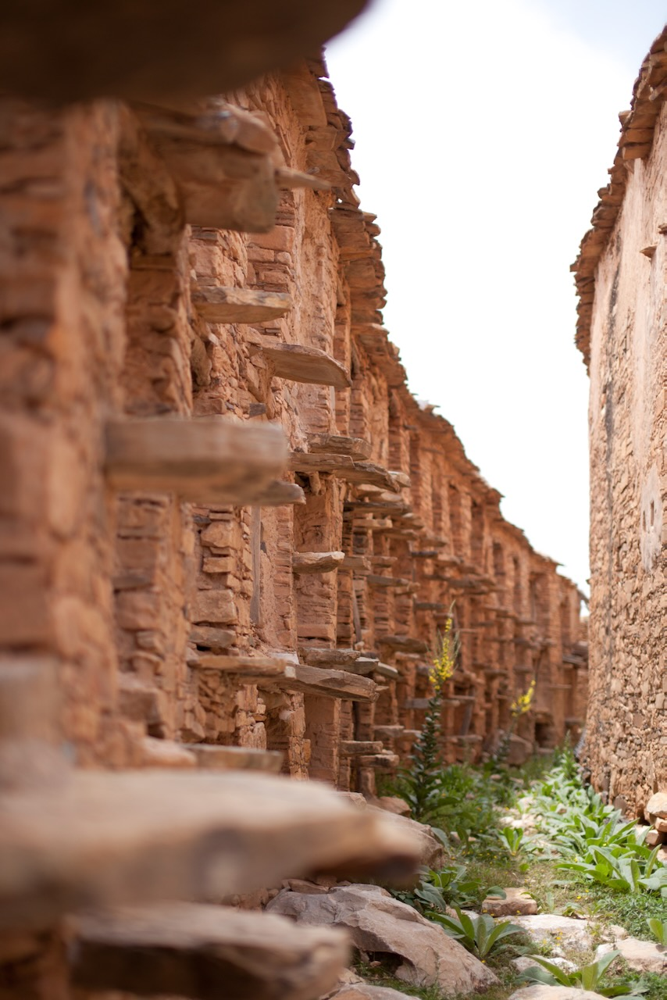

Le [grenier fortifié Agadir Inoumar](https://explore-agadirsoussmassa.com/fr/grenier-inoumar/) fait figure de joyau architectural amazigh. Inscrit dans la tradition des Igoudar, bien ancrée dans l’Anti-Atlas Occidental, Agadir Inoumar est considéré, avec son demi hectare de superficie, comme le plus grand de ses confrères.

{.center}

Construits il y a plus de 3 siècles, ces lieux pittoresques reflètent une culture ancestrale. Agadir Inoumar témoigne d’une ingéniosité architecturale et surtout organisationnelle. Les cellules appartenaient aux familles ayant participé à sa construction, et chaque famille disposait souvent d’un étage complet, dont la propriété se transmet encore à ce jour. Elles étaient utilisées pour stocker les denrées alimentaires, ainsi que les objets et les documents précieux. S’élevant sur plusieurs étages, Agadir Inoumar se répartit en 5 blocs qui comptent au total 295 niches.

{.center}

Les murs sont construits de la terre et des pierres, et le soleil tapant a progressivement rendu à ce mélange de matériaux sa teinte ocre originale. Les toitures et les tiges sont faites de bois d’arganier et de laurier rose, tandis que les piliers sont en troncs d’arbre. De grosses pierres plates dépassant les murs, font office d’escaliers pour monter les étages.
