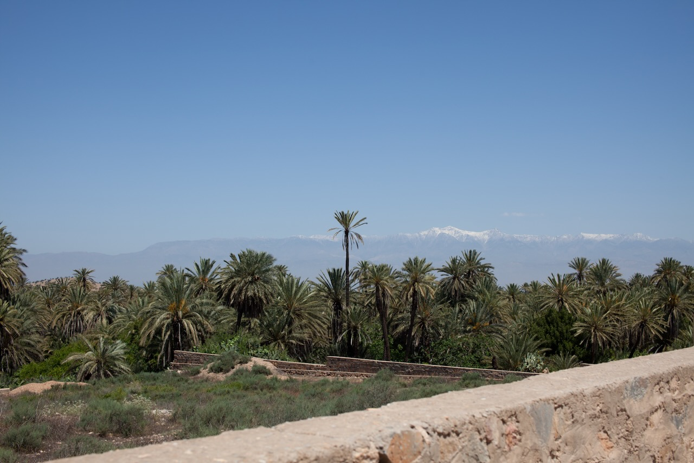

La Palmeraie de Tiout (ou Tioute) est située à 30 kilomètres au sud-est de Taroudant.

Avec ses innombrables palmiers et ses cultures vivrières, la Palmeraie de Tiout ressemble à une oasis. Une source en amont et l’oued ont favorisé l’apparition de cette zone agricole dynamique, alors que la région est plus qu’aride.

{.center}

Les habitants des hameaux de la Palmeraie cultivent principalement des céréales (blé, orge et maïs).
