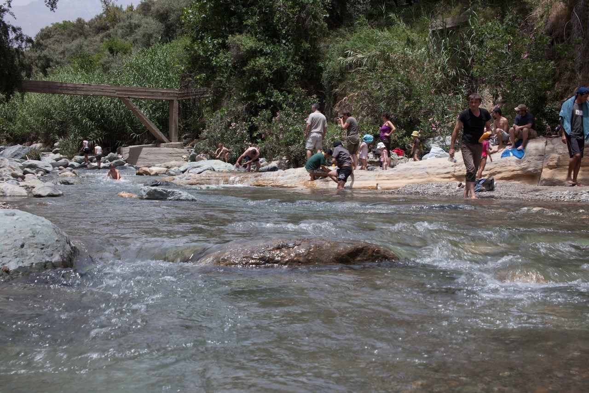

Après une assez longue route dans la benne arrière d'un camion, sur les route cabossée des montagnes de l'Atlas marocain, et avec une panne pour couroner  le tout, nous arrivons à Sidi Boutlila.

Ensuite, petite marche pour arriver à une rivière, où nous passons quelques heures bien agréables, à jouer dans l'eau relativement fraîche par rapport à la chaleur ambiante.

{.center}
