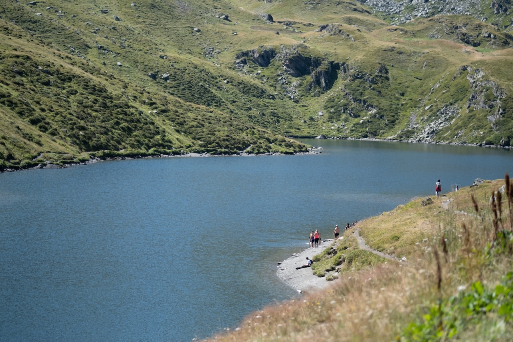

Victoire, les enfants acceptent de faire une vraie randonnée complète, avec la montée à pieds et non en télécabine. 😅

Il faut dire que le lac du Lou est plutôt accessible, avec peu de dénivelé à gravir.

Mais il n'en est pas moins joli !

{.center}
