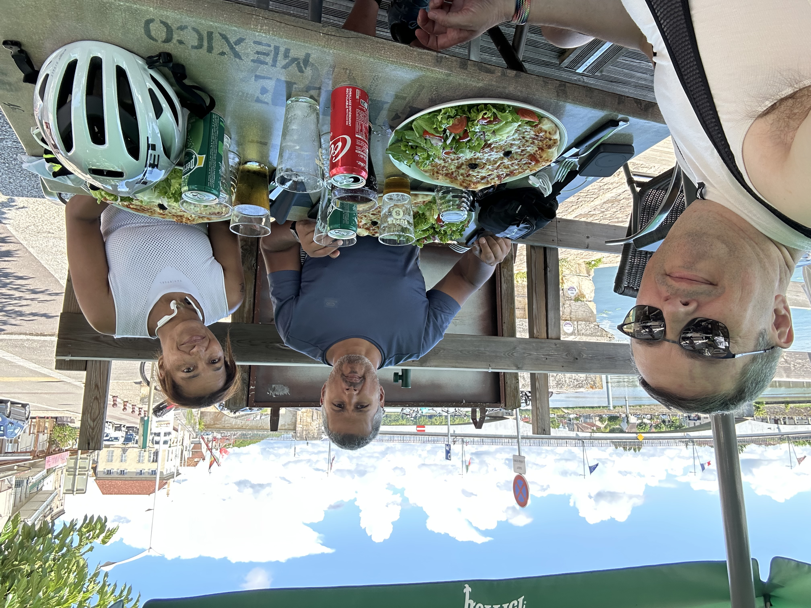

C’est parti pour [4 jours à vélo entre Dijon et Tournus avec Laurence et Olivier](/blog/2025/08/13/4-jours-a-velo-en-bourgogne-franche-comte/) !

Première étape entre Dijon et Dole sous forme de mise en jambes, avec l'immense ligne droite très roulante du canal de Bourgogne.

Un arrêt sympa pour le déjeuner en bord de Saône à Saint-Jean-de-Losne, avec une formule « Pizz'A Vélo » astucieuse :

{.center}

Un peu plus tard, arrivés sur le canal du Rhône au Rhin, une petite pose glace et remplissage des gourdes s'impose.

Nous finissons la journée par [un bout de l'EuroVelo 6](https://fr.eurovelo.com/ev6/from-nevers-to-basel), qui longe le Doubs.

Quelques petites accélérations pour le plaisir sur la fin du trajet, et finalement c’était plutôt une bonne idée, vue la tempête qui s’est déclenchée 3 minutes après qu’on soit rentrés dans l’hôtel ! 😲
