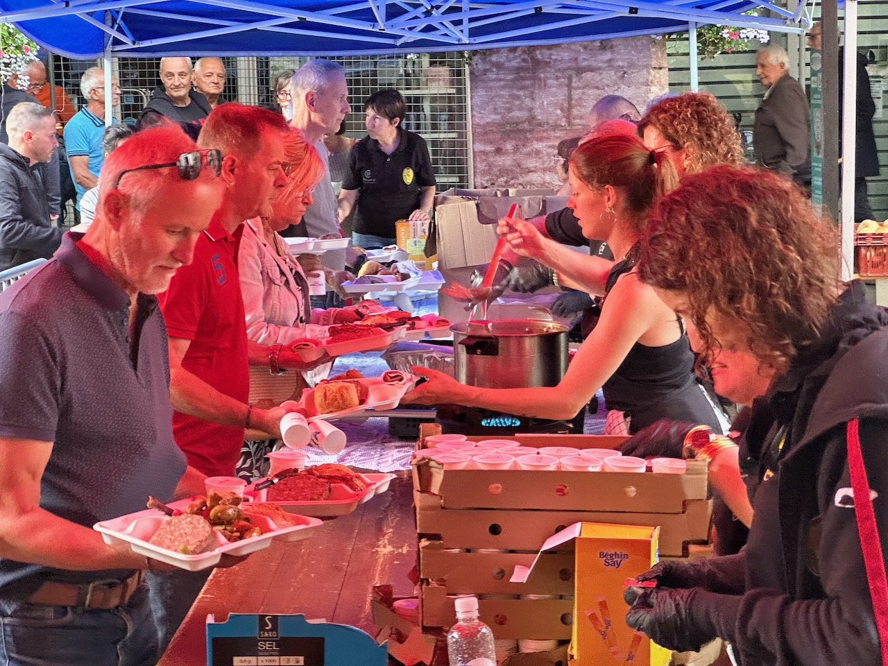

Après avoir laissé passer l'orage, petite balade à Louhans.

C’est la fête du poulet de Bresse à Louhans ce jour-là, les gens font la queue pour acheter du poulet et manger sur des tables installées dans la rue.

{.center}

Nous avions déjà réservé le dîner dans le restaurant de l'hôtel, il faudra revenir pour goûter le poulet de Bresse préparé localement.
