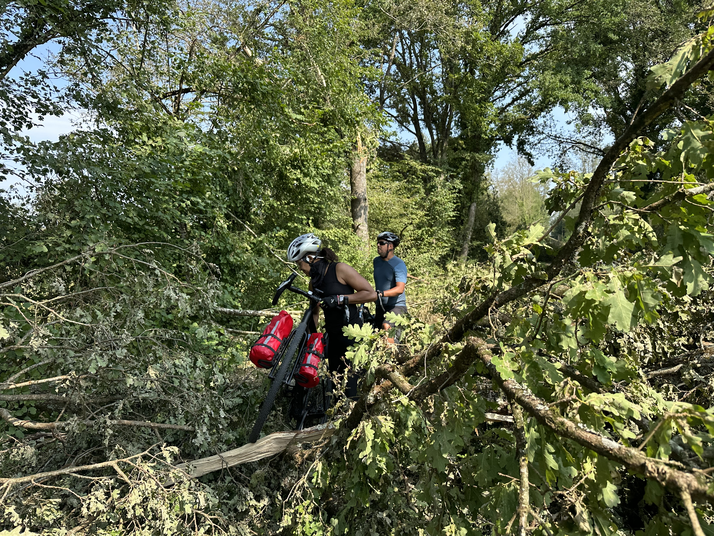

2e jour de [notre sortie avec Laurence et Olivier](/blog/2025/08/13/4-jours-a-velo-en-bourgogne-franche-comte/), entre Dole et Louhans.

La plus grosse étape du week-end, plus de 80 km. Je savais que ça devrait aller, ayant déjà couvert cette distance [2 semaines plus tôt](/activites/2025/07/11/mon-premier-80-km-en-gravel/), dans des conditions bien moins favorables.

Itinéraire très sympa, varié, notamment sur d’anciennes voies ferrées converties en pistes cyclables, ou des pistes spécifiquement aménagées. Nous avons ainsi emprunté [la Voie de la Bresse Jurassienne](https://www.jura-tourism.com/itineraire/la-voie-de-la-bresse-jurassienne/) presque jusqu'à Lons-le-Saunier, puis une première partie de [la Voie Bressane](https://www.jura.fr/veloroutes-et-voies-vertes/veloroutes-et-voies-vertes/le-grand-c/la-voie-bressane/).

Petite péripétie en route tout de même, quand nous nous retrouvons bloqués par de nombreux arbres tombés sur la piste, à cause d'une tornade qui a traversé le secteur quelques jours plus tôt. Nous avons dû faire un détour par des routes départementales, avec un peu plus de dénivelé.

{.center}

Une fois encore, après que nous soyons arrivés à l'hôtel à Louhans, un gros orage s'est déclenché. Un peu de chance pour nous ! 🤞

{.center}
