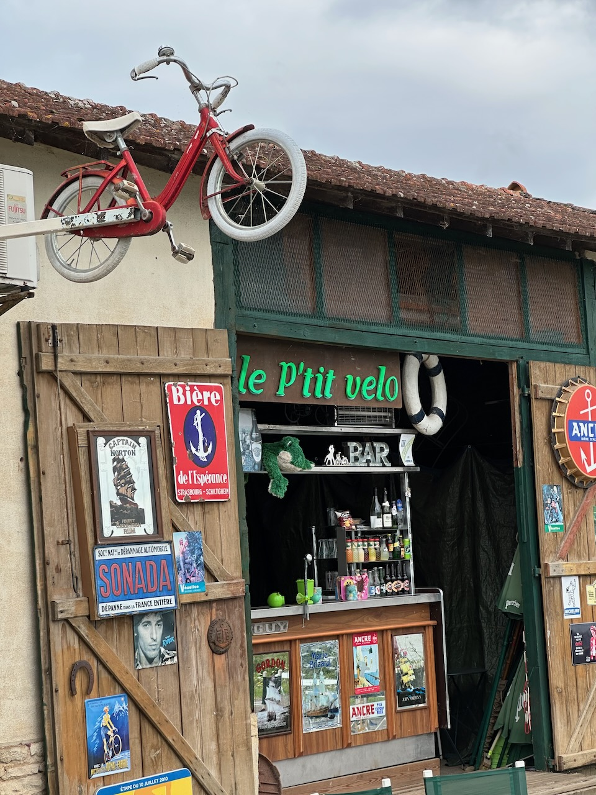

4e et dernier (demi) jour de [notre sortie avec Laurence et Olivier](/blog/2025/08/13/4-jours-a-velo-en-bourgogne-franche-comte/), entre Chalon-sur-Saône et Tournus.

Quelques routes de campagne (avec de gros semi-remorques qui roulent trop vite 😡), puis arrivée sur [la Voie Bleue](https://www.lavoiebleue.com/) en bord de Saône, bien plus tranquille et agréable.

Une super pause café à mi-parcours, au bar « le P'tit vélo » de Gigny-sur-Saône, parfait pour une petite pose pendant une randonnée à vélo. Le propriétaire a même des jumelles à disposition pour observer les cigognes qui nichent dans les arbres sur la rive en face.

{.center}

Et une dernière partie très roulante, toujours en bord de Saône, avant une petite côte assassine (relativement) pour monter jusqu’à la gare.

Ah, et quand même un pneu arrière presque à plat à 10 km de l’arrivée… 😱

Un coup de regonflage avec ma petit pompe pour finir la journée, sans problème.

Étonnament, nous avons eu l'impression qu'un liquide blanc s'échappait du pneu en faisant des petites bulles, puis ça s'est arrêté. Le pneu est toujours gonflé et ne perd pas d'air depuis (après 2 semaines). J'ai acheté mon vélo avec des roues et pneus « *tubeless ready* », mais en théorie pas montés en tubeless. Je vais devoir démonter la roue pour vérifier ce qu'il en est. 😅
