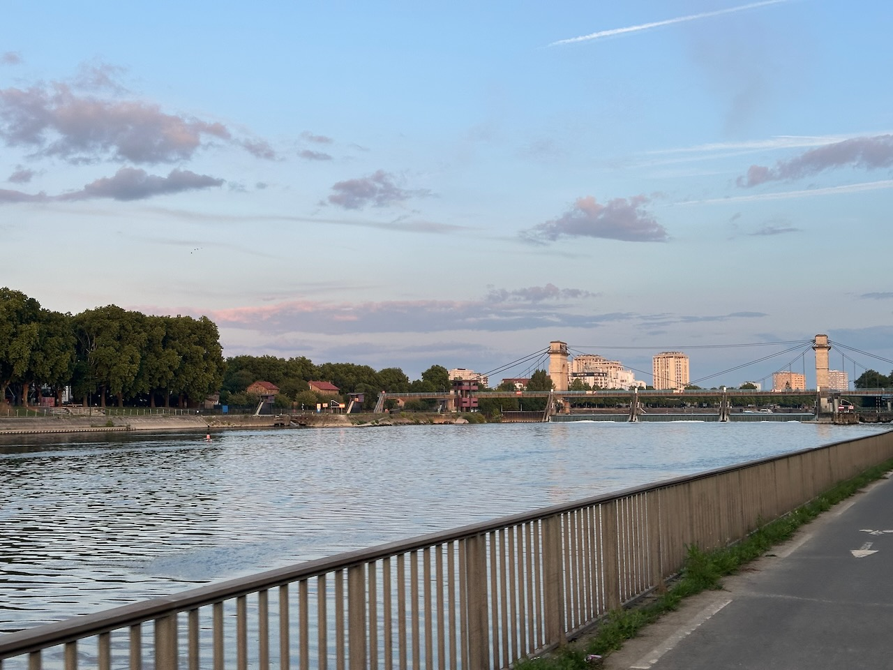

Quand on a un vélo, une bonne météo, les bords de Seine, et la belle lumière du soleil couchant… pourquoi prendre le RER ?

J'ai donc décidé de prolonger un peu cette escapade à vélo, et de rentrer à la maison en pédalant, sur une trace [déjà testée](/activites/2025/07/19/reconnaissance-a-la-gare-de-bercy-en-passant-par-la-marne/) le long de la Seine.

{.center}

Petit bonus, vidéo accélérée de ce trajet, soit presque une heure en juste un peu plus de 3 minutes :

https://youtu.be/KRAw_ssj41o
