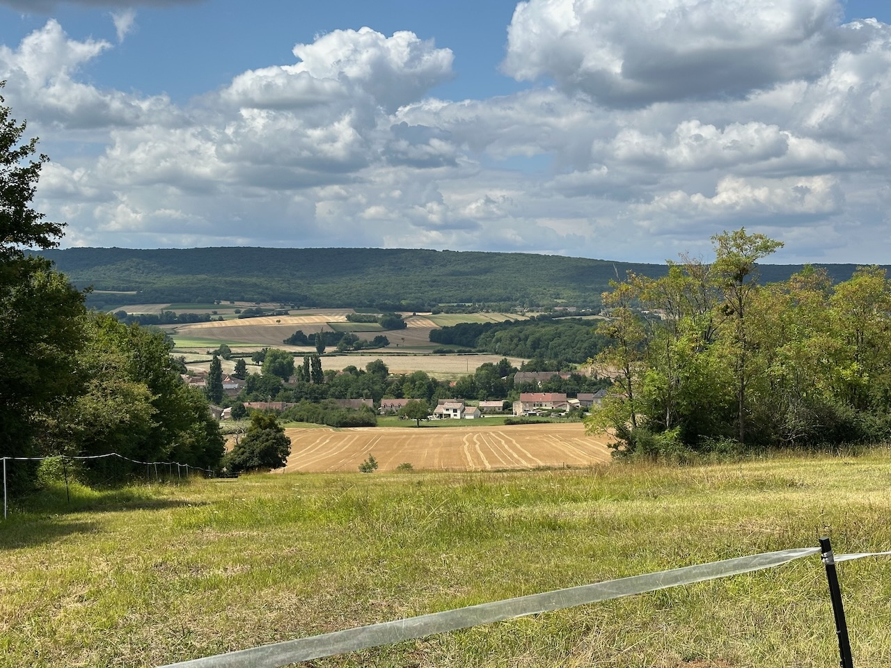

Le train n’étant que dans 3h, je n’allais quand même pas poireauter sur le quai de la gare, donc petit tour dans les colines autour de Tournus.

Bin c’est vallonné, j'avoue que j'ai mis pied à terre dans plusieurs grosses côtes, je n'étais pas habitué ! 😅

{.center}

Et un petit goûter pour finir en beauté et compenser l'effort, c'est toujours un plaisir.
