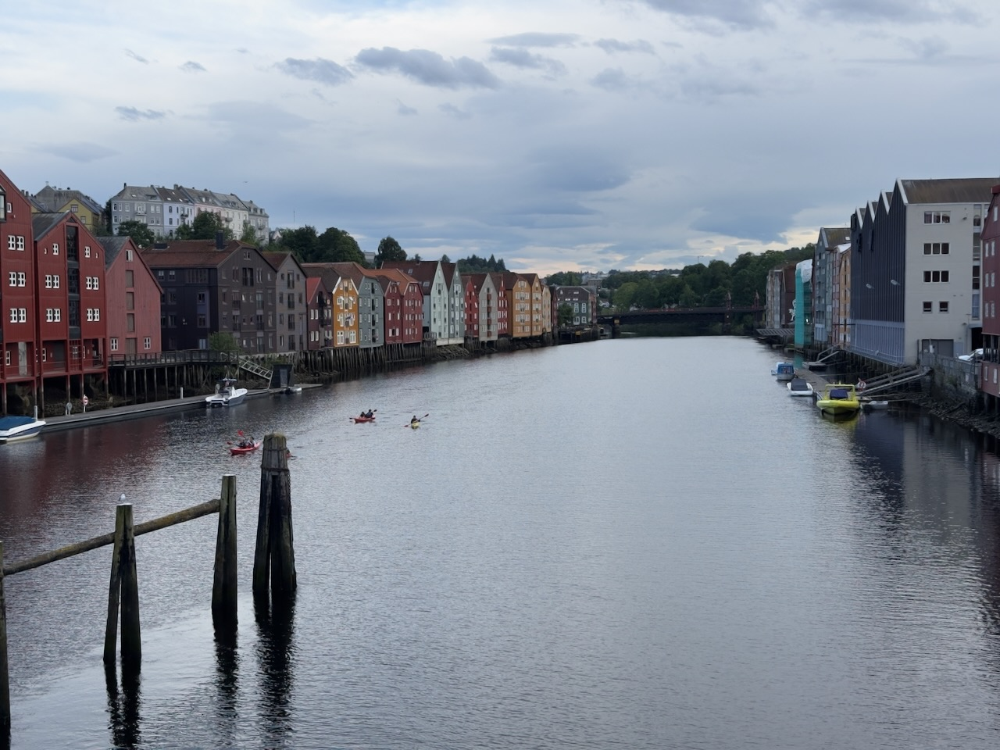

Première découverte de la ville, très jolie avec ses maisons en bois colorées, notamment le long de la **Nidelva**, le fleuve qui traverse la ville.

{.center}

Découverte aussi que la ville est répartie sur des collines, nous avions présumé qu'elle était plate, ça va faire plus d'exercice que prévu… 😅

Ambiance de bord de mer, la ville étant au bord d'un grand fjord, et avec les goélands qui crient en survollant les rues.
