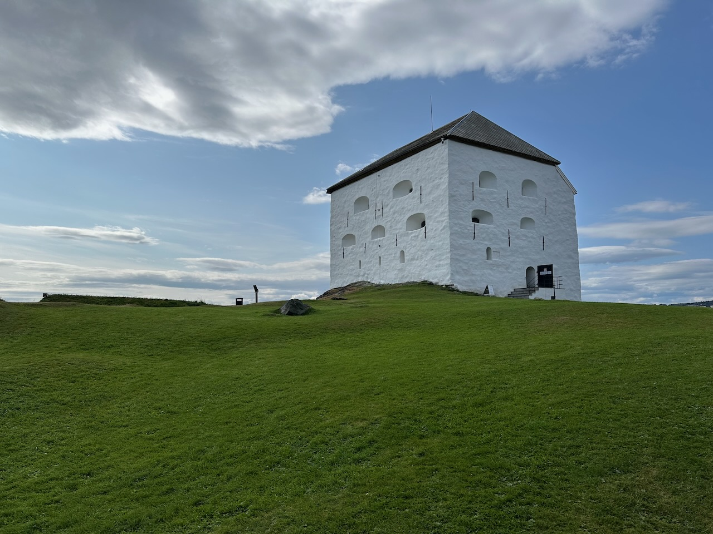

La forteresse **Kristiansten** (Kristiansten Festning en norvégien) est un ouvrage militaire situé sur une colline de la ville de Trondheim, en Norvège.

{.center}

La forteresse fut construite en 1681, après l'incendie de la ville, pour la protéger des invasions venues de l'est.

Au pied de la forteresse, un grand rassemblement de passionnés de voitures américaines avait lieu, avec des véhicules de toutes les époques et de tous les styles, notamment pas mal de *muscle cars* type Mustang.

{.center}
