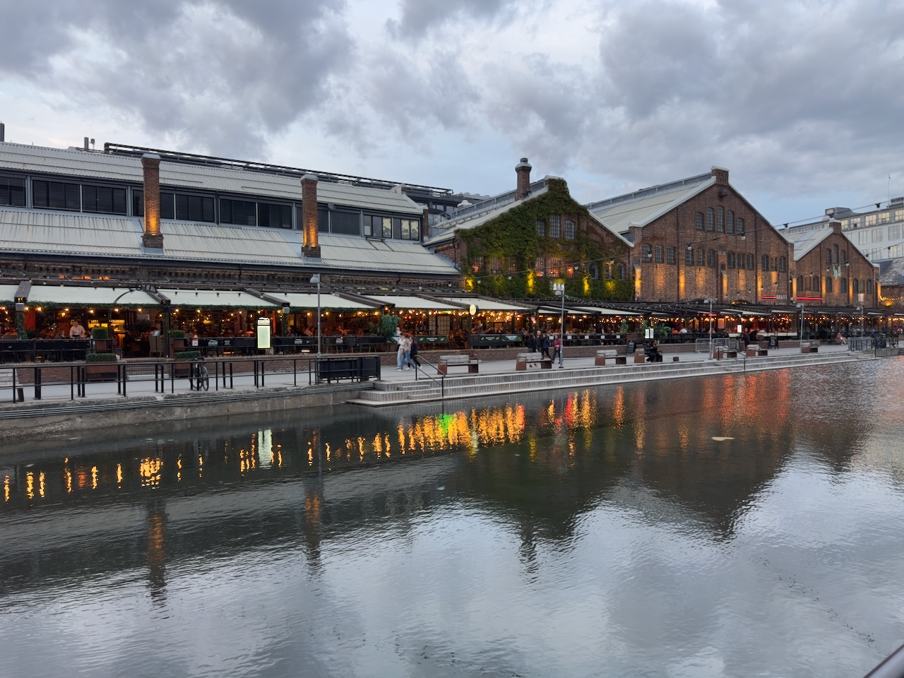

Ce soir là, nous nous rendons dans le quartier récemment transformé de **Solsiden**, qui était autrefois un port industriel, mais qui est maintenant un lieu animé et tendance avec des restaurants et des bars au bord de l'eau, et un centre commercial.

{.center}
