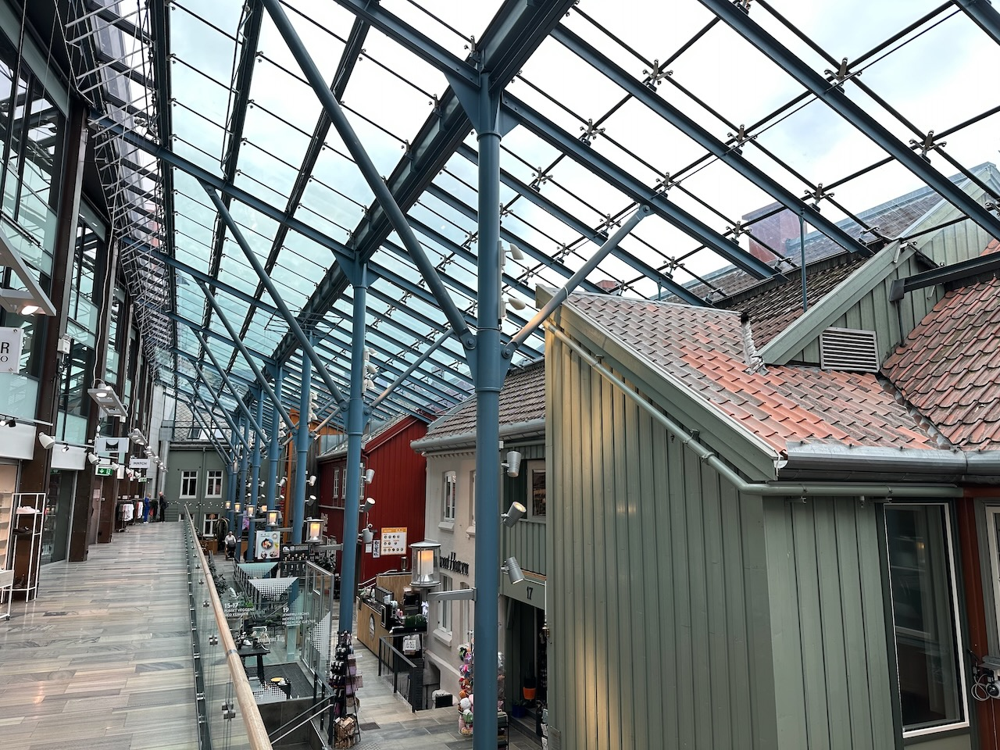

Petite balade plus utilitaire que touristique, pour aller faire quelques courses.

Découverte du centre commercial situé au centre de la ville, bâtiment moderne dont le toit vitré a d'un côté intégré de plus anciennes maisons, donnant l'impression d'être dans un petit village sous cloche.

{.center}
