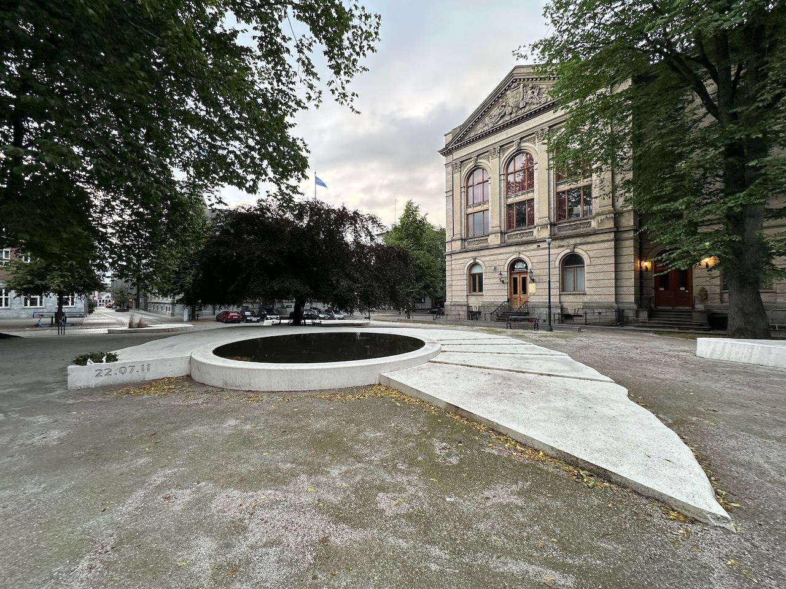
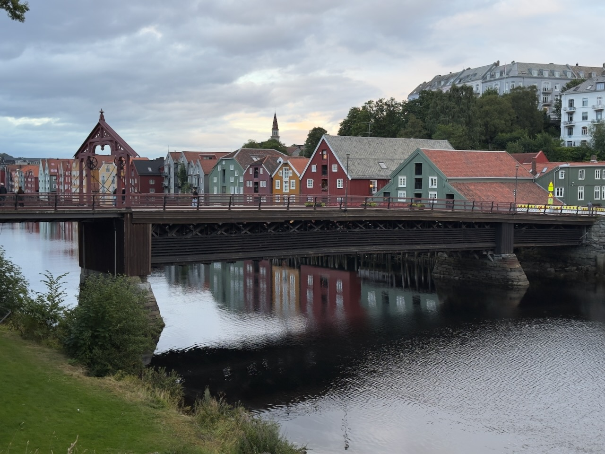

Le dernier soir à Trondheim, seul cette fois, je fais un dernier tour dans la ville.

Je découvre par hasard « Terra Incognita », le mémorial du [massacre du 22 juillet 2011](https://fr.wikipedia.org/wiki/Attentats_d%27Oslo_et_d%27Ut%C3%B8ya). Ce jour là, l’extrémiste de droite Anders Behring Breivik fait exploser une bombe dans le quartier gouvernemental d'Oslo, tuant huit personnes, puis se rend sur l'île d'Utøya, dans le camp d’été de la Workers Youth League (AUF), où il tue 69 autres personnes lors d'une fusillade de masse.

{.center}

[La conception du mémorial est décrite en détail](https://landscape.coac.net/terra-incognita-trondheims-july-22nd-memorial), avec de nombreuses photos, par ses créateurs [Marianne Levinsen](https://mariannelevinsen.dk/) et [Anders Krüger](https://anderskruger.se/).

L'occasion aussi de revoir le Gamle Bybro (« Vieux Pont de la Ville » en norvégien), un vieux pont en bois rouge qui traverse la Nidelva, construit à l'origine à la fin du 17ème siècle, et qui est devenu un symbole de Trondheim.

{.center}
