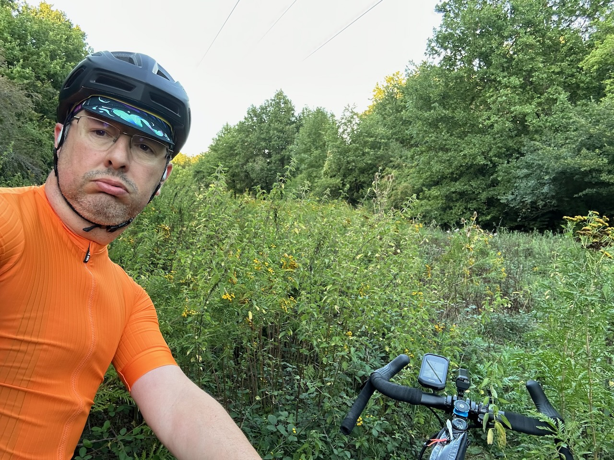
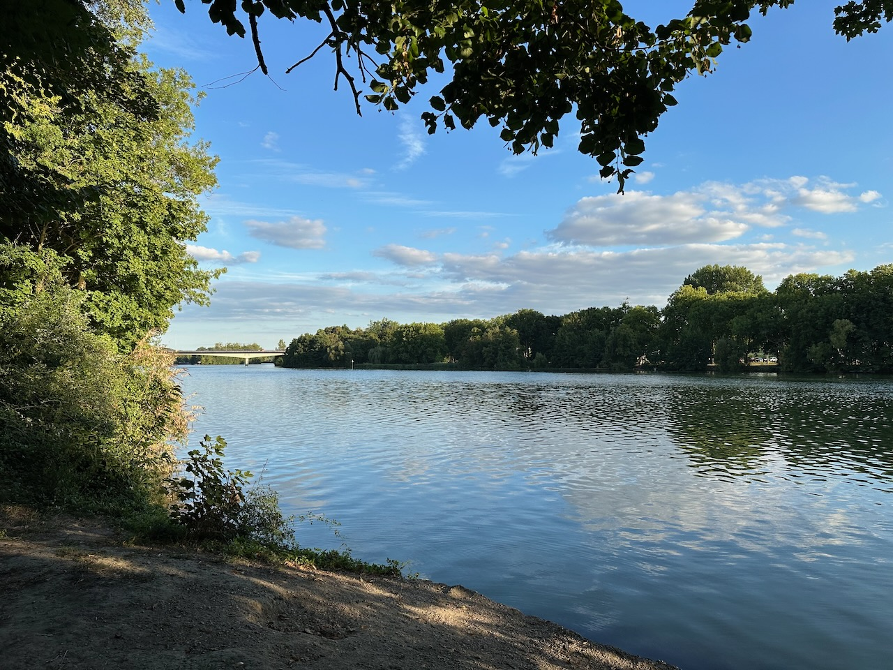

Parti un peu tard pour aller chercher un squadrat de l'autre côté de la forêt, mais ça valait le coup, belle sortie.

À part l'inévitable blague de Komoot, qui me fait une fois de plus passer par un « chemin » sous une ligne à haute tension, donc en fait un champ de ronces et orties, que j'ai finalement contourné.

{.center}

En parlant de Komoot, je crois bien que c'est le première fois que la durée de trajet est inférieure à celle qui était prévue ! Comme quoi, quand on ne part pas à pieds chercher un squadratinho dans une parcelle de forêt impraticable en vélo, on perd moins de temps… 😅

Beau parcours donc, avec un long passage agréable en bord de Seine, du côté de Soisy-sur-Seine et Étiolles, avant de remonter dans la forêt vers la Faisanderie.

{.center}

C'est par là justement que je me suis écarté d’une centaine de mètres du chemin optimal du retour pour aller attraper un squadratinhos, quand tout à coup… 😍



Il n’y a pas que pour les lieux que les #squadrats permettent des découvertes !

Ah mais justement, l'objectif de la sortie était de compléter mes squadrats et squadratinhos, et j'ai maintenant un Übersquadrat de 7×7 et un Übersquadratinho de 26×26 ! 🥳

D'après ce que j'ai vu en chemin, la suite se complique sévèrement, il va falloir que je tombe malade pour aller dans un hôpital et que je me mette au golf, pour aller chercher les prochains… Les deux ne sont pas liés.
