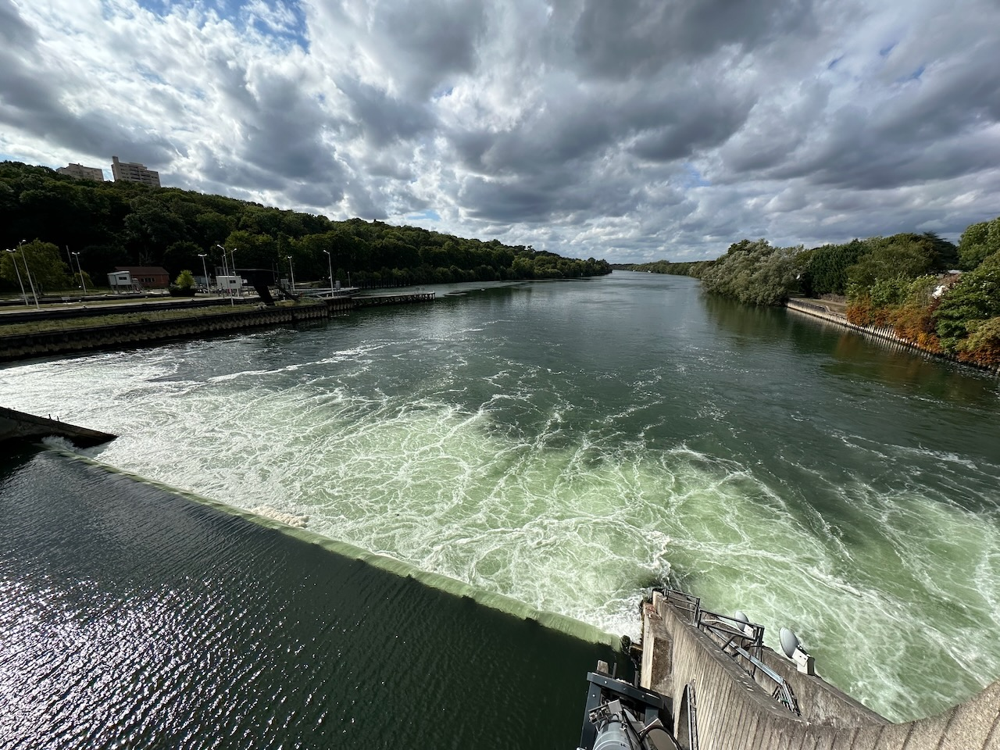
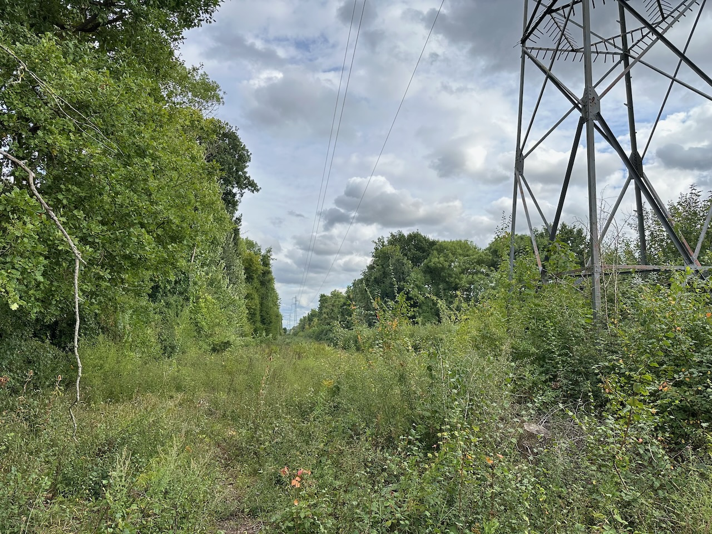

Traversée de la forêt de Sénart pour aller vers Ris-Orangis, de l'autre côté de la Seine, notamment le Château de Trousseau. Il est malheureusement privé et inaccessible, encore un squadratinho que je n'aurai pas… 😞

Retour sur l'autre rive de la Seine par le barrage et écluse d'Évry-Soisy, comme son nom l'indique entre Évry et Soisy-sur-Seine.

{.center}

Parcours de nombreuses rue de Soisy-sur-Seine pour compléter les squadratinhos dans le coin. C'est à flanc du plateau de la Brie, donc alternance de montées et descente, ça fait travailler les jambes. 😅

Et puis évidemment tentative de passage par un « chemin » Komoot sous une ligne à haute tension, 3e mauvaise expérience en la matière ces dernières semaines. Cette semaine, j'ai déjà retiré les 2 autres de OpenStreetMap, mais là le chemin est plus visible, il va falloir mettre d'autres informations.

{.center}

Au passage, nouvelle expérience du confort des pneus tubeless, avec une crevaison immédiatement et automatiquement « soignée ». 😍

