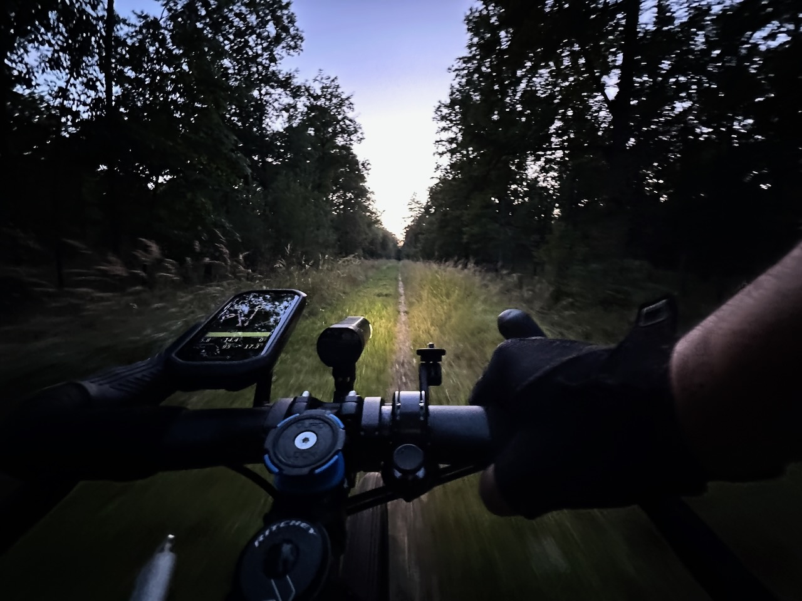

Il restait de l'eau dans mes gourdes suite à [la sortie de ce midi](../un-sandwich-et-en-selle/), j'étais obligé de ressortir, c'est la règle.

Parti un peu tard par rapport au trajet que je m'étais fixé, contenant plusieurs escapades piétonnes en forêt profonde pour attraper des squadratinhos, je savais que l'estimation de durée fournie par Komoot était largement sous évaluée. Je commence à le connaître.

J'ai effectivement mis plus de temps, et je n'ai même pas pu tout faire, puisqu'il voulait une fois de plus me faire entrer dans l'enceinte d'un établissement privé, l'[ITEP « Le Petit Sénart »](https://www.fondationolgaspitzer.fr/etablissements/unite-hebergement)… 🤦‍♂️

Du coup, retour à travers la forêt dans la pénombre, le soleil étant couché et les arbres occultant le peu de lumière résiduelle.

Et qu'est-ce qu'il se passe quand la nuit tombe, et que les humains disparaissent ? Les animaux sauvages sortent !

{.center}

Sur le chemin du retour, donc : un chevreuil, un sanglier avec quelques petits, un autre chevreuil vraiment pas farouche, deux péripatéticiennes, et encore deux autres chevreuils.

Ah, et donc 28 squadratinhos récupérés… ce qui fait passer mon übesquadratinho à 30×30 ! 🥳

C'est sans doute très futile, mais je rentre dans le top 1000 (877e pour être exact), ça fait plaisir.
