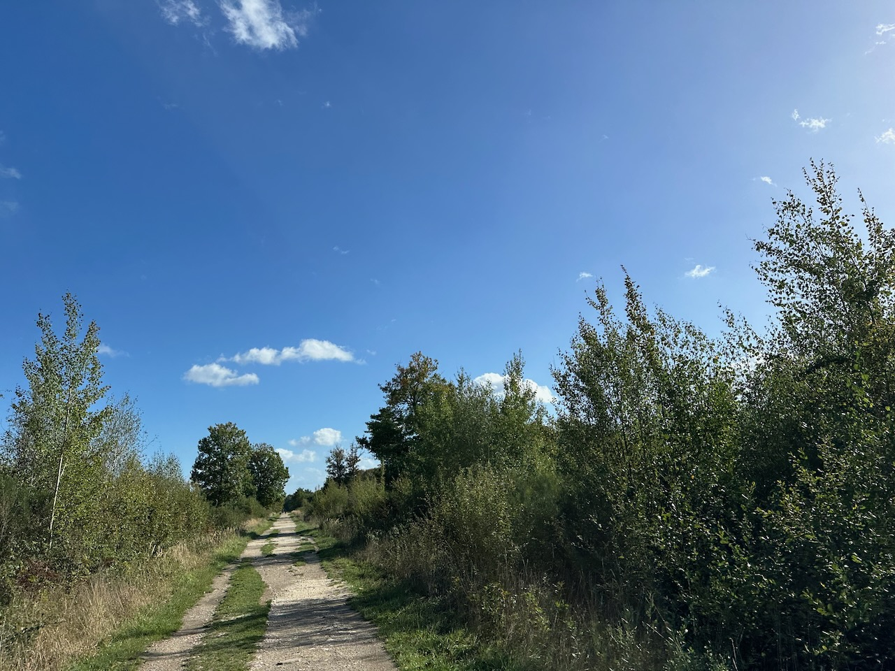
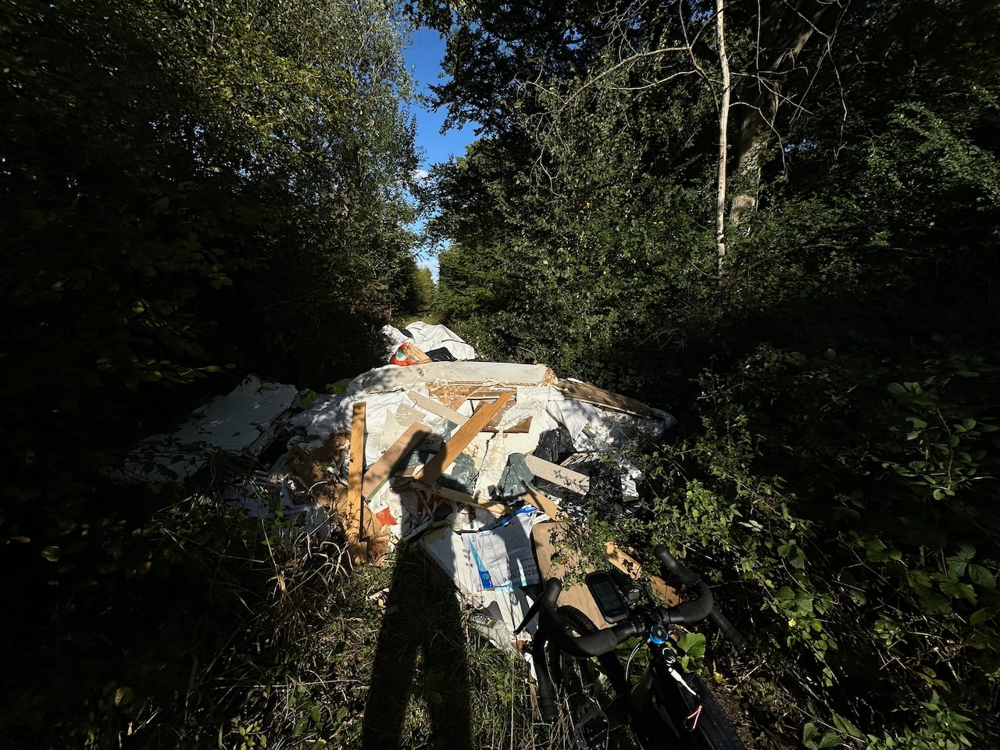

Ça ferait un bon titre pour YouTube, ça ! 😅

Bon, Météo France annonçait effectivement de l'orage à partir de 13h, et a repoussé d’heure en heure.

Le truc dingue que j'ai fait, c'est regarder par la fenêtre. 🤯

J'ai vu du ciel bleu avec quelques petits nuages blancs bien inoffensifs. Alors j'ai pris mon vélo et je suis parti en chasse de squadratinhos !

{.center}

Et là, j'ai tout simplement augmenté mon übersquadratinhos pour arriver à 32×32. Je suis maintenant classé 753e au niveau mondial, pas mal ! 💪

En chemin, pas grand monde qui se baladait dans la forêt, sans doute la crainte de l'orage.

J'ai aussi pu constater une fois de plus la grande connerie de certains énergumènes, qui ont déversé sur un chemin tous leurs déchets de chantier de construction. 😡

{.center}

Ok, finalement le ciel est devenu tout noir et il est tombé des trombes d’eau, alors qu’il me restait juste 3 minutes de trajet. 😅

Forcément, tôt ou tard, ça devait devenir vrai. Mais c’est comme la fable de l’enfant qui crie au loup, au bout d’un moment on n’y croit plus. 🤣
