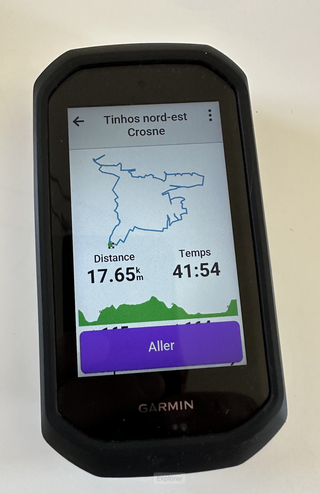
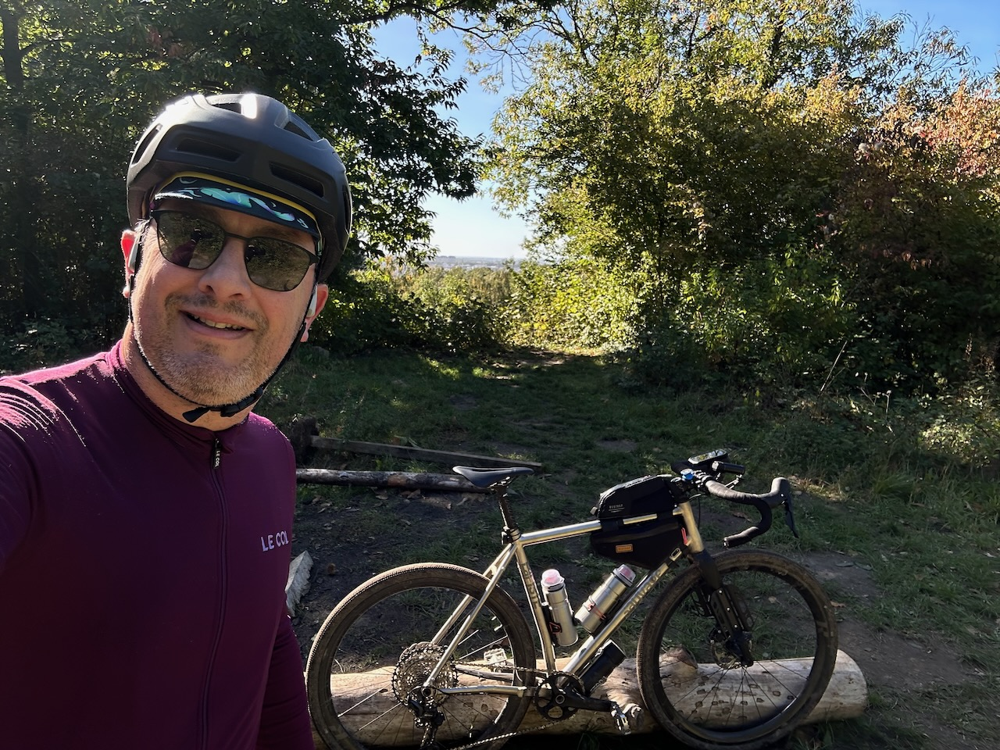
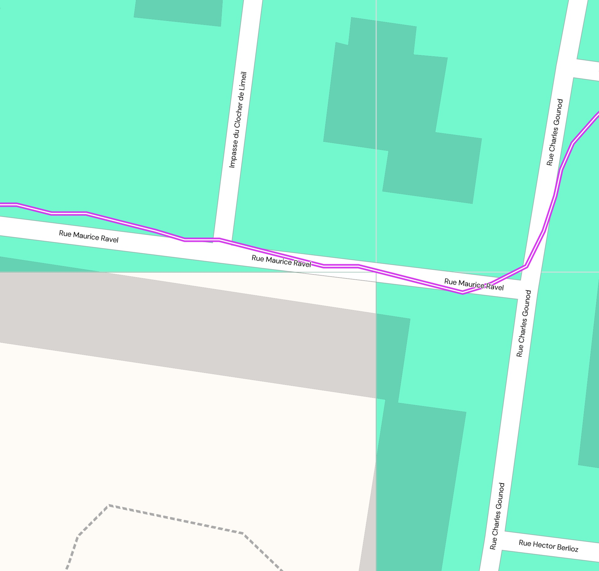

Mon ordi de vélo Garmin Edge 1050 m'annonce 42 minutes pour une boucle vers Crosne, il fait grand beau temps, parfait pour une petite sortie gravel sur la pause déjeuner !

{.center}

Sauf que l'estimation de durée est **complètement fausse**, puisque j'ai mis 1h30, plus du double ! 🤷‍♂️

Pour une fois, la trace était en ville principalement, sans plein de détours dans des parcelles forestières sans chemins. Donc je ne sais pas comment il a fait cette estimation, j'aurais dû regarder plutôt celle de Komoot, qui semble bien plus fiable.

À part ça, j'en ai quand même profité pour enfin gravir le Mont Griffon, dans la [forêt domaniale de La Grange](https://www.onf.fr/vivre-la-foret/foret-domaniale-pres-de-chez-moi/+/1d40::foret-domaniale-de-la-grange.html), qui culmine à une [altitude incroyable de 115,70 mètres](https://fr-fr.topographic-map.com/map-kv65t6/Mont-Griffon/) ! 🤣

{.center}

Ah… et en chemin je suis passé à quelques mètres, si ce n'est centimètres, d'un squadratinho qui me manquait :

{.center}

Pas de bol, il va falloir retourner à cet endroit, en haut d'une côte pas très sympa… 😅
