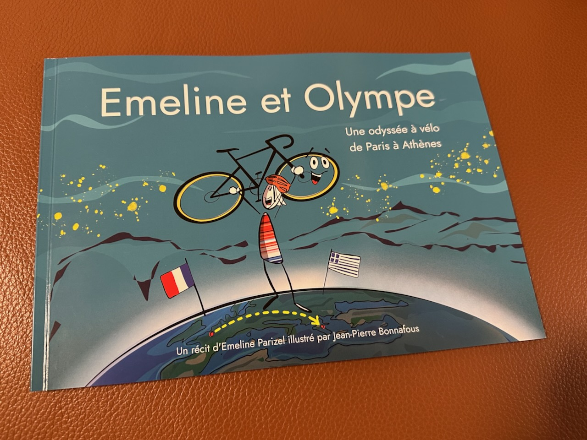
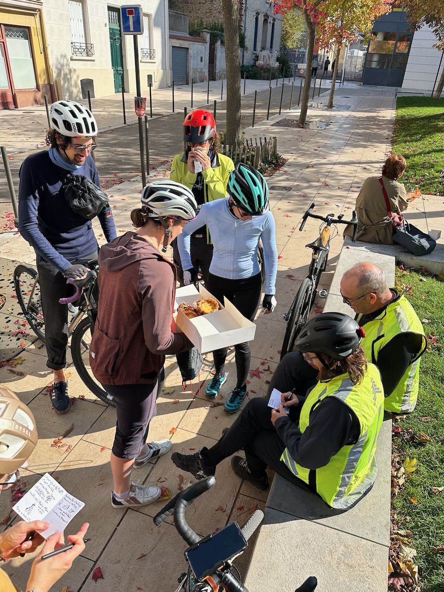

Des mois se sont écoulés depuis que le projet de livre de Émeline et Jean-Pierre a abouti, suite à une campagne de financement à laquelle j'avais participé.

{.center}

Le jour est enfin venu de faire cette balade en vélo avec les héroïnes Émeline et Olympe de ce périple épique vers le Mont Olympe et Athènes, et d'autres participant·e·s à la campagne.

Rendez-vous donné près de la Place d'Italie, rue de Campo-Formio, à la fois dans la librairie « [Le Chat se Livre](https://www.parislibrairies.fr/magasins/paris/Le-chat-se-livre-6549/) » et chez le vélociste « [Cycles Panache](https://cycles-panache.fr/) », voisins.

Notre boucle d'une vingtaine de kilomètre est l'occasion pour Émeline de nous faire passer par des lieux qui évoquent son périple, de la Place d'Italie au pavillon Hellénique de la Cité Universitaire Internationale, en passant par  l'ambassade d'Albanie ou l'hôtel « Patou » (ceux qui savent savent).

Mais aussi de nous faire découvrir un flan à la vanille à se damner, dans [la Boulangerie Méditerranéenne](https://www.sortiraparis.com/hotel-restaurant/cafe-tea-time/articles/314155-la-boulangerie-mediterraneenne-l-adresse-de-quartier-ensoleillee-a-montrouge-92) de Montrouge (à 2 pas du Beffroi).

{.center}

Émeline et Jean-Pierre ont par ailleurs eu l'idée de nous faire réaliser notre propre carnet de voyage dessiné pour cette sortie, et nous avons fini par tous écrire un mot ou juste une signature dans chaque carnet des autres participant. Un bon souvenir.
