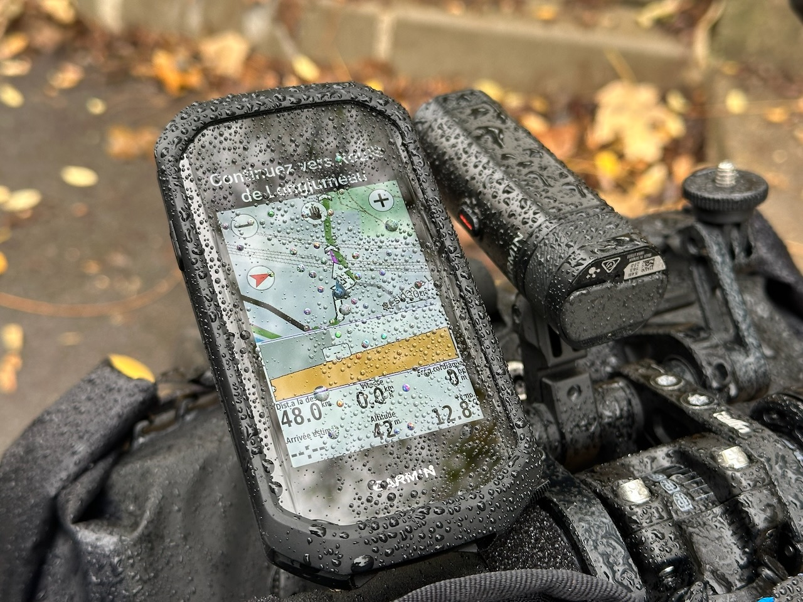

Je n'ai pas fait de vélo [depuis 4 semaines](/activites/2025/10/11/retour-par-le-plateau-de-vitry-et-orly/), et je me suis inscrit à une course gravel demain, il faudrait peut-être remettre les mollets en ordre de marche !

En piochant dans mes itinéraires déjà planifiés dans Komoot autour de chez moi, je jette mon dévolu sur un parcours d'une cinquantaine de kilomètres autour d'Orly, qui me permettra de gagner quelques squadrats.

Je consulte Windy avant de partir : « tranquille, pas de pluie en vue avant au moins quatre heures »

30 minutes plus tard, après quelques kilomètres : « bah Nicolas dis donc t’es mouillé sur ton vélo… ah bin tiens, il pleut… 🤷‍♂️ »

{.center}

Au final, j'ai eu une pluie fine mais continue pendant presque toute la sortie. Première sortie autant pluvieuse depuis que je me suis mis plus régulièrement au vélo il y a à peu près un an. Je n'ai pas l'équipement adapté. En fait, avec des vêtements de vélo classiques, tout fini par être trempé au bout d'un moment. Le corps réchauffe alors les couches internes de vêtement, et ça tient à peu près chaud. C'est un peu comme la plongée sous-marine en combinaison néoprène en somme… 😅

Bon, à 12°C plus du vent, c'est quand même pas super agréable. Je n'aurais pas dit non à 4 ou 5 degrés de plus.

En tout cas, les molets et le reste sont en bonne forme, le traumatisme musculaire de [Reinebringen](/activites/2025/10/27/reinebringen-c-est-difficile-mais-c-est-beauuuuuu/) est oublié, ça va le faire pour la course de demain !

Et sinon, côté Squadrats, 16 squadrats et 236 squadratinhos collectés, la carte se rempli bien.
