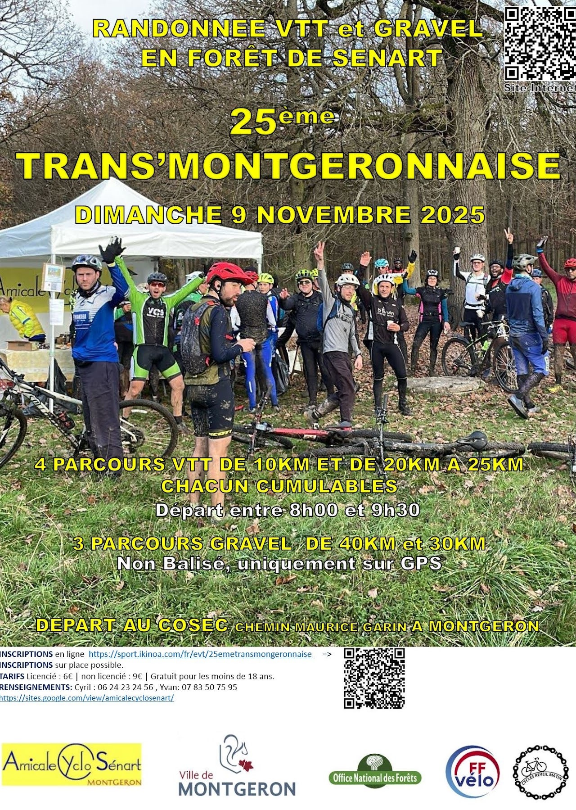
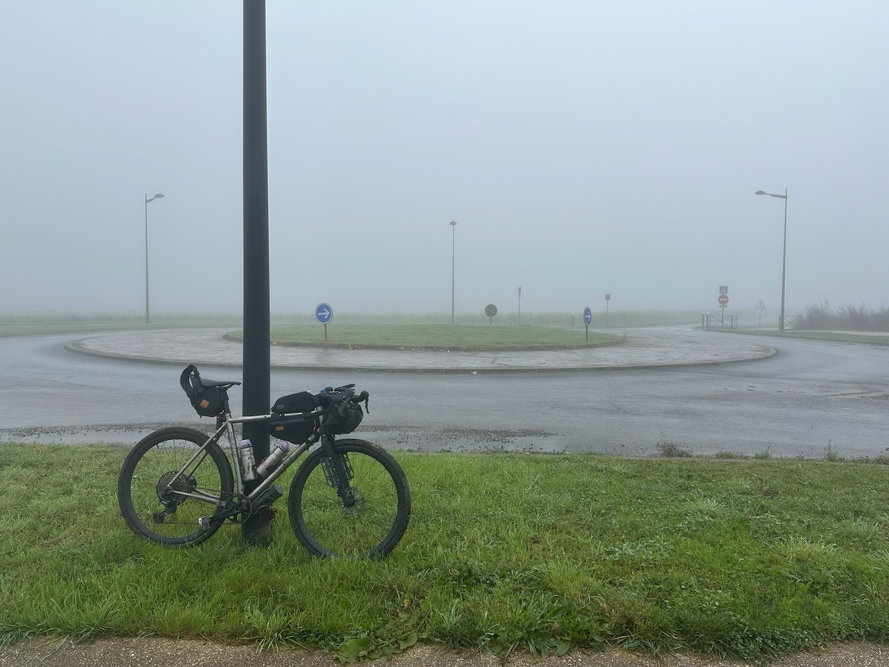
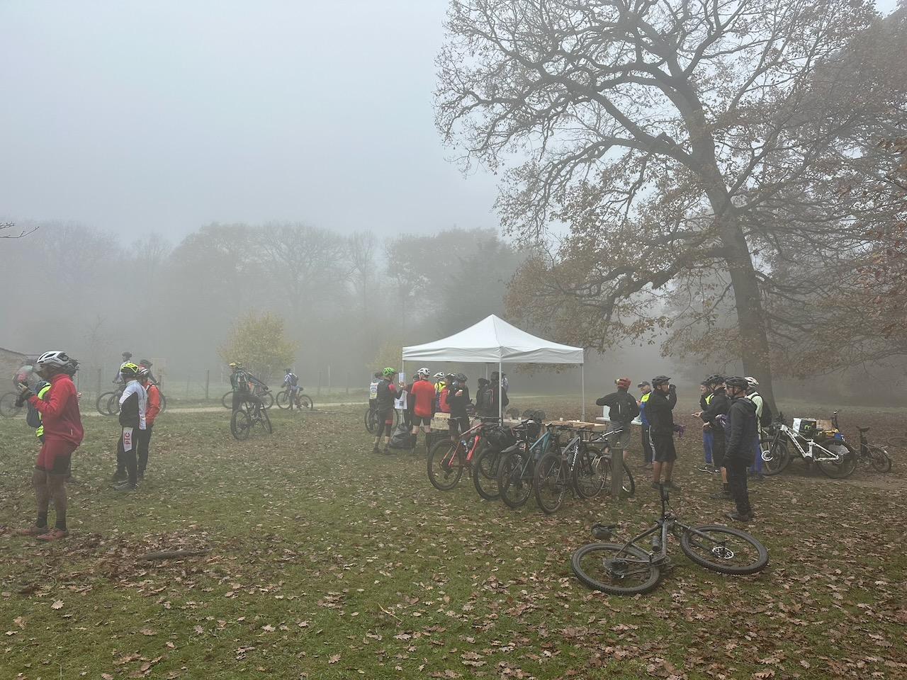

Je me suis inscrit sur un coup de tête il y a quelques mois à un événement cycliste organisé chaque année par le club de Montgeron, la Trans'Montgeronnaise.

{.center}

Trois parcours VTT en forêt sont proposés, c'est l'activité qui a fait naître l'événement. Mais il y a aussi du gravel depuis quelques années, c'est ce qui m'a poussé à m'inscrire. Cette année, 3 parcours gravel étaient proposés, 2 en forêt et un autre plus long, s'écartant de la forêt pour en faire en partie le tour, avec des portions en ville et sur des routes de campagne.

Je ne savais pas trop à quoi m'attendre, n'ayant jamais participé à un tel événement. Je pensais qu'on serait pas mal de cyclistes à se suivre sur le parcours.

Mais finalement je n'ai vu que 2 autres gravelistes, qui m'ont doublé dans des côtes où j'étais un peu à la peine. Puisque nous partions chacun quand nous le souhaitions, dès notre inscription validée, je suppose que l'ensemble des participants se sont étalés sur 2 ou 3 heures. Un des organisateurs m'a dit que nous étions une centaine, mais je soupçonne aussi que c'est le nombre total de gravelistes, dont une partie a dû rester sur les parcours en forêt.

Bref, j'ai roulé seul sur ce parcours de 45 km, avec un brouillard très épais qui ne permettait pas de voir grand chose.

{.center}

Le parcours était néanmoins très agréable, bien conçu, et m'a fait découvrir quelques passages, donc je ne regrette pas d'avoir fait cette sortie. Le faible tarif d'inscription (9 €) incluait aussi un ravitaillement au départ et à l'arrivée, avec sandwich, boisson chaude, gâteau, c'est très raisonnable.

{.center}

Mais l'intérêt de payer pour un tel événement et finalement rouler seul m'échappe un peu. Je ne suis pas sûr de recommencer l'an prochain, sauf si j'arrive à convaincre des copains de m'accompagner.
