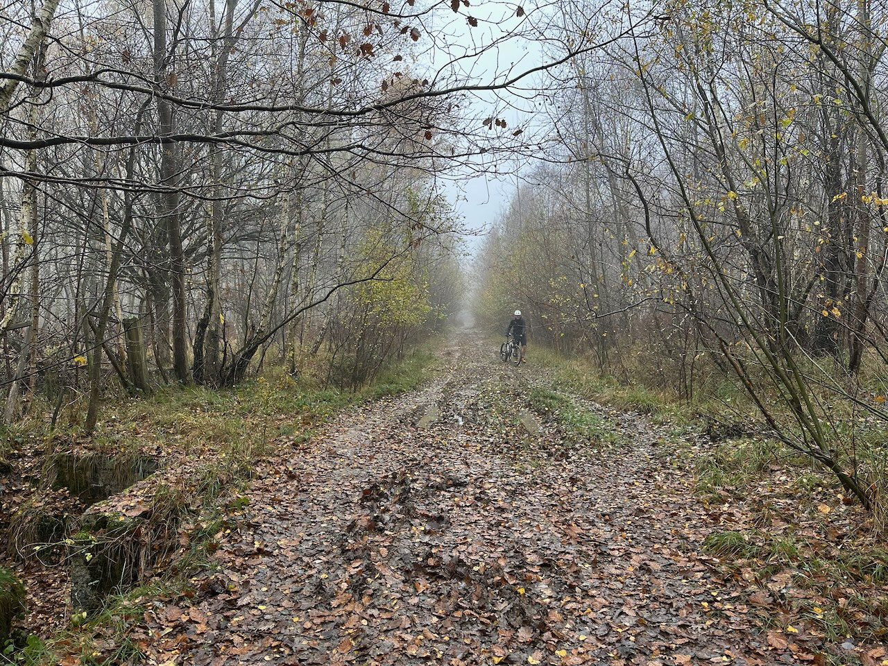
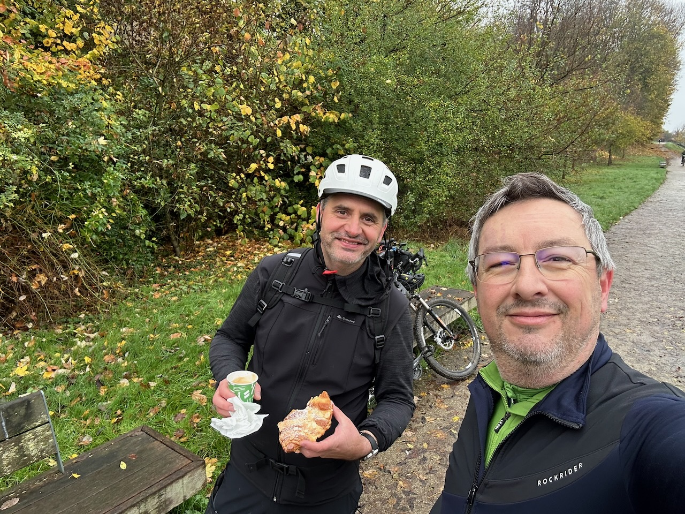

Super trace dans le [Massif de l'Arc boisé](https://www.valdemarne.fr/vivre-en-val-de-marne/parcs-et-espaces-naturels/massif-de-larc-boise), massif forestier d’environ 3000 hectares, rassemblant la forêt régionale de Grosbois, et les forêts domaniales de la Grange et de Notre-Dame, et situé sur trois départements : le Val-de-Marne, la Seine-et-Marne et l’Essonne.

Après l’incontournable passage de la vallée de l’Yerres (descente raide à Montgeron et montée raide à Crosne 😅), contournement de la forêt domaniale de la Grange, par Valenton, Limeil-Brévannes et Boissy-Saint-Léger, avant d’entrer dans la forêt régionale de Grosbois, en contournant le [domaine de Grosbois](https://www.tourisme-valdemarne.com/incontournables/chateau-de-grosbois-et-musee-du-trot/), célèbre pour son château et son centre d'entraînement pour les courses hippiques de trot, servant notamment à l'entraînement des équipages qui courent à l'hippodrome de Vincennes.

L’occasion bien sûr de profiter de beaux chemins blancs roulants, mais aussi de quelques chemins bien boueux avec la pluie tombée ces derniers jours. 😬

{.center}

Voilà qui nous emmène jusqu’à la forêt domaniale de Notre-Dame, et Lesigny, point le plus éloigné de la sortie.

Retour ensuite par Santeny, Marolles-en-Brie et son golf longé par le Réveillon, puis remontée à  Villecresnes, où une boulangerie ouverte nous tend les bras pour une petite pause bien méritée !

{.center}

Café et croissant aux amandes avalés, il ne reste plus que 10 km pour rentrer, l’occasion de redescendre sur Yerres en traversant la forêt domaniale de la Grange, puis longer un bout de l’Yerres, avant de finir par la remontée bien sauvage dans Montgeron.

Au final, super sortie Gravel de presque 40km, pour une fois accompagné, vraiment super pour un dimanche matin automnal.

Ah, et j'ai failli oublier : cette sortie me permet de passer à un übersquadrat de 9×9 ! 🥳
