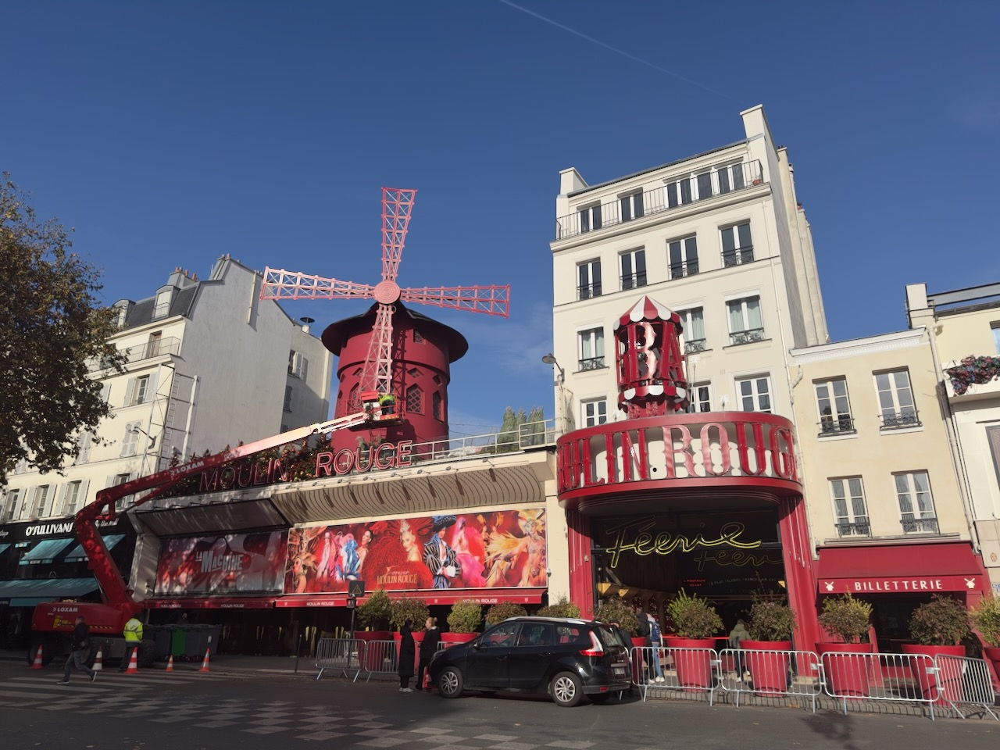
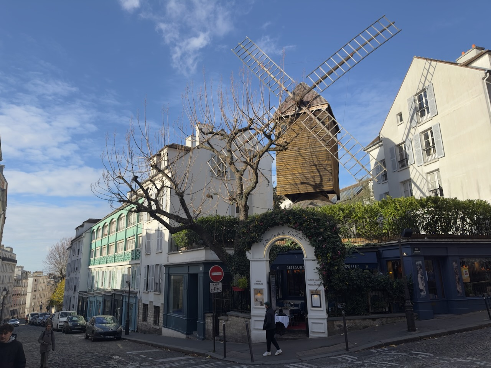
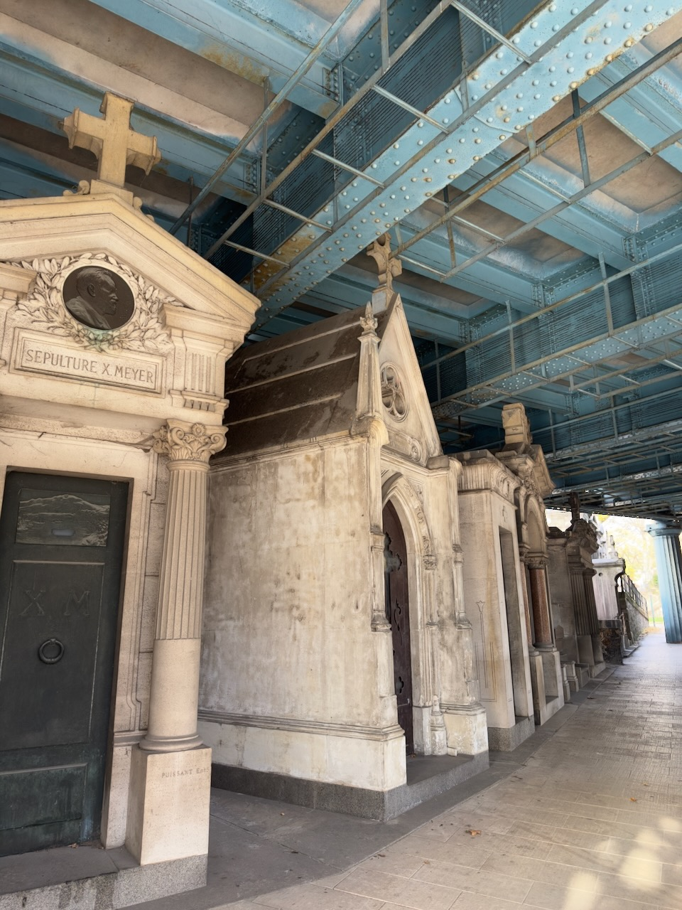

Tous les collègues ont déjà quelque chose de prévu ce midi ?

Et il fait beau ? Mais froid 🥶. Mais beau… 🌞

Vraiment dommage, je devais du coup aller me balader avec un sandwich, obligé ! Petite balade dans Montmartre donc.

{.center}

Après être passé au [Moulin Rouge](https://www.moulinrouge.fr/), je suis passé au [Café des Deux Moulins](https://www.cafedesdeuxmoulins.com/), mais Amélie n'était pas là. 🤷‍♂️

Petit tour sur les hauteurs de la Butte Montmartre jusqu'au très joli [Moulin de la Galette](https://moulindelagaletteparis.com/)…

{.center}

…puis redescente vers le [cimetière de Montmartre](https://fr.wikipedia.org/wiki/Cimeti%C3%A8re_de_Montmartre), où se trouvent les tombes de plusieurs célébrités, dont France Gall et Michel Berger.

J'ai aussi cherché Ampère, mais je ne l'ai pas trouvé, il ne devait pas être au courant que j'allais passer.

C'est la première fois que j'allais au cimetière de Montmartre, c'est un peu particulier de voir le [pont Caulaincourt](https://fr.wikipedia.org/wiki/Pont_Caulaincourt) l'enjamber, à quelques centimètres de certaines tombes. Elles ont au moins l'avantage de moins subir les intempéries.

{.center}
