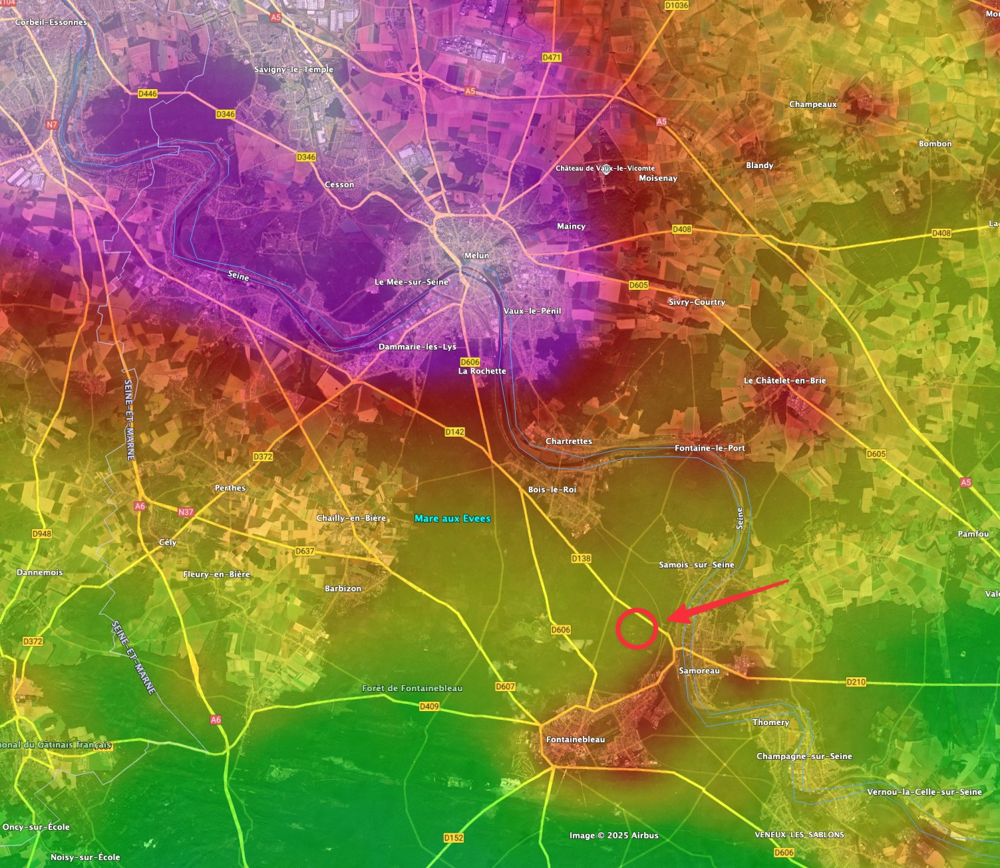
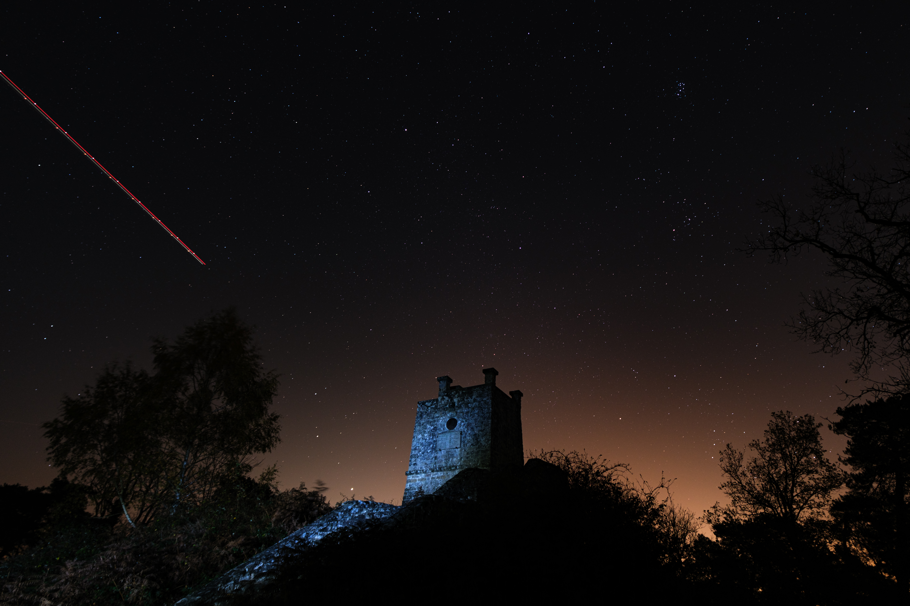
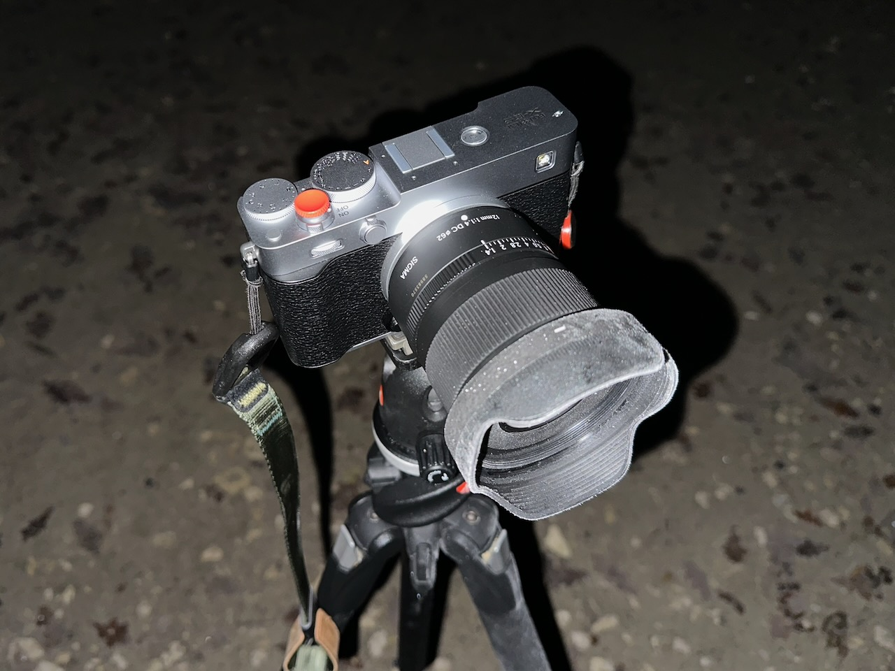

Nouvelle lune, ciel complètement dégagé ? Vite, un endroit sympa pour photographier les étoiles dans les meilleures conditions, c'est à dire avec une pollution lumineuse pas trop forte, sans devoir faire des heures de route, et un premier plan sympa !

Après différentes pistes écartées, ce sera la Tour Denecourt en forêt de Fontainebleau, [découverte en septembre](/activites/2025/09/07/balade-a-la-tour-denecourt/).

{.center}

Petite promenade en forêt dans un noir profond, du coup, et en gros 2 heures sur places par -3°C 🥶 et beaucoup d'humidité, mais ça valait le coup !

{.center}

Bon, on en parle, des avions qui passent en permanence ? 😔

Pas sûr que l'appareil photo ai apprécié ces conditions…

{.center}

Le retour à la voiture avec sièges chauffants a été bienvenu… 😅
