Avec une seule sortie — [plutôt difficile](/activites/2026/06/13/autour-de-vaux-le-vicomte/) — en un mois, il était temps de reprendre le vélo pour profiter du « redoux » post canicule, pour préparer la semaine de bikepacking qui arrive dans moins de 2 semaines.

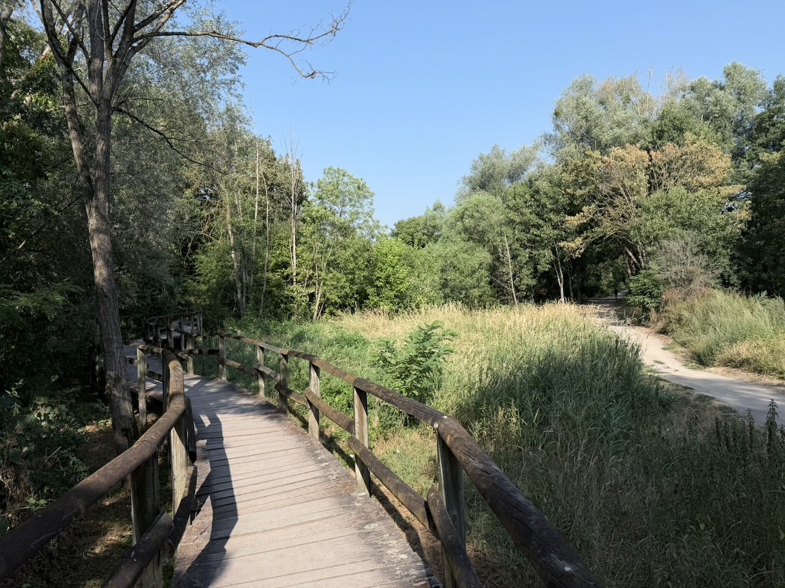{.center}
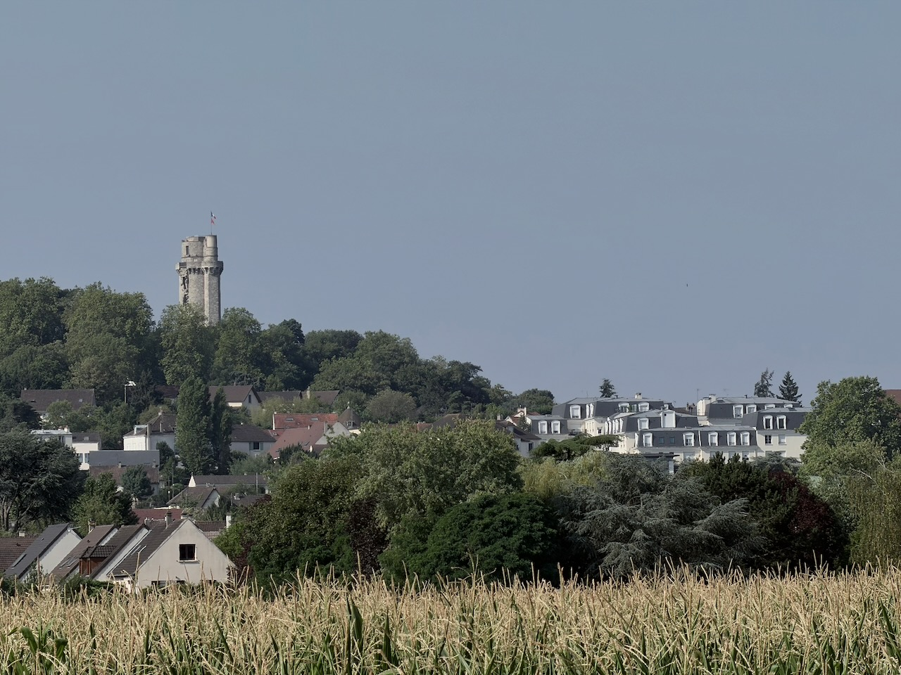{.center}

En chemin, une piste au bord de l'Orge est fermée pour cause d'inondation… 🤔

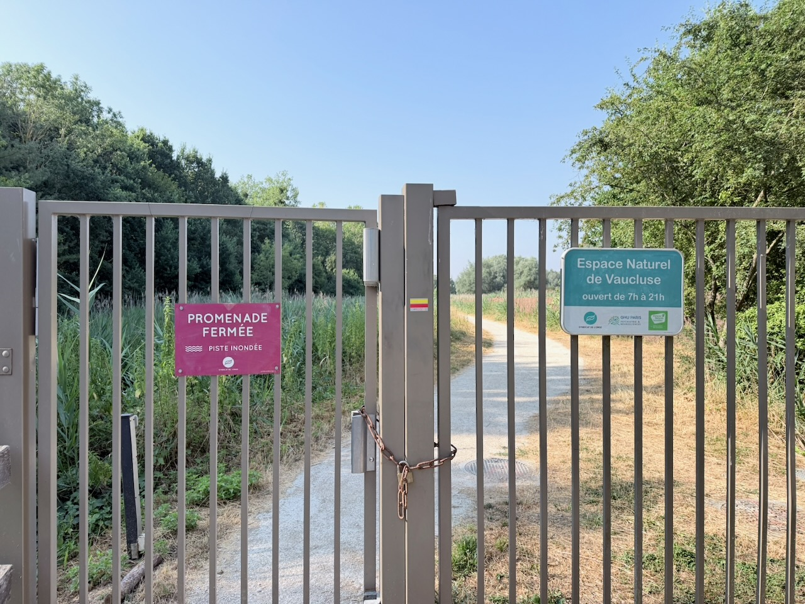{.center}

Pose boulangerie à Arpajon après 25 km, pour prendre des forces pour la suite, avec la chaleur qui commence à arriver, et des passages à travers champs avec le soleil qui tape.

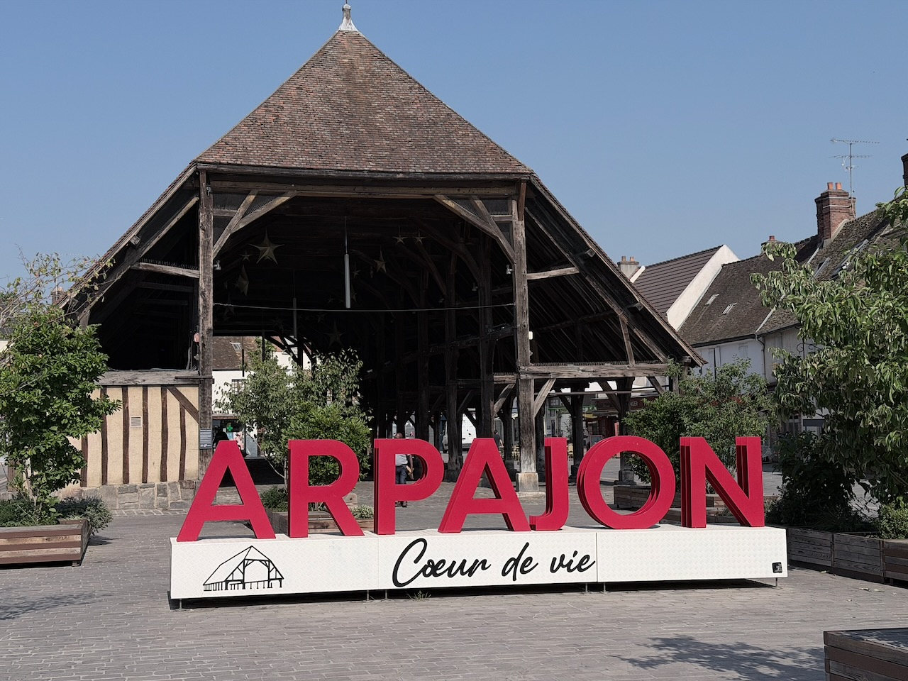{.center}
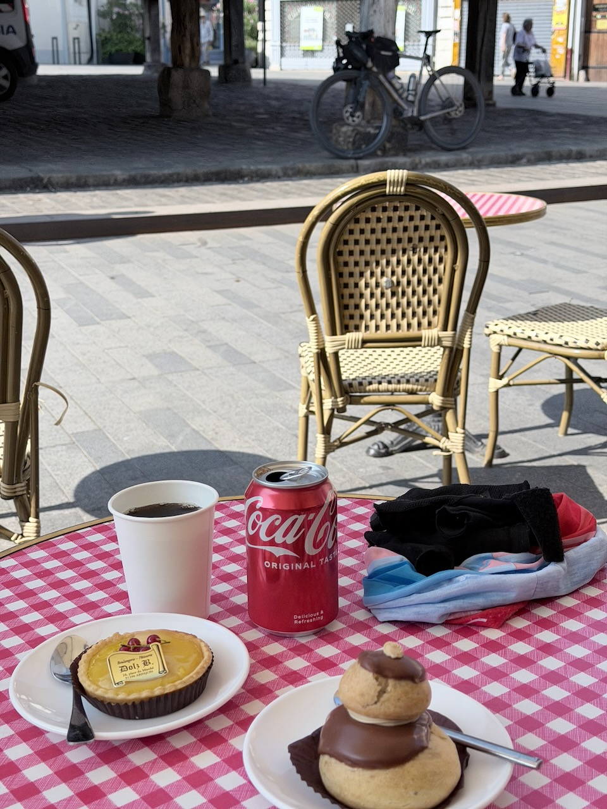{.center}

Les 40 km suivants passent plutôt facilement, même si je dois faire quelques détours à cause de zones arborées fermées au public à cause des risques d'incendies (Fontainebleau n'est pas si loin).

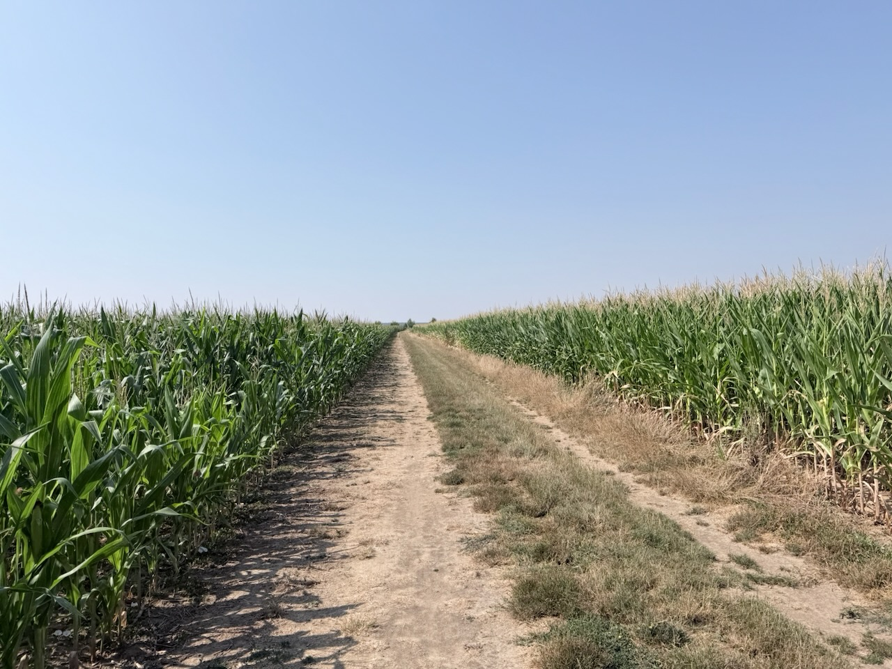{.center}
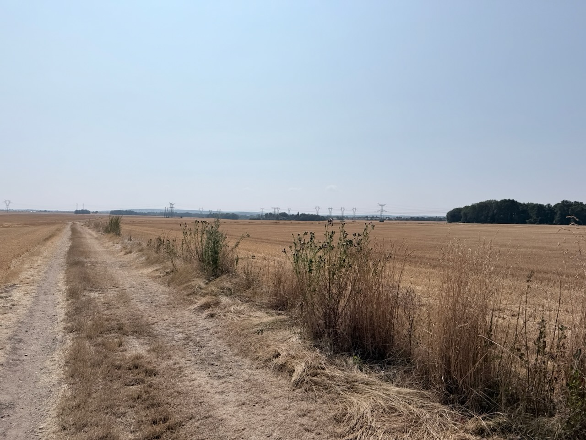{.center}
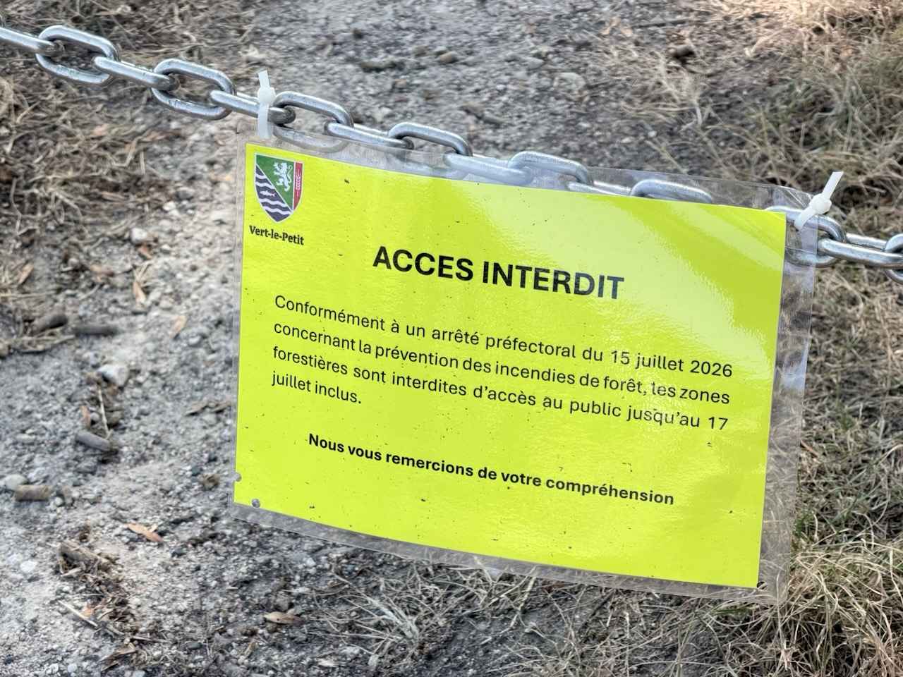{.center}

Au km 65, je retrouve les berges de la Seine en amont de Corbeil-Essonne, et une micro plage m'invite à une pause fraîcheur, impossible de résister. Les pieds sont bien contents de quitter les chaussures bien chaudes, et la vue est plutôt sympa ici.

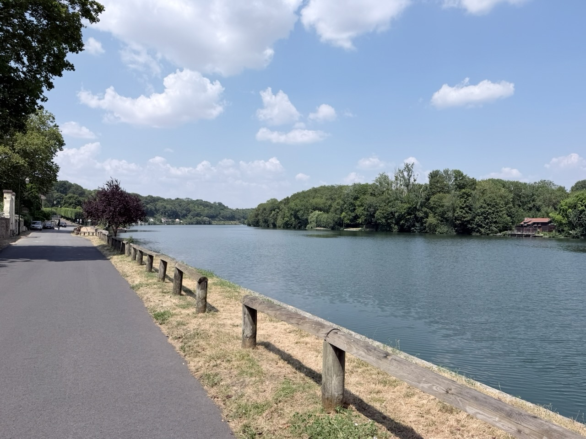{.center}
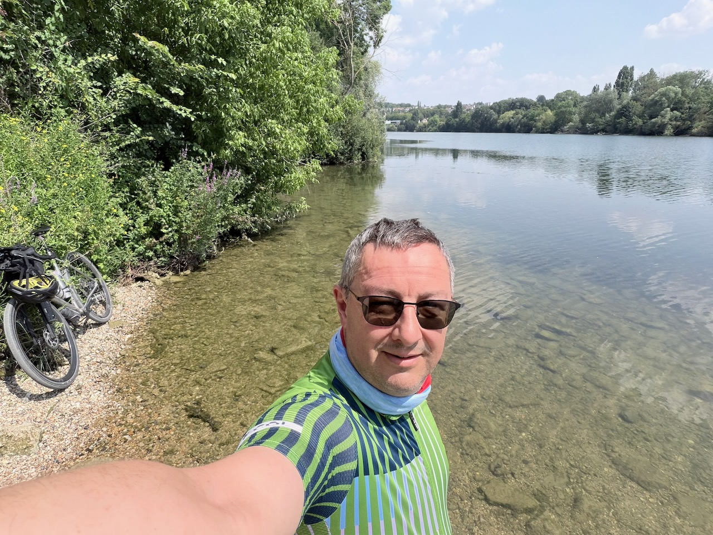{.center}
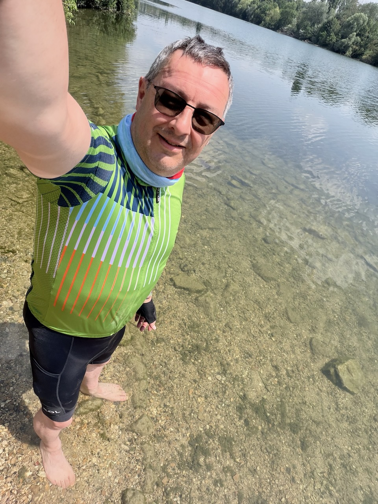{.center}

Les 18 km qui suivent, pour rentrer au bercail, me paraissent plus longs que les 65 précédents… 🤷‍♂️

Heureusement, je trouve en route un endroit à l'ombre pour une petite pause Figolu.

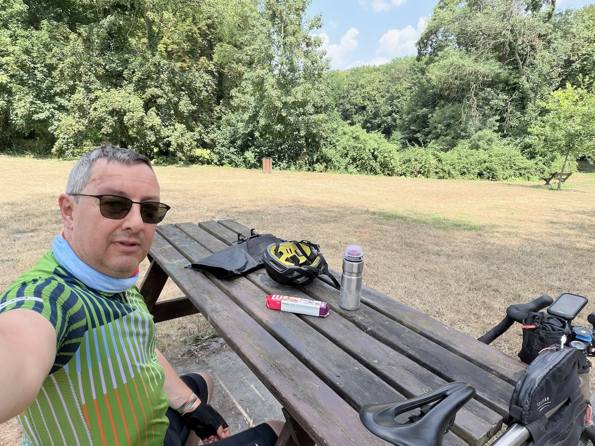{.center}

Pour couronner le tout, ce grand tour me permet de compléter mon ūbersquadrat pour atteindre 16×16. 🥳
