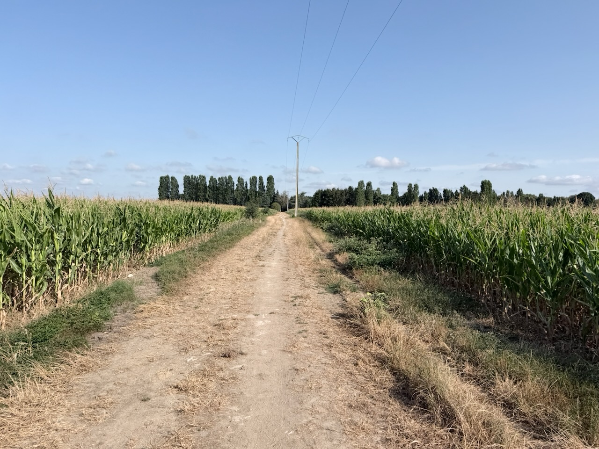
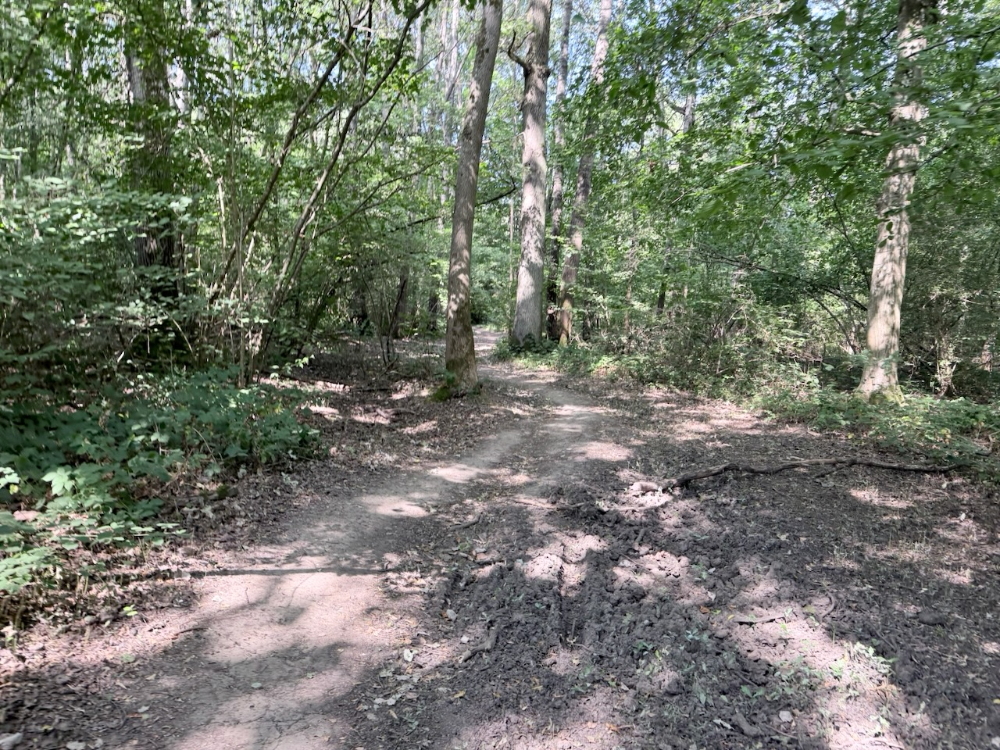
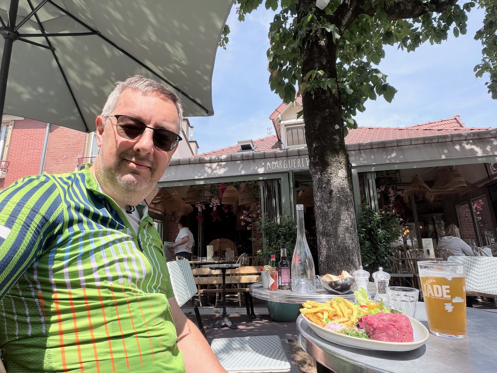
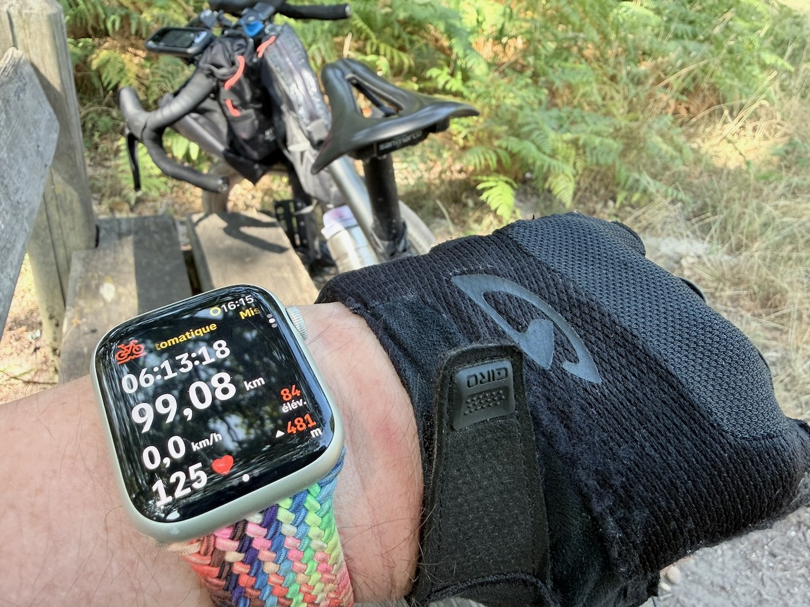

J’avais planifié un 80 km, raisonnable compte tenu de mes dernières sorties.

{.center}

En mode bien gravel comme j’aime, avec des terrains extrêmement opposés, entre la piste cyclable bien plane et tranquille en ville d’une part, et la forêt sauvage presque infranchissable d’autre part, en passant par les chemins défoncés au milieu des champs.

{.center}

Quand je parle de forêt infranchissable, c’est au sujet de petits singles qui serpentent entre les arbres, mais envahis de ronces parce que plus personne n’y passe (ce que Komoot ne sait pas), où il faut y aller en force comme un bulldozer, avec les cales qui servent alors particulièrement. 😬

(Évidemment, je n'ai pris aucune photo pour vous faire la démonstration… 🤷‍♂️)

Après 65 km de bonheur, bonne pause déjeuner pour reprendre des forces (un peu trop 😅).

{.center}

Et là je me dis que c’est quand même dommage de ne faire plus que 15km, alors que je suis en pleine forme.

Donc  nouvelle trace pour rentrer, avec 20 km de plus, pour enfin atteindre ce fameux palier à 100 km.

{.center}

Les 10 derniers kilomètres ont été un peu difficiles (notamment des douleurs à l’arrière des genoux), mais quel bonheur d’avoir tenu, enfin ! 💪