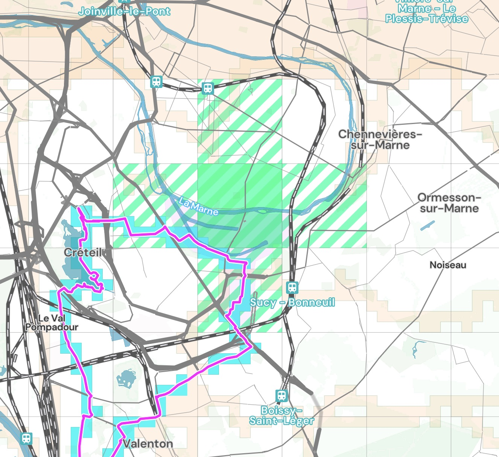
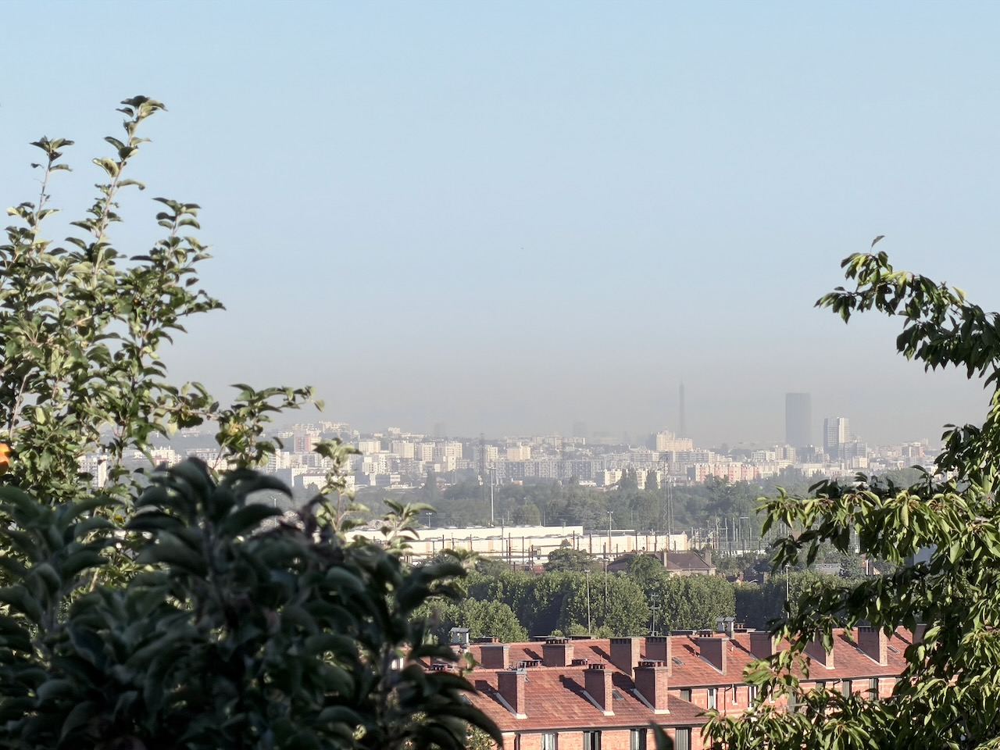
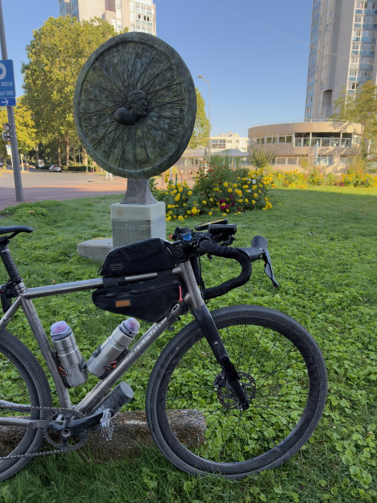
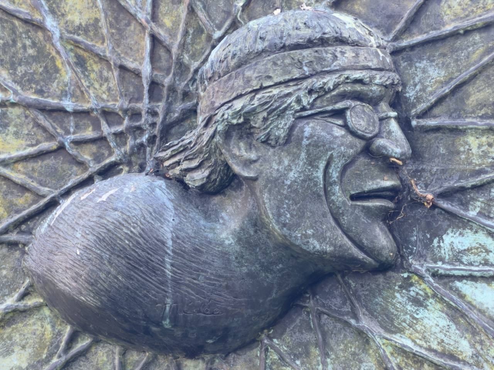

Ma [sortie de 100 km de la semaine dernière](../../22/omg-mon-premier-100-km/) ne devait en faire que 80 initialement, et quand j'ai bifurqué pour agrandir la boucle, j'ai oublié que cela me ferait éviter le seul squadrat qu'il me manquait dans le coin… 🤦‍♂️

Alors donc, aujourd'hui, petite sortie à la fraîche pour chasser le squadrat manquant (le fameux carré vert du titre, faut suivre).

{.center}

Une sortie très urbaine donc, mais quand même de jolies vues, notamment une vue panoramique lointaine sur Paris depuis les hauteurs de Villeneuve-Saint-Georges, dont la Tour Eiffel (la photo ne rend pas justice).

{.center}

L'occasion de faire un tour au lac de Créteil, que je n'ai pas vu depuis sans doute 35 ans, et de découvrir que Laurent Fignon y est honoré, lui qui a fait [ses début de cycliste à l'US Créteil](https://fr.wikipedia.org/wiki/Laurent_Fignon#Jeunesse_et_carri%C3%A8re_amateur). Et « [une sculpture en hommage à Laurent Fignon](https://fr.wikipedia.org/wiki/Laurent_Fignon#Post%C3%A9rit%C3%A9) offerte par le journal L'Équipe et le Tour de France est dévoilée le 24 juillet 2011, jour de la dernière étape du Tour qui relie Créteil aux Champs-Élysées à Paris ».

{.center}
{.center}

En 2h, la température est passée de 20 à 27°C, et ça devrait encore monter aujourd'hui jusqu'à 39°C ressenti… 🥵

Dans 2 jours, départ en train pour Vichy, pour débuter une semaine de bikepacking qui nous ramènera à la maison à Montgeron.
