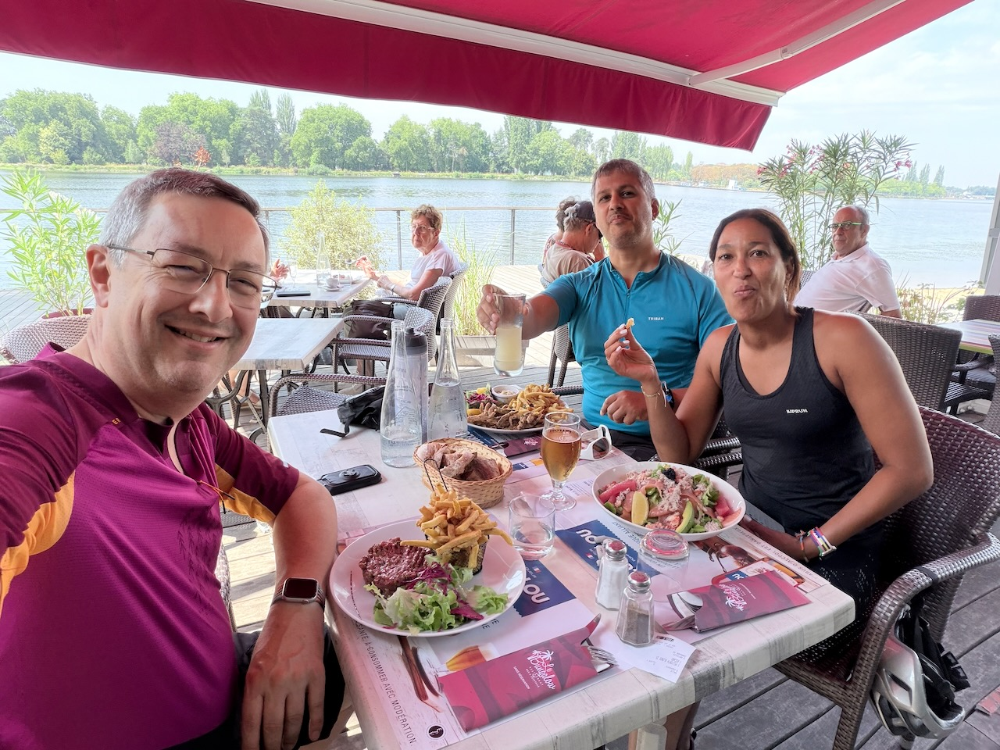
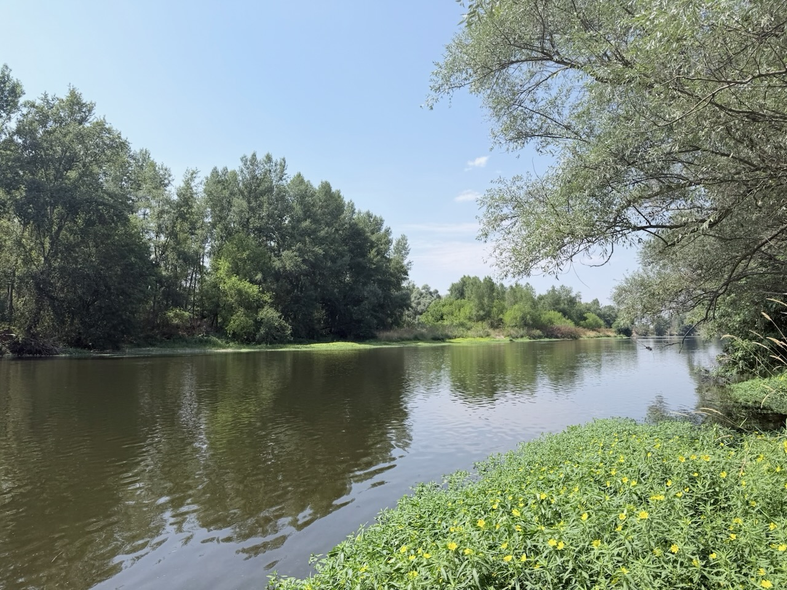
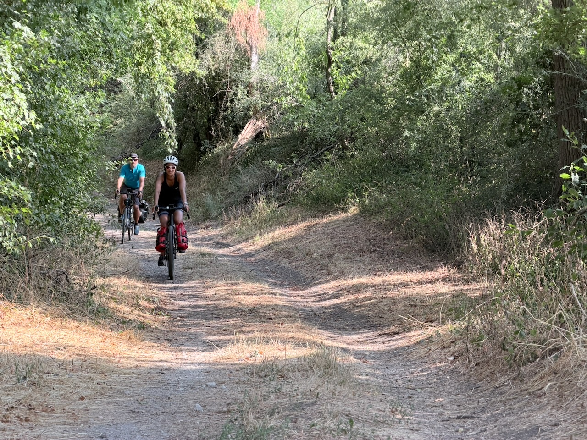

C’est parti pour une nouvelle rando vélo avec [Laurence](https://www.strava.com/athletes/109457891) et [Olivier](https://www.strava.com/athletes/67862880) !

Nous nous retrouvons à Vichy, sur les bords de l’Allier, pour un déjeuner de lancement.

{.center}

Puis départ sur nos cycles en début d’après-midi pour une première étape de mise en jambes, en pleine chaleur. 30°C selon la police, au moins 36°C selon les participants.

Nous commençons heureusement par longer la rivière sur la Via Allier, très bien aménagée, et avec des arbres offrant régulièrement de l’ombre.

{.center}

Nous rentrons ensuite dans les terres, et nous nous trouvons au milieu de champs de maïs, sans aucun coin d’ombre. Un peu difficile avec ce temps.

Après une petite pause dès qu’un peu d’ombre se présente, et le passage d’une dernière butte, nous voici arrivés à notre première étape, à Saint-Pourçain-sur-Sioule.

{.center}

Nous n’avons fait qu’une trentaine de kilomètres, sans trop de dénivelé, mais la grosse chaleur complique bien les choses.

La plus grosse étape de la semaine aura lieu demain, nous partirons à la fraîche pour optimiser nos chances.
