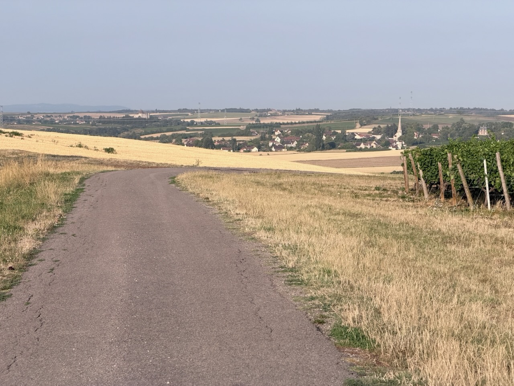
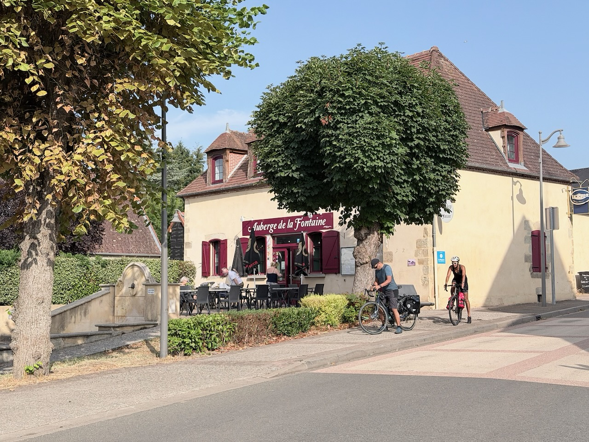
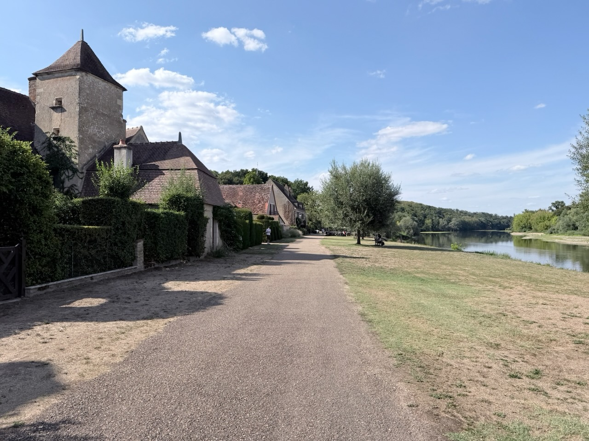

Partis à 7h30 pour profiter de la fraîcheur matinale, nous alternons côtes et descentes toute la matinée, dans la campagne de l’Allier.

{.center}

Une petite pause café à Bresnay, au bout d’une 1h30, nous relance pour la suite. Notre objectif est de faire 70km avant la pause déjeuner.

{.center}

Même si celle-ci n’arrive finalement qu’à 14h, après un passage dans les Terres du Milieu, l’objectif est tenu, et une bonne salade au Veurdre nous remet d’aplomb. À moins que ce soient les profiteroles et crème caramel… 😅

Nous revoilà à proximité de l’Allier, mais ce n’est qu’en arrivant dans le splendide village d’Apremont-sur-Allier que nous revenons vraiment au bord de la belle rivière.

{.center}

La pause est incontournable, et il ne restera que 10 km ensuite pour finir la journée.

Comme d’habitude, ce sont bien sûr les kilomètres les plus difficiles, notamment pour certains popotins qui attendent l’arrivée avec impatience.

Au final, une bien belle balade dans la campagne, et moins de souffrance due à la chaleur que nous ne le craignions, avec de gentils nuages, pas mal d’arbres au bord des petites routes, et un peu d’air.
