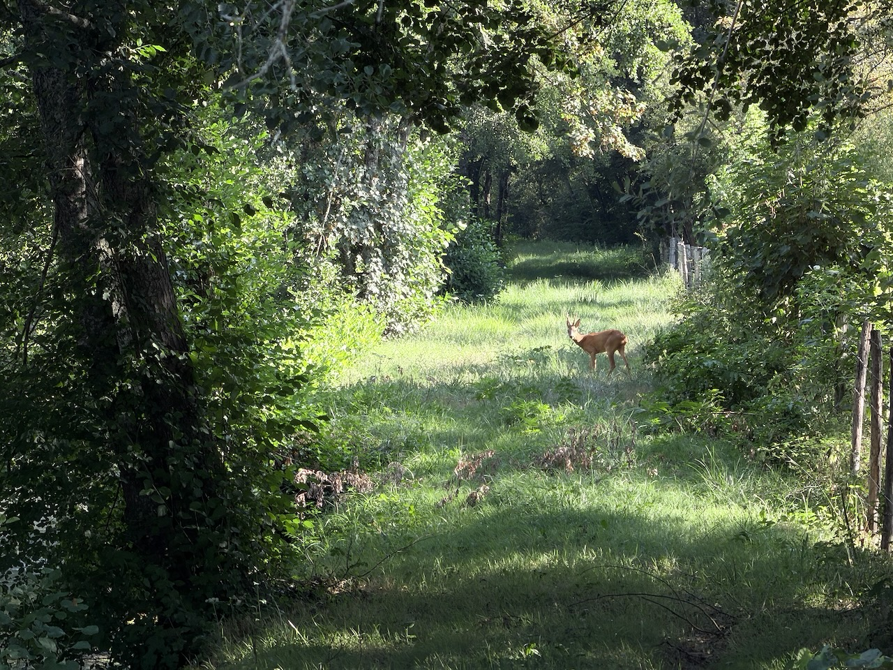
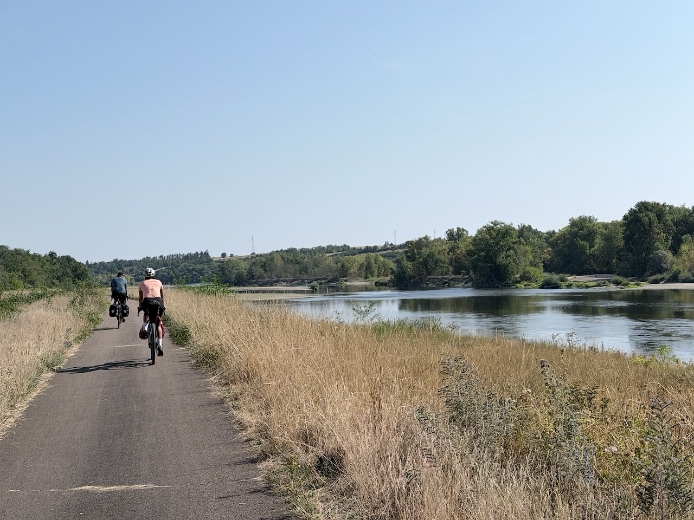
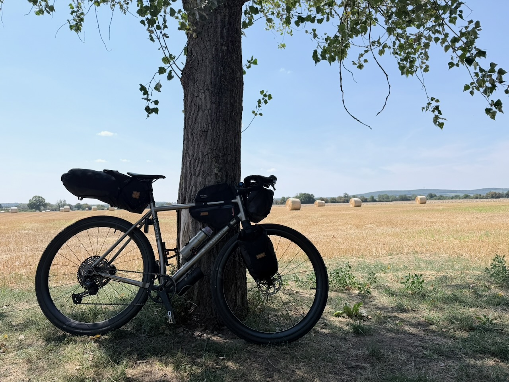
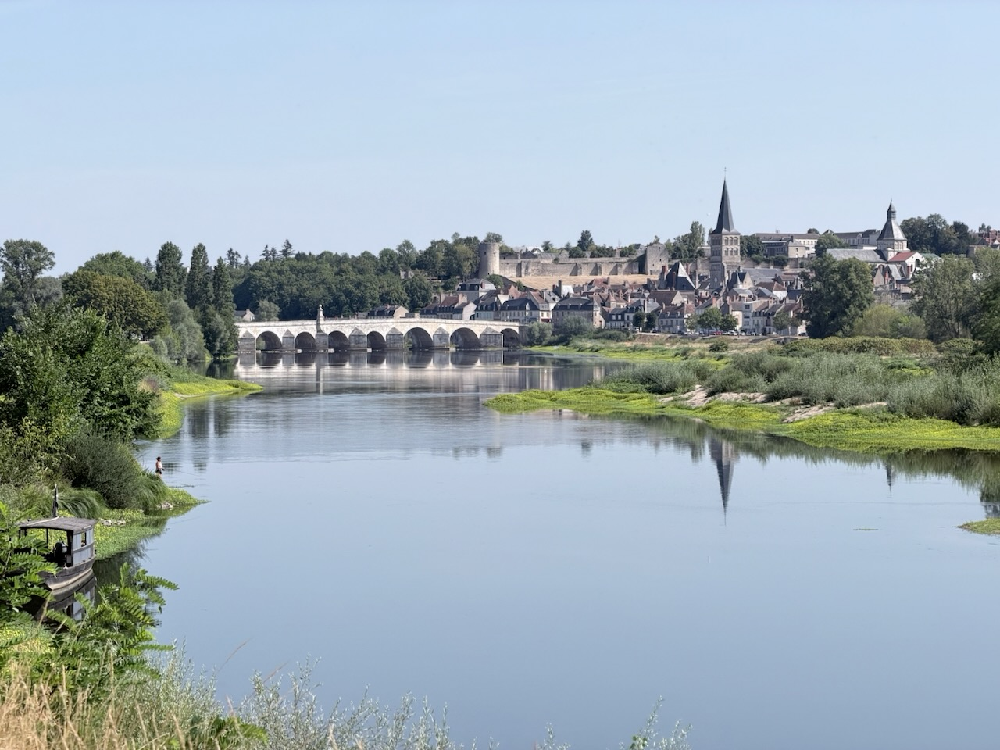

C’était censé être une étape de « repos » après les 100km d’hier, mais la température est tellement montée qu’elle s’est avérée plus compliquée que prévu.

{.center}

La première partie dans la campagne était bien sympa, similaire à la veille, mais l’arrivée en bord de Loire a tout changé.

La fameuse « Loire à Vélo », en tout cas sur le tronçon entre Marseilles-lès-Aubigny et Pouilly-sur-Loire, est horrible. Grandes lignes droites de bitume noir, sans aucune ombre.

{.center}

Ça s’améliore ensuite, dans la boucle que fait la Loire vers Sancerre.

{.center}

Étrangement, la Loire à Vélo passe sur la berge opposée aux villes intéressantes du coin, donc nous avons fait des écarts pour aller à La Charité-sur-Loire et Pouilly-sur-Loire, seul moyen de se restaurer et surtout remplir les gourdes.

{.center}

Et sinon, j’ai testé pour vous la manivelle qui se décroche du vélo, en pleine pointe à 150 km/h, euuh, à 15 km/h dans un virage, un peu surprenant. Heureusement que j’avais emmené ma caisse à outils.

(Je n’ai pas triché pour la distance.)
