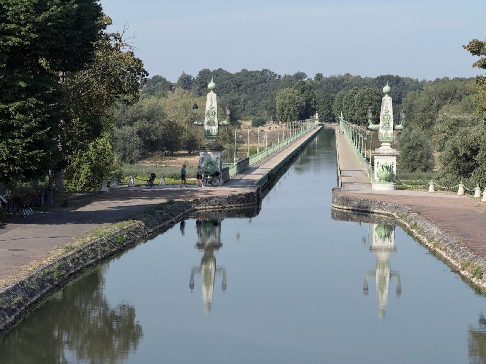
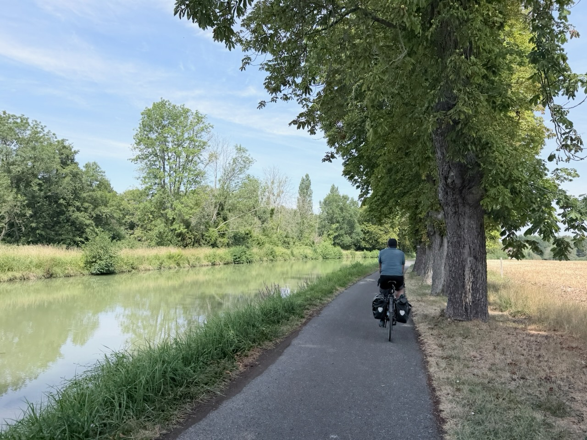

…mais bon, le réveil à 6h, c’est étrange pendant les vacances.

{.center}

Enfin bon, on a effectivement pu faire une grande partie du trajet (dont il manque les 3 premiers kilomètres sur Strava 🤦‍♂️) sans souffrir de la chaleur, c’était bien joué !

{.center}

Un bout de Loire et de son canal, puis bifurcation vers le nord à partir du joli pont-canal de Briare, à destination de Montargis.

{.center}

Pas beaucoup de dénivelé, que des chemins bien roulants, et régulièrement de l’ombre.

{.center}

Encore une belle journée !
