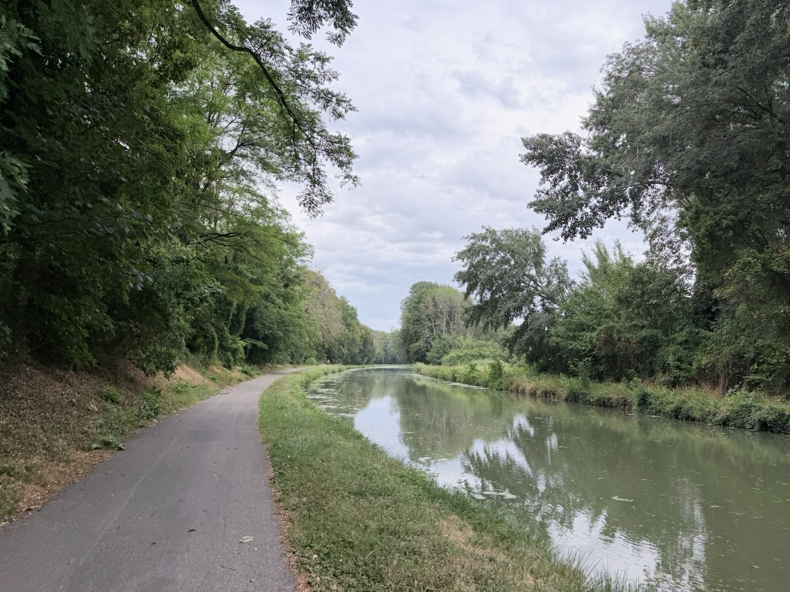
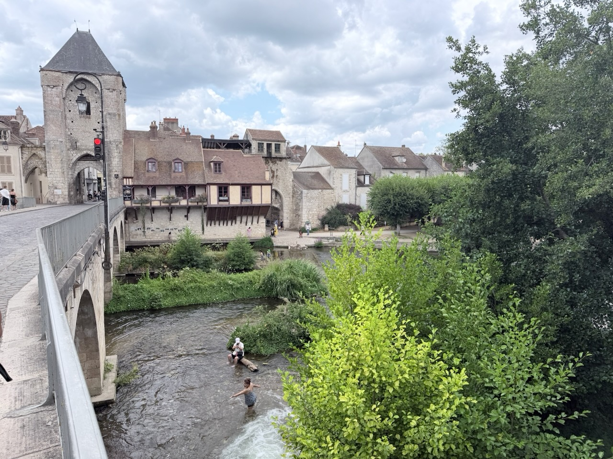
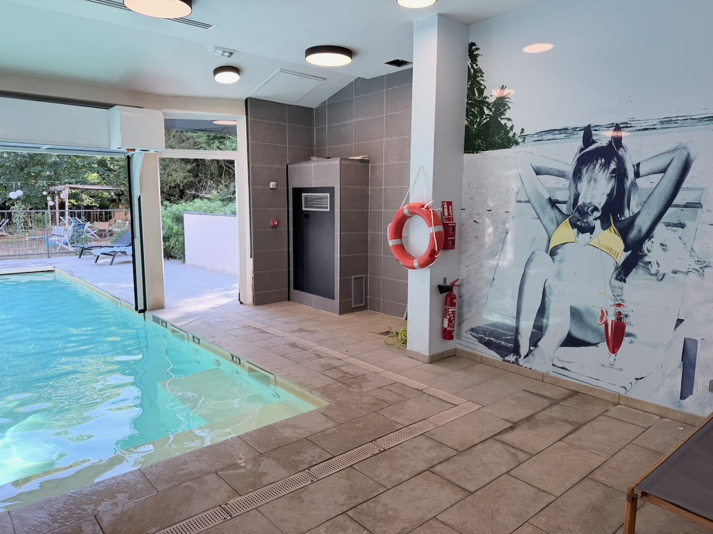

Petite étape tranquille et avec peu de dénivelé entre Montargis et Fontainebleau, via les canaux de Briare et du Loing.

{.center}

Nous avons dû légèrement adapter la fin de l’itinéraire (merci Pasquale 🙏)  pour éviter d’entrer en forêt de Fontainebleau par des chemins, tout accès étant interdit encore quelques jours à cause des risques d’incendie.

{.center}

Nous avons quand même eu droit à une petite côte bien violente en sortant de Moret-Loing-et-Orvanne (rue du Puits de Rosay), pour ne pas endormir les cuisses et mollets.

Le meilleur hôtel de notre itinéraire nous attendait à Fontainebleau, avec sa piscine, pour un instant détente bien mérité.

{.center}
