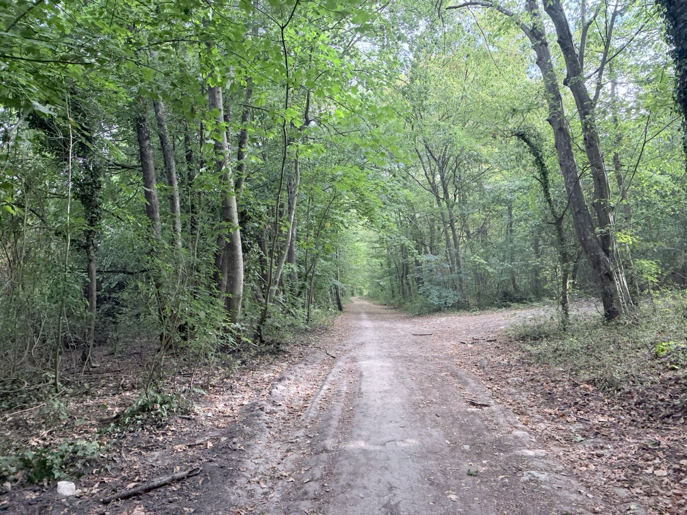
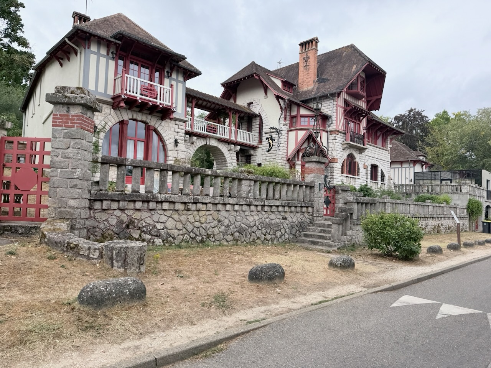
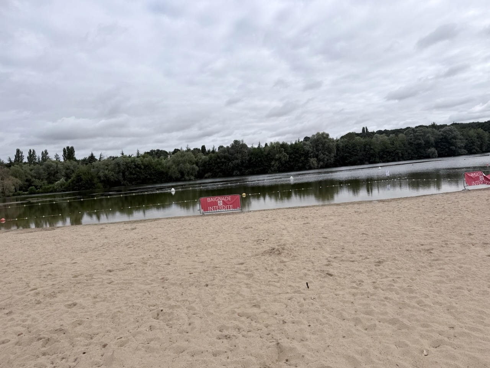
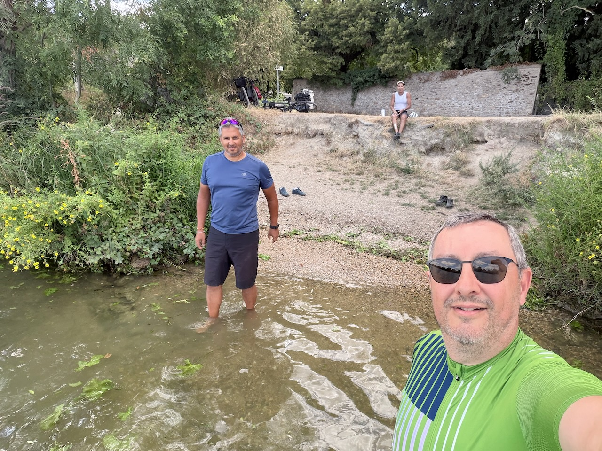

Ne pouvant traverser la forêt de Fontainebleau autrement que par les routes, nous préférons suivre les méandres de la Seine.

La balade est agréable, avec pas mal de passages sur des chemins de terre au milieu des arbres.

{.center}

C'est aussi l'occasion de voir de nombreuses très belles demeures anciennes.

{.center}

Nous passons également par l'Île de Loisirs de Bois-le-Roi, où il n'y a presque personne, et la baignade est indiquée comme interdite, sans raison visible.

{.center}

Au niveau de Corbeil-Essonnes, nous ne pouvons résister à la tentation de tremper nos pieds dans la Seine, une petite pause rafraîchissante.

{.center}

Nous finissons par traverser la Seine à Évry-Courcouronnes, pour monter vers la forêt de Sénart, pour finir notre parcours.

Après 5 jours et demi de vélo, et plein de bons moments passés ensembles, voilà notre périple accompli, de Vichy à Montgeron !
