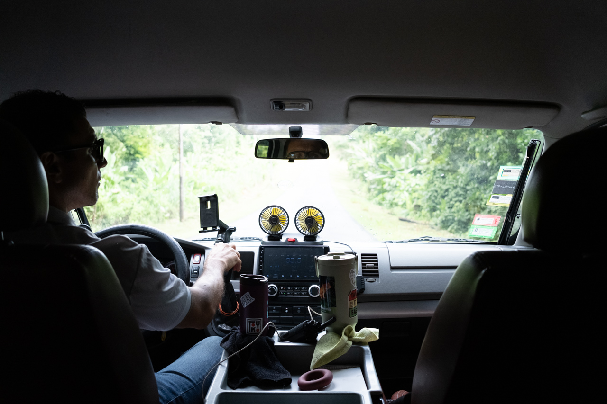

Nous allons commencer notre périple par quelques jours dans la [réserve Pacuare](https://www.pacuarereserve.org/), où aucune route n'arrive, donc ce premier trajet se fait en mini-bus taxi, pour rejoindre un embarcadère où nous retrouverons un bateau qui terminera le trajet.

{.center}
