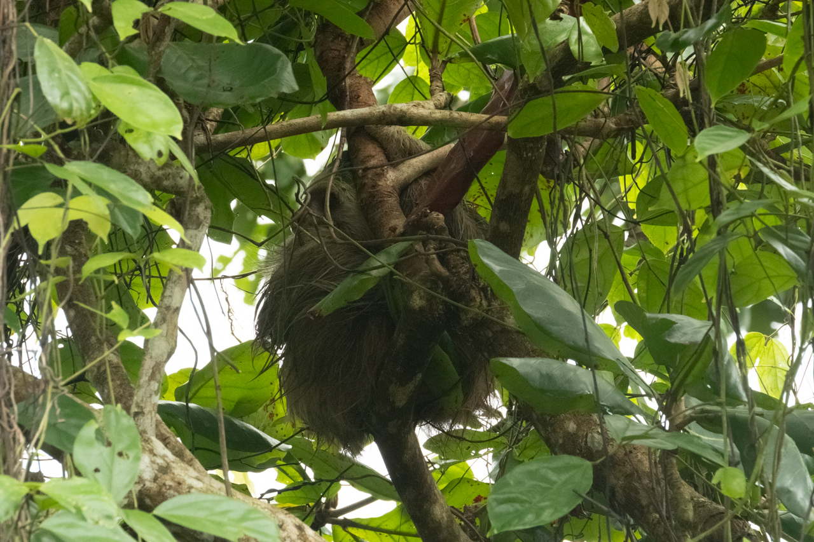
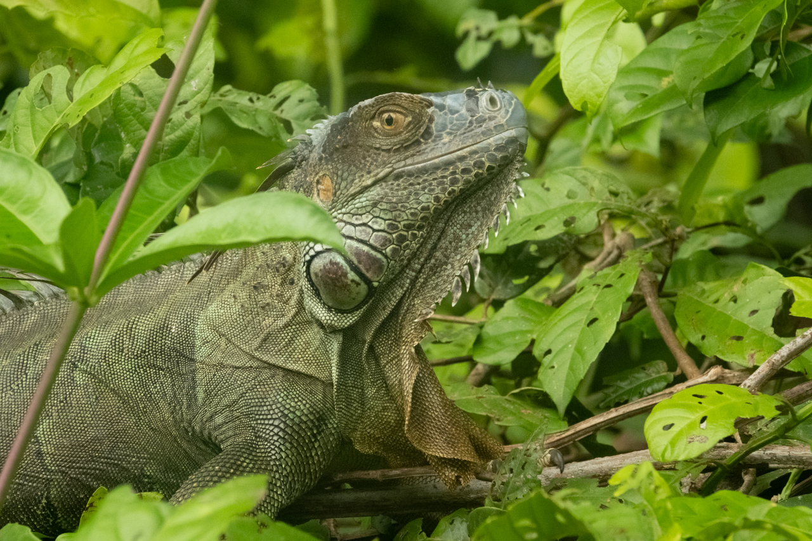
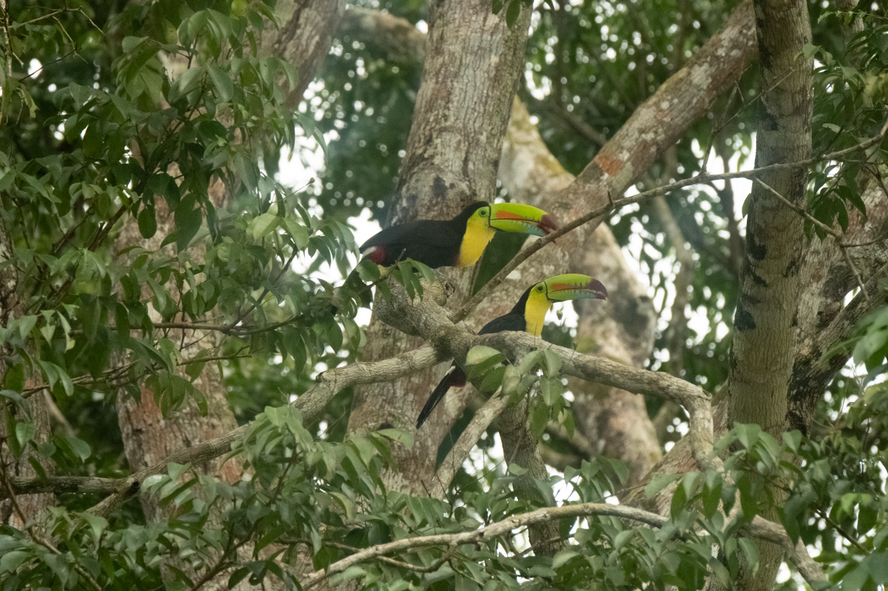
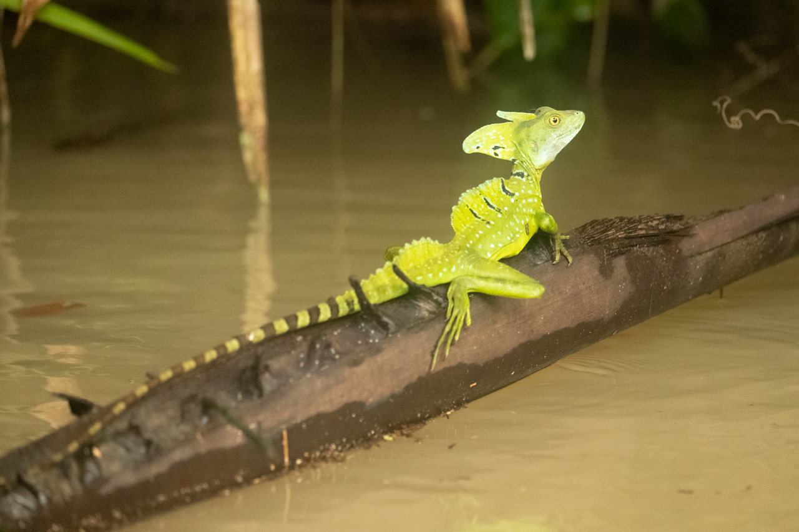
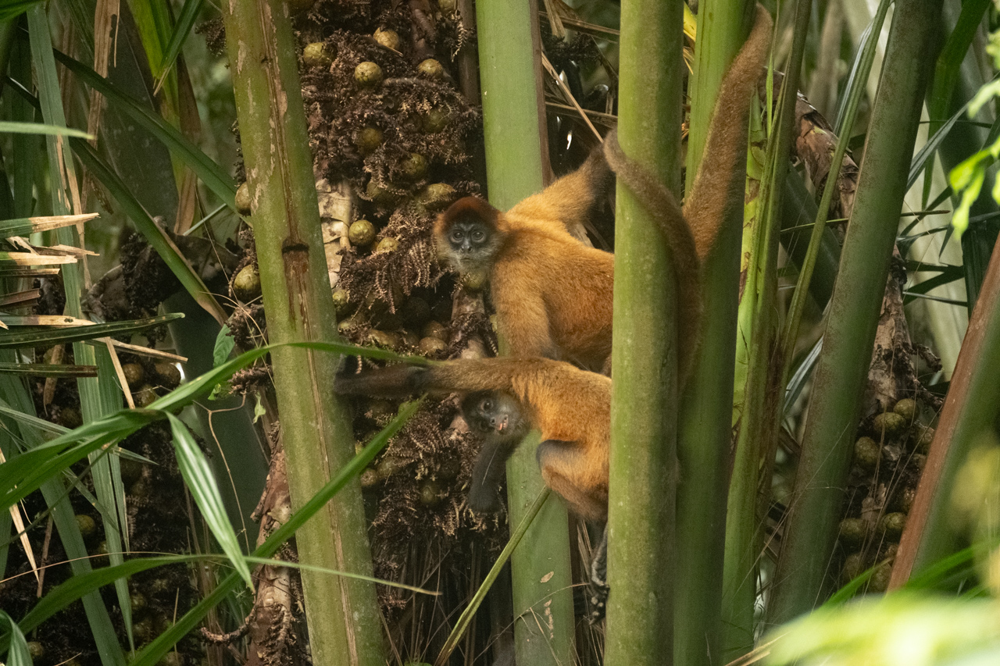
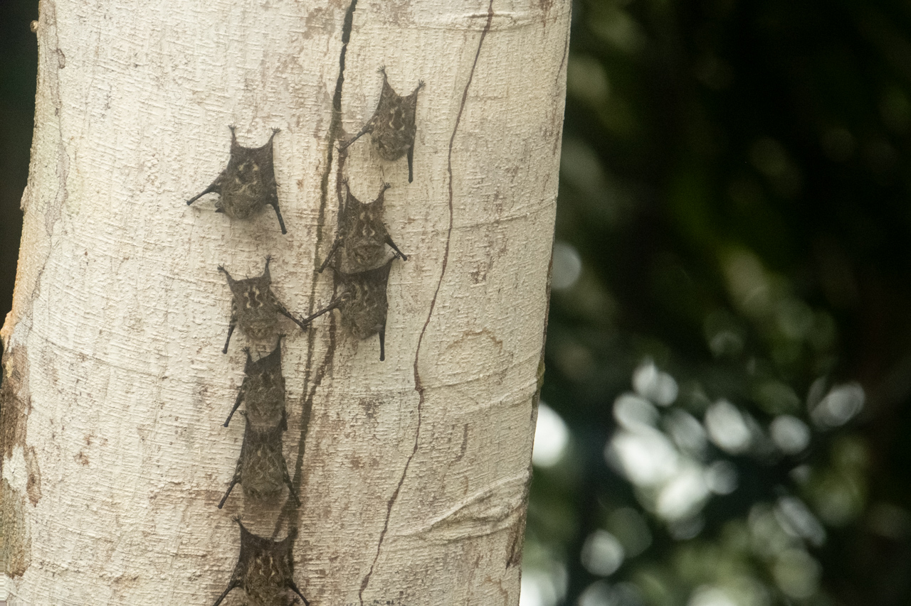
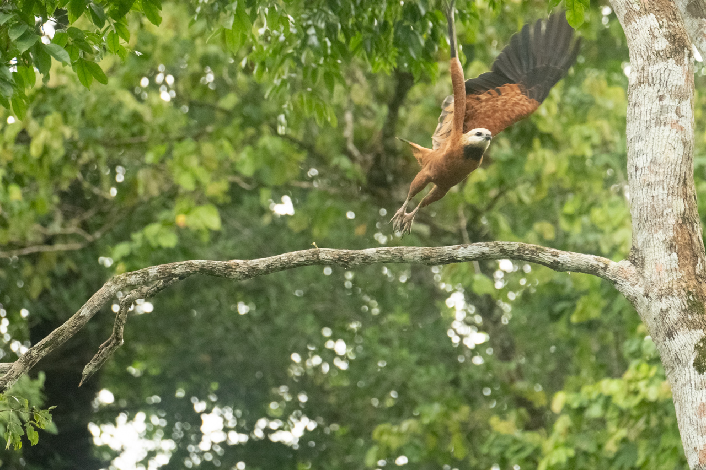

Excursion avec un guide sur un canoë à moteur, pour aller découvrir une autre facette de la faune locale, dans le Rio Pacuare ou ses afluents, et sur leurs berges.

Des reptiles, de nombreux oiseaux, quelques singes, une grande variété pour notre émerveillement.

{.center}

{.center}

{.center}

{.center}

{.center}

{.center}

{.center}

