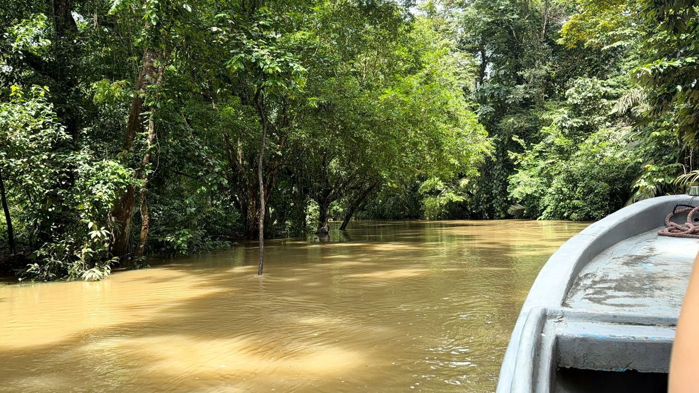
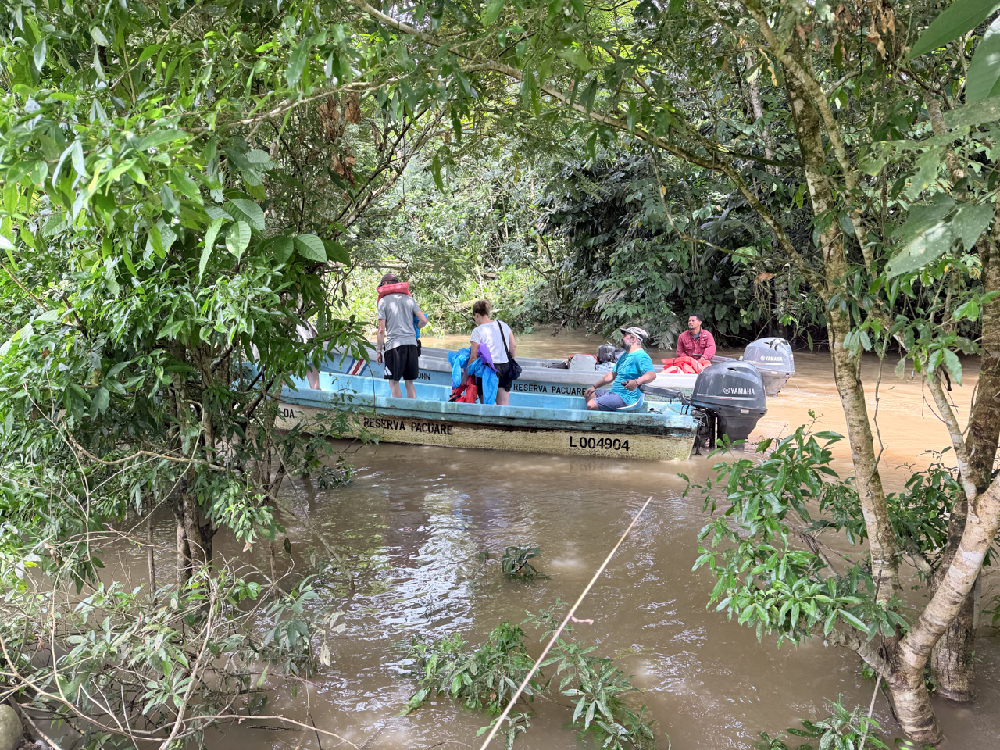

Nous retournons en bateau à l'embarcadère au bout du Rio Pacuare pour récupérer notre voiture de location et commencer la suite de l'aventure.

{.center}

L'orage exceptionnel de la nuit — même pour cette période au Costa Rica — a fait des dégats, notamment des arbres qui sont tombés en travers des canaux.

{.center}

Notre trajet se terminera à pieds sur quelques centaines de mètres, avec les valises pas du tout adaptées.
