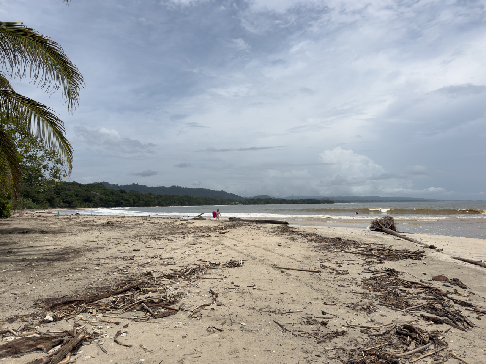
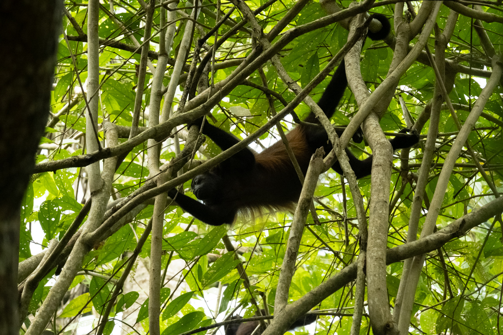
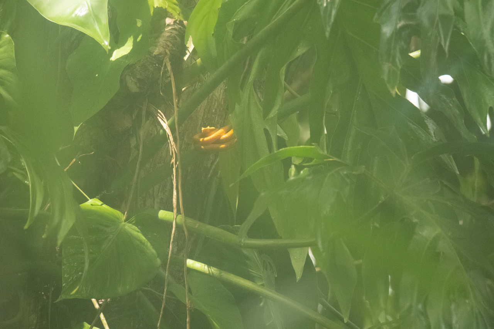

Parmi les 26 parcs nationaux au Costa Rica, le [parc national Cahuita](https://fr.visitcostarica.com/where-to-go/protected-areas/cahuita-national-park) incarne parfaitement l'engagement du pays en matière de conservation et de préservation de la biodiversité. Ce sont ses plages de sable blanc, ses récifs coralliens et ses forêts luxuriantes, qui constituent un véritable trésor naturel.

Le parc national de Cahuita tire son nom de la langue indigène : « Cawi », qui signifie l’acajou (arbre local très répandu) et « Ta », qui signifie Pointe. Littéralement : « pointe d’acajou ».

De nombreux sentiers pédestres permettent de découvrir la forêt tropicale, le récif corallien et les plages.

{.center}

Nous avons pu y observer un paresseux avec un petit, des singes hurleurs, des iguanes, une jolie — mais dangereuse — [vipère de Schlegel](https://fr.wikipedia.org/wiki/Vip%C3%A8re_de_Schlegel) d'un jaune vif (et mes soucis de buée dans l'objectif persistent 😔), des chauve-souris, etc.

{.center}

{.center}
