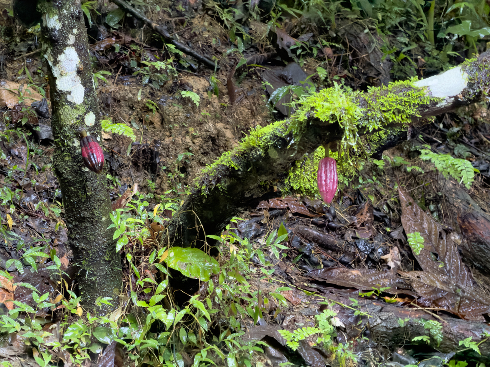
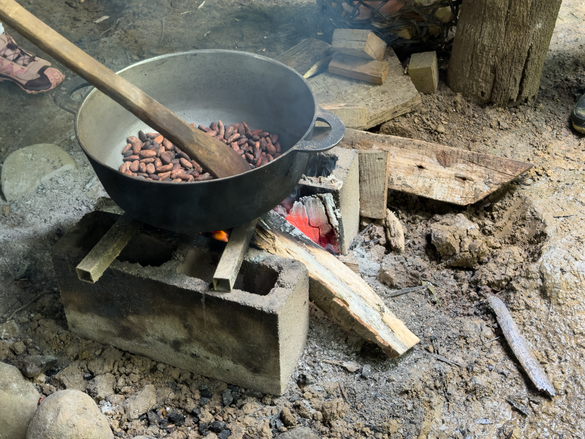
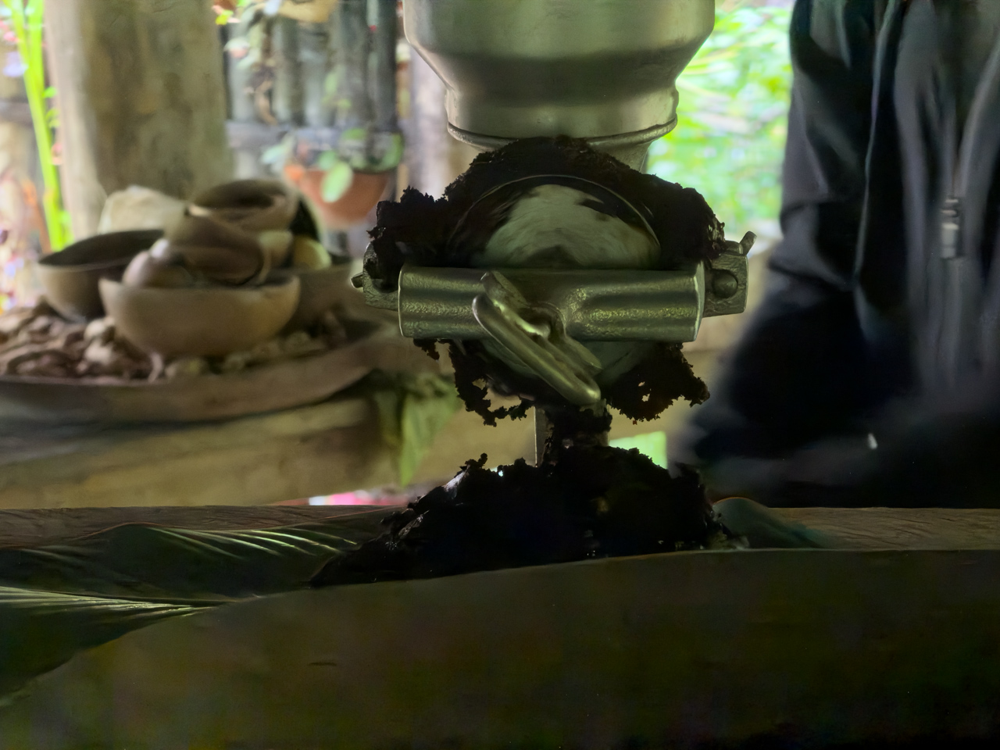

Les Bribris forment l’une des plus grandes communautés indigènes du Costa Rica. La communauté Bribri vit au sud du Costa Rica dans 4 grands territoires : Salitre, Cabagra, Talamanca Bribri et Këköldi. On trouve aussi des indigènes appartenant à cette communauté au Panama mais ils sont nettement inférieurs en nombre. 

Tous les Bribris parlent l’espagnol mais ils ont aussi leur propre langage ainsi que deux dialectes.

Les Bribris vivent de l’agriculture, de la chasse, de l’élevage et de la pêche. Ils cultivent notamment des bananes, du maïs, des haricots et font leur propre cacao.

{.center}

Nous avons justement eu droit à une visite des plantations de la famille (avec un test peu réussi de tir à l'arc traditionnel 😅), et une démonstration de la fabrication de boisson chaude au cacao en partant de la base, la fève de cacao.

{.center}
{.center}
