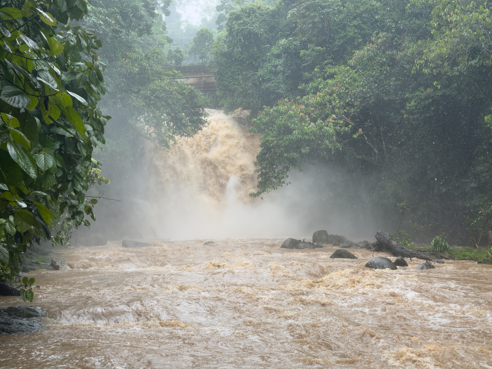

Les cascades de Bribri se composent de plusieurs chutes d'eau. La plus populaire est la Catarata Ma-Cu, également connue sous le nom de « cascade pétillante de BriBi ».

C'est une cascade où il est habituellement possible de se baigner dans une eau limpide.

Sauf quand les pluies sont exceptionnelles, comme c'est le cas ce jour-là… 🤷‍♂️

{.center}
