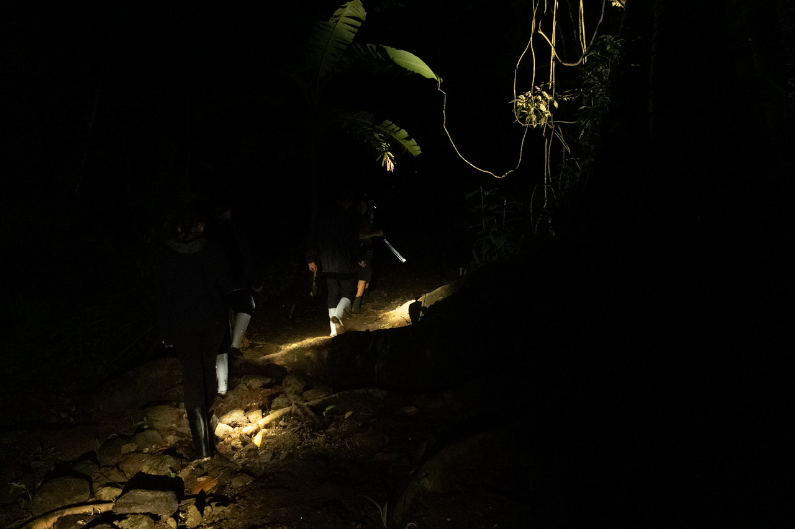
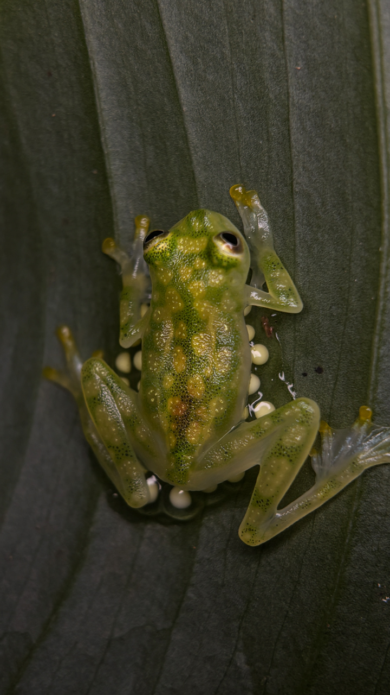
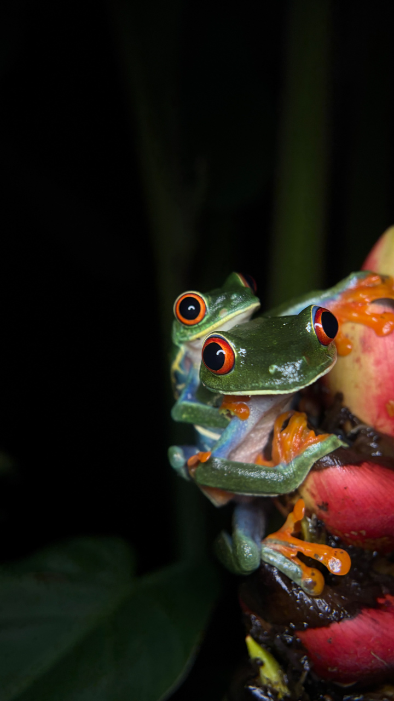
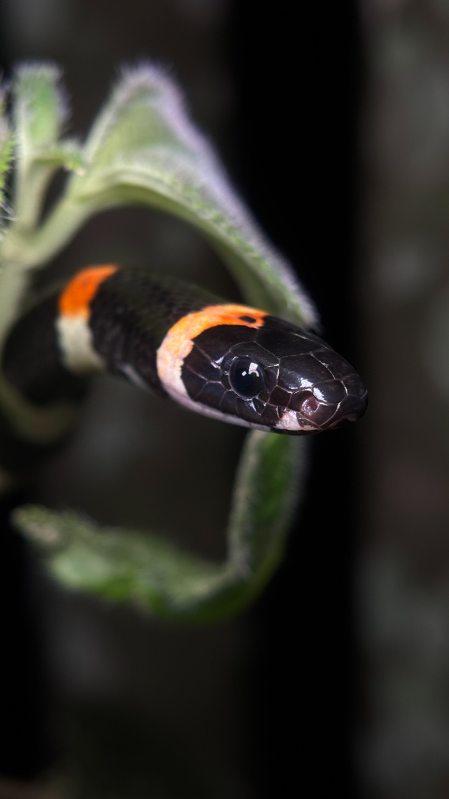
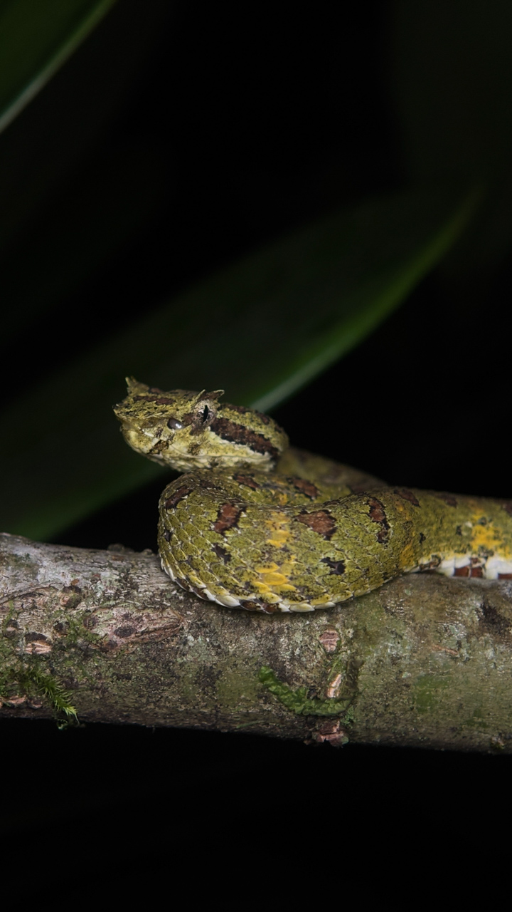

Superbe expérience avec un guide naturaliste, pour découvrir la faune locale qui se dévoile surtout la nuit.

{.center}

Les photos en gros plan ont été prises par le guide avec son smartphone et un système d'éclairage adapté.

{.center}

{.center}

{.center}

{.center}
