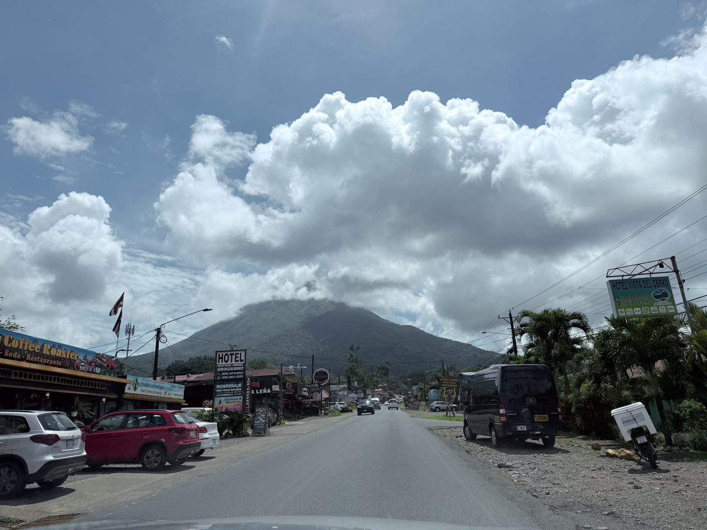
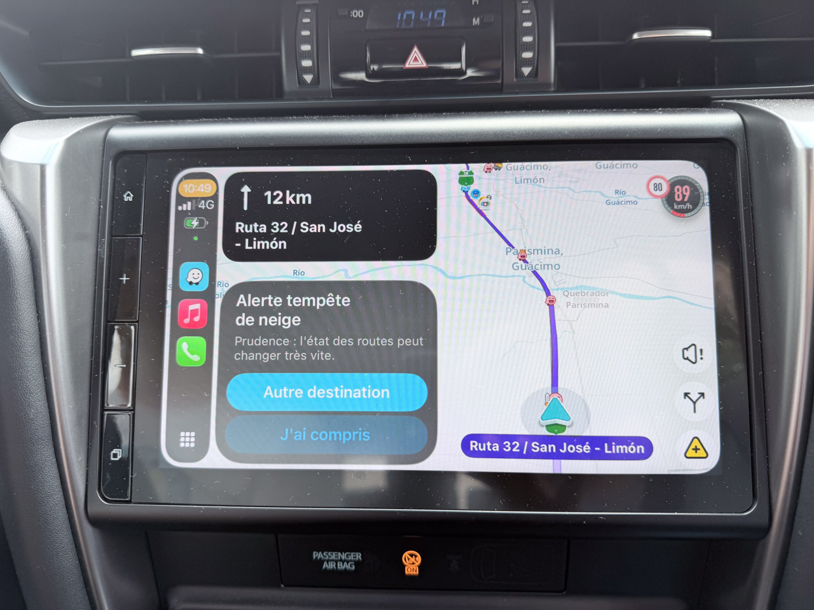

Au moment de partir, après une nuit qui a été l'occasion pour le ciel de déverser plus d'eau qu'il n'est tombé en France en 2026 (au doigt mouillé 😅), l'agence qui organise notre voyage (les géniaux « Costa Rica Découverte ») nous prévient que la route directe par la Ruta 4 (un des grands axes du pays) est pour l'instant coupé, un pont risquant de s'effondrer.

L'itinéraire alternatif proposé impose de faire un grand détour en revenant vers San José, ce que tout le monde fera certainement. Waze nous indique alors un trajet de 7h30… 😱

Heureusement, le passage sur le pont est finalement ouvert avant qu'on arrive à l'embranchement qui nous ferait changer d'itinéraire, et nous arrivons sans encombre à destination en moins de 5h.

{.center}

En cours de route, Waze aura quand même réussi à nous afficher plusieurs fois une alerte pour tempête de neige… 🤣

{.center}