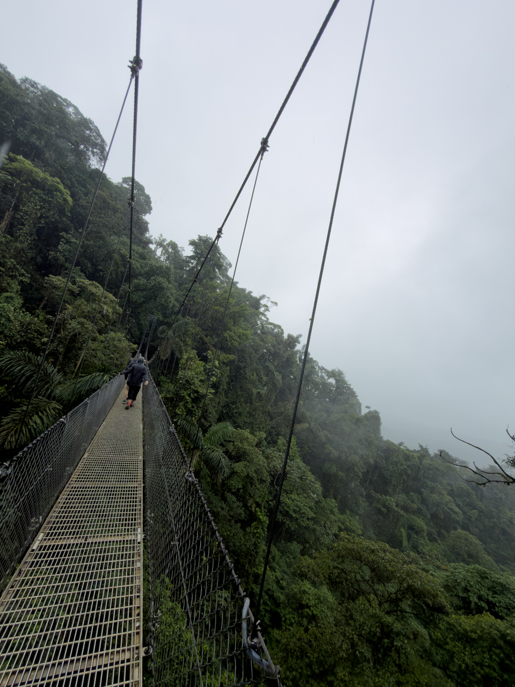
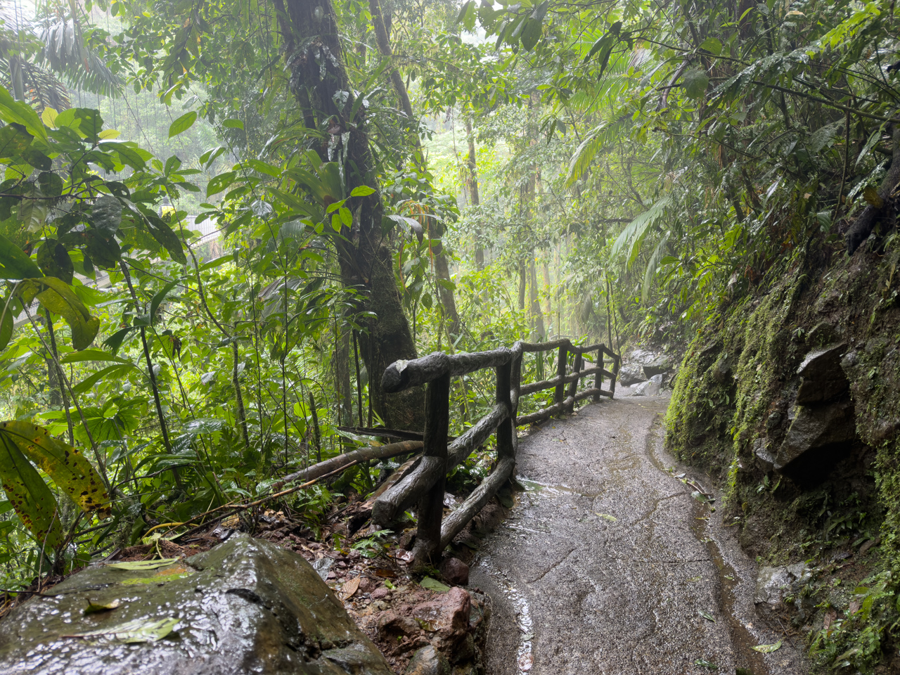

Il ne faut pas avoir le vertige ni détester la pluie, mais voilà une nouvelle occasion d’approfondir la découverte des plantes et animaux du Costa Rica.

{.center}

Serpents mortels, araignées (dont une mygale dans son terrier), scorpions (pas encore croisés), singes et autres mammifères, et de nombreuses et mystérieuses variétés de plantes et arbres allant du très bénéfique au plus nocif, font qu’on préférera toujours rester bien au milieu du sentier, et avoir un guide naturaliste avec nous pour ne pas faire de bêtises. 😅

{.center}

(Il manque le début de la trace.)
