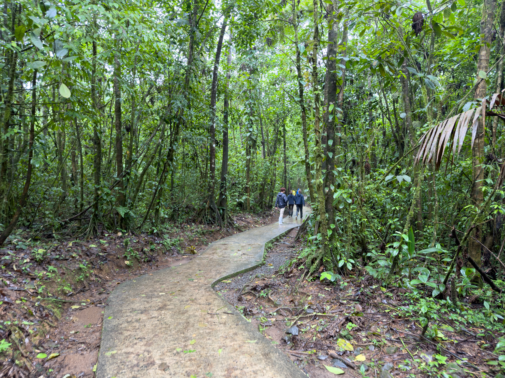
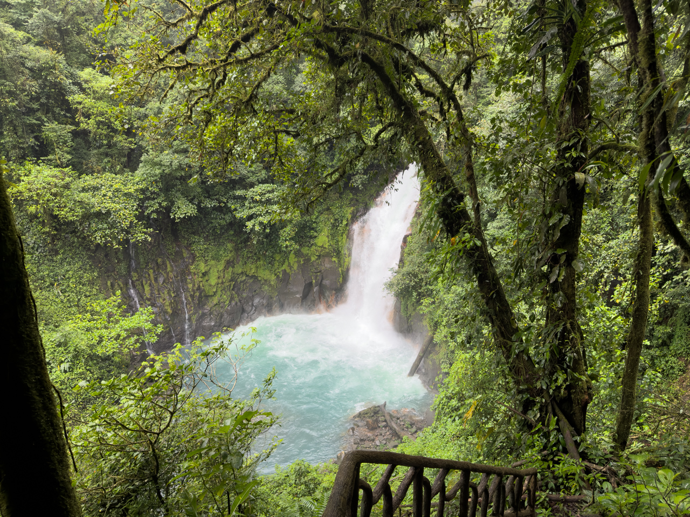
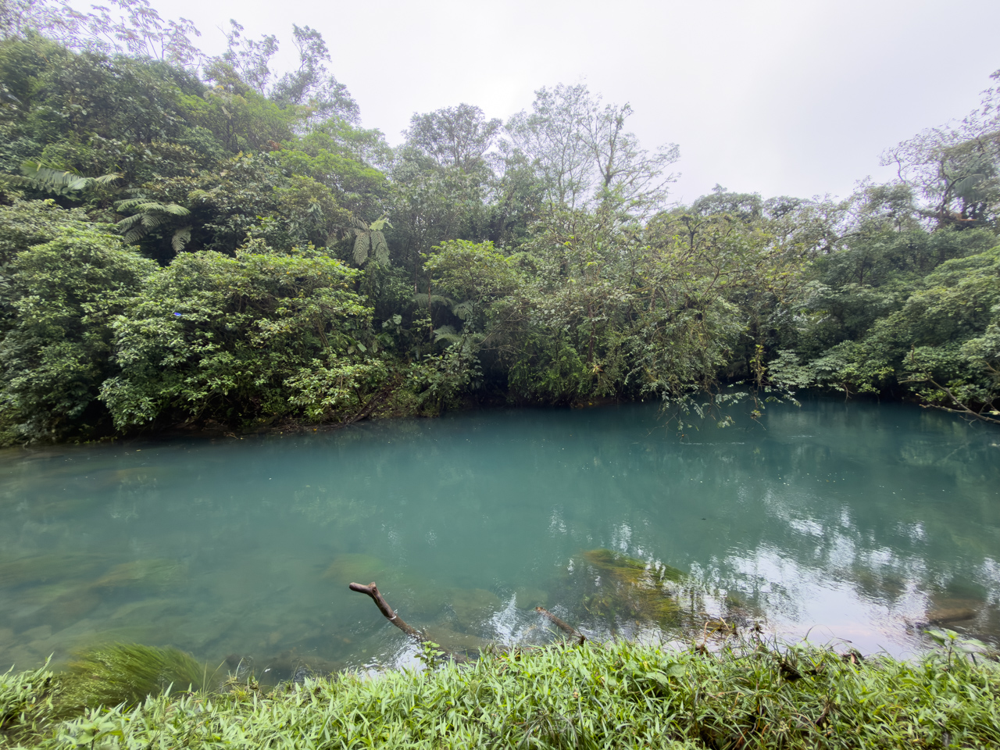

Nous marchons dans la forêt — très aménagée au début du parcours — pour rejoindre le [Rio Celeste](https://en.wikipedia.org/wiki/Celeste_River), d’un bleu étonnant, avec sa grande cascade et sa « Laguna Azura ».

{.center}

{.center}

{.center}

Le bleu turquoise provient d’un phénomène physique connu sous le nom de diffusion de Mie.

La rivière Celeste est alimentée par deux rivières incolores, la rivière Buenavista et la rivière Sour. La rivière Buenavista transporte une grande concentration de particules d'aluminosilicate de petit diamètre. Sour, comme son nom l'indique, a une acidité élevée en raison de l'activité volcanique. Lorsque ces deux cours d'eau se mélangent pour former la rivière Celeste, la baisse du pH provoque l'agrégation et l'agrandissement des particules d'aluminosilicate jusqu'à un diamètre d'environ 566 nm. Ces particules en suspension produisent une dispersion de Mie qui donne à la rivière une forte couleur turquoise.

Et voilà [le détail scientifique](https://fr.wikipedia.org/wiki/Théorie_de_Mie) si vous avez le courage… 😅
