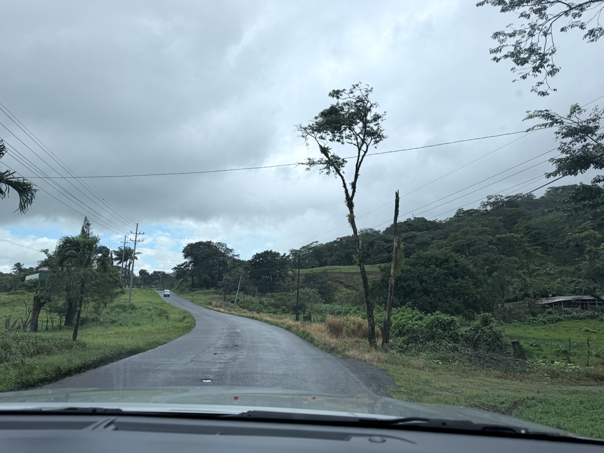
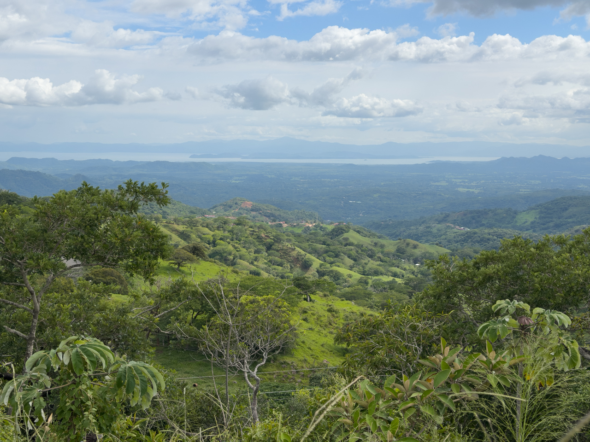

Nous reprenons ensuite la route en direction de [Monteverde](https://fr.wikipedia.org/wiki/R%C3%A9serve_biologique_de_Monteverde) et sa forêt de nuage.

Pour cela, nous empruntons une petite route souvent cabossée, clairement pas le passage habituel des touristes.

{.center}

En montant prograssivement dans la montagne, nous apercevons pour la première fois l'océan Pacifique, avec des paysages grandioses.

{.center}
