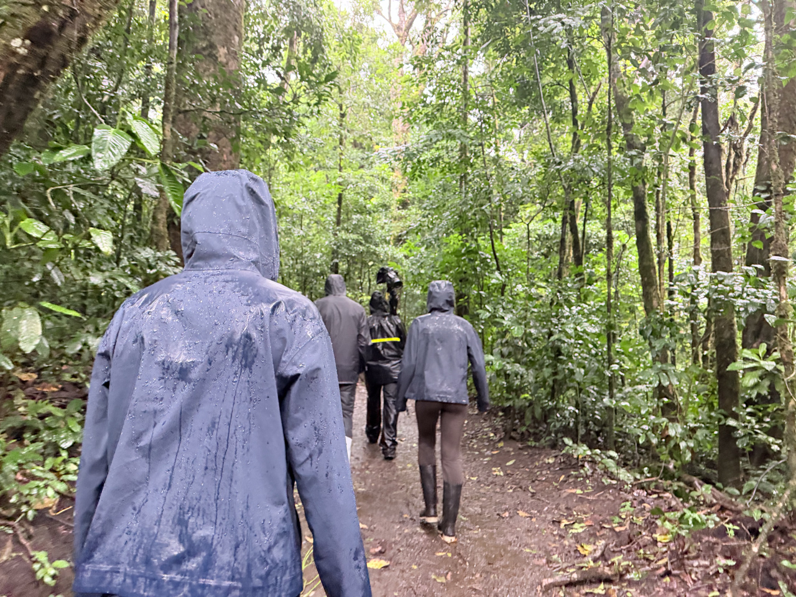
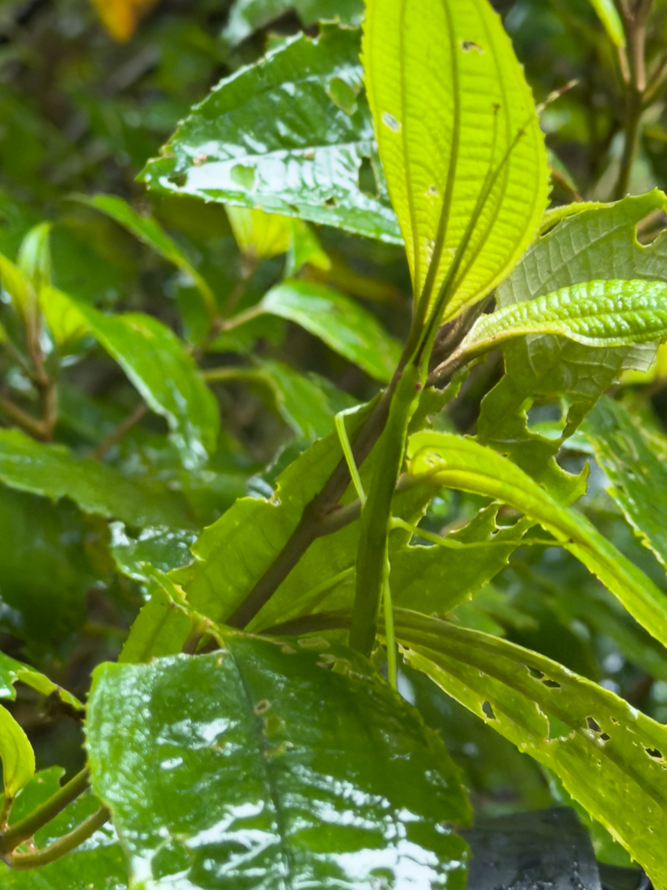
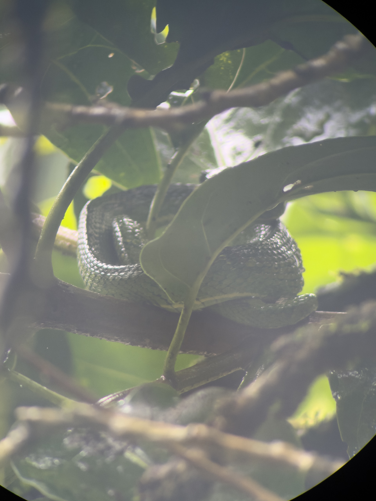
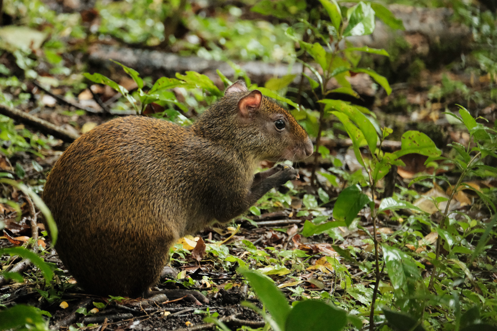
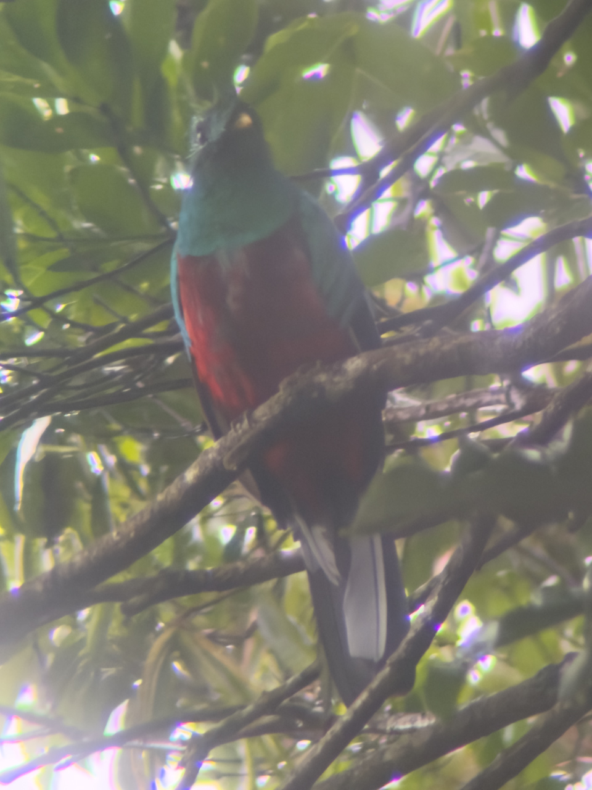
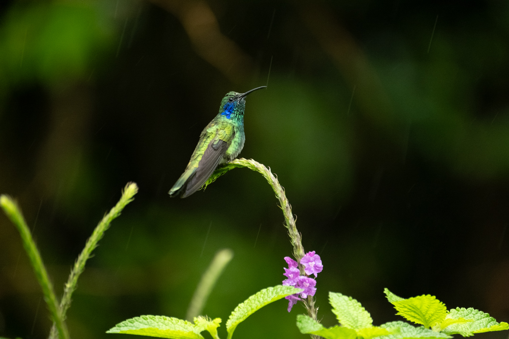
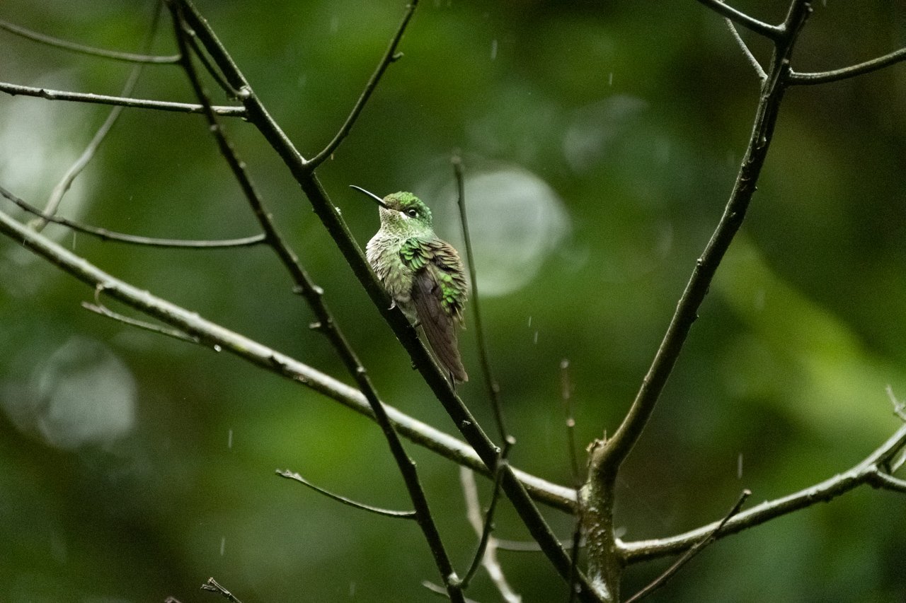
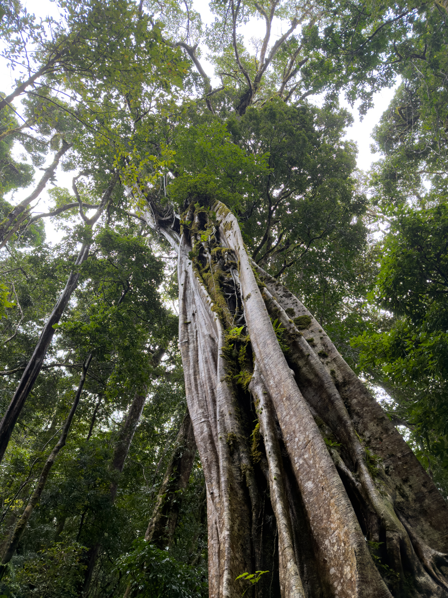
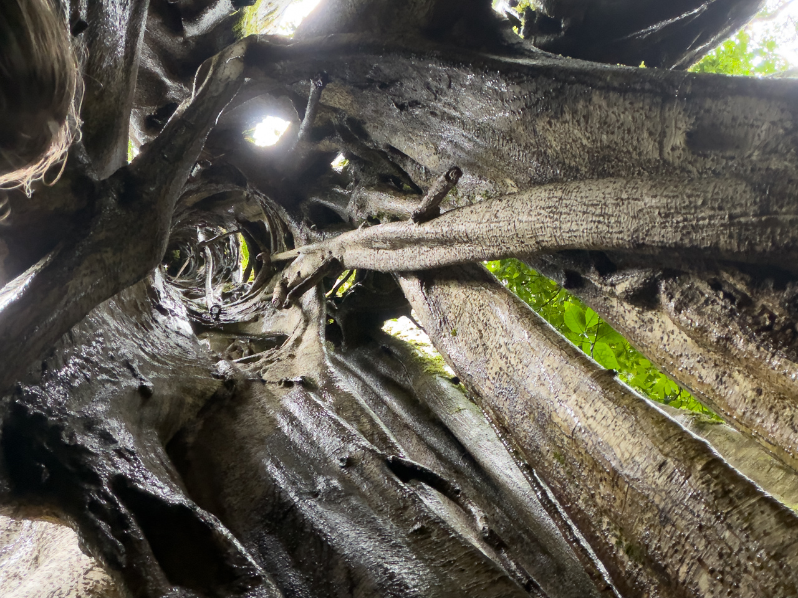

Nouvelle visite d’une réserve naturelle, avec un guide naturaliste. Il y a tant d’espèces animales et végétales à découvrir, de diversité d’écosystèmes au Costa Rica, c’est passionnant.

Et bien sûr la pluie est là. 😅

{.center}

Monteverde est une forêt nuageuse (seules 1,4% des forêts mondiales le sont), c’est à dire qu’elle est principalement alimentée en eau par les nuages qui la traversent et la condensation. Même s’il fait beau en dehors, il peut « pleuvoir » dans la forêt.

Nous observons différents animaux au cœur de la forêt, insectes (dont un phasme !), mamifères et oiseaux.

{.center}

{.center}

{.center}

Nous avons notamment la chance de pouvoir apercevoir un [quetzal](https://fr.wikipedia.org/wiki/Quetzal), oiseau splendide emblématique de l'Amérique Centrale, mais rare :

{.center}

Un espace est aménagé avec des distributeurs de solution sucrée, pour les colibris, qui se régalent :

{.center}

{.center}

Nous découvrons également le [figuier étrangleur](https://fr.wikipedia.org/wiki/Figuier_%C3%A9trangleur) — en fait un ficus —, qui commence sa vie en mode [épiphyte](https://fr.wikipedia.org/wiki/%C3%89piphyte) (comme les broméliacées), mais fini par détruire son arbre support à force de l'entourer et l'empêcher de croître :

{.center}

{.center}
