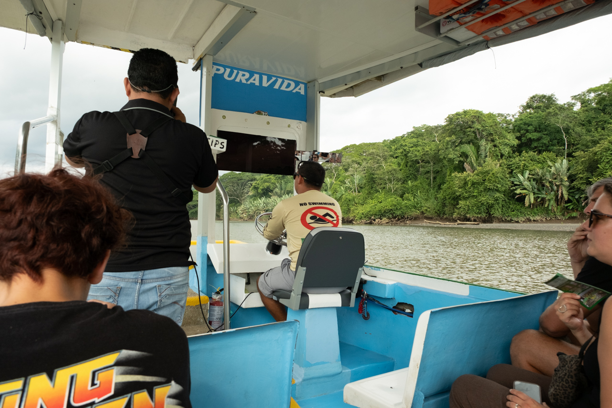
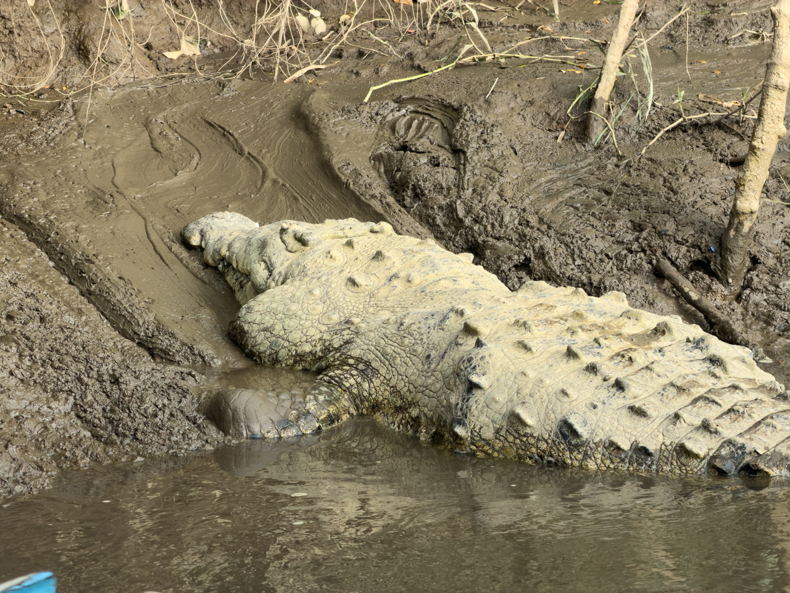
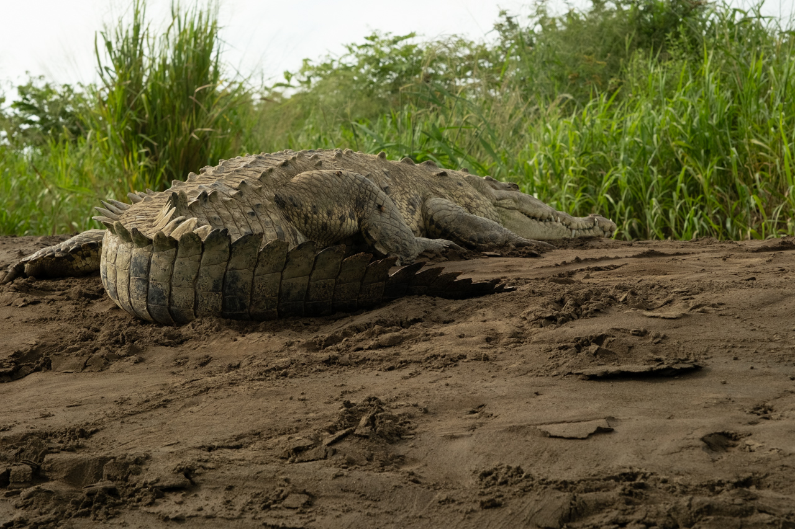
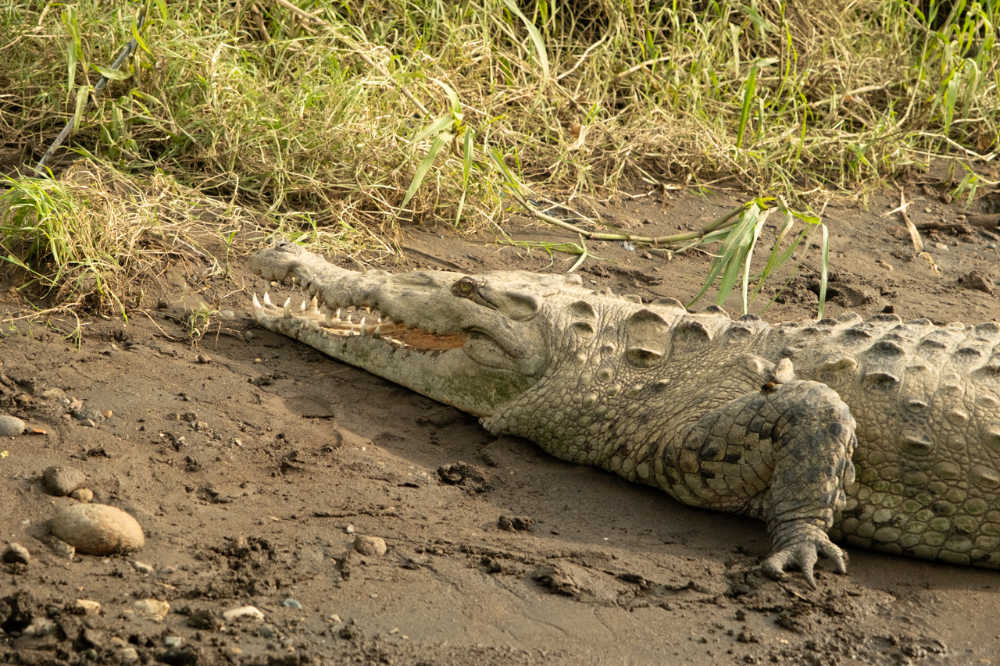
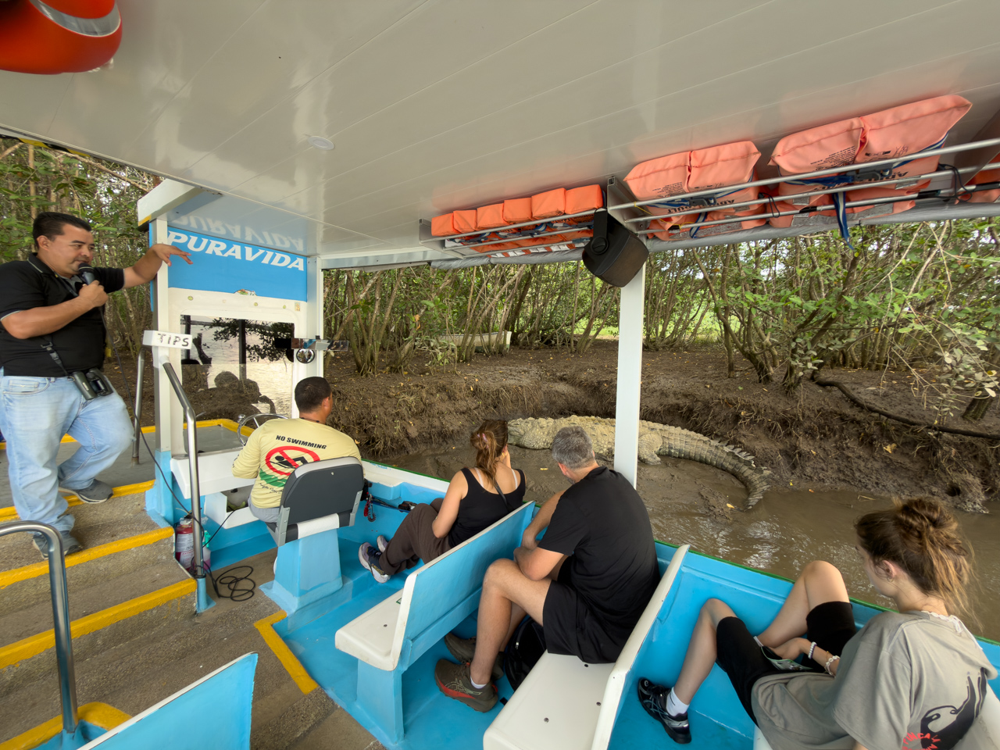
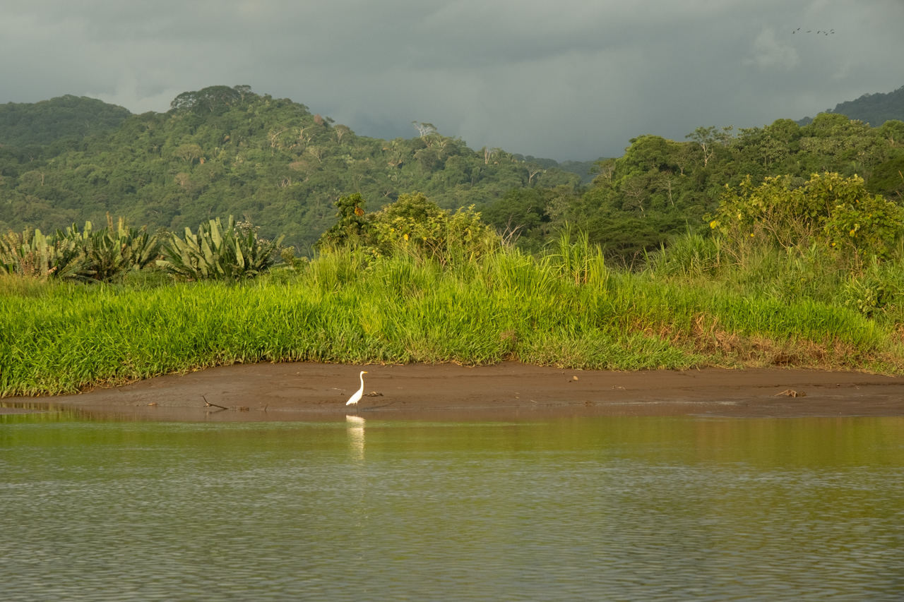

Le Rio Grande Tárcoles est le 3e plus long fleuve du Costa Rica. Il prend naissance sur les pentes au sud de la Cordillère volcanique centrale, et s’écoule en direction du golfe de Nicoya, dans l’océan Pacifique.

{.center}

Nous avons vu une vingtaine de Crocodiles d’Amérique, faisant jusqu’à 4,5 mètres pour « Ossama Bin Laden » (nommé ainsi parce qu’il est souvent bien caché 😬), le plus âgé avec 70 ans.

{.center}

Jusqu'à récemment, les touristes s'arrêtaient sur le pont à quelques kilomètres en amont et lançaient des poussins vivants (vendus sur place) aux crocodiles, donc ils étaient tous là-bas. Mais le Costa Rica a interdit cette pratique, et tous les crocodiles sont maintenant plus proches de l'embouchure, et moins harcelés par les touristes.

{.center}

{.center}

{.center}

Nous avons aussi vu de très nombreuses espèces d’oiseaux, dont différentes variétés de hérons, aigrettes, spatules et autres échassiers, des Aras rouge en vol.

{.center}
