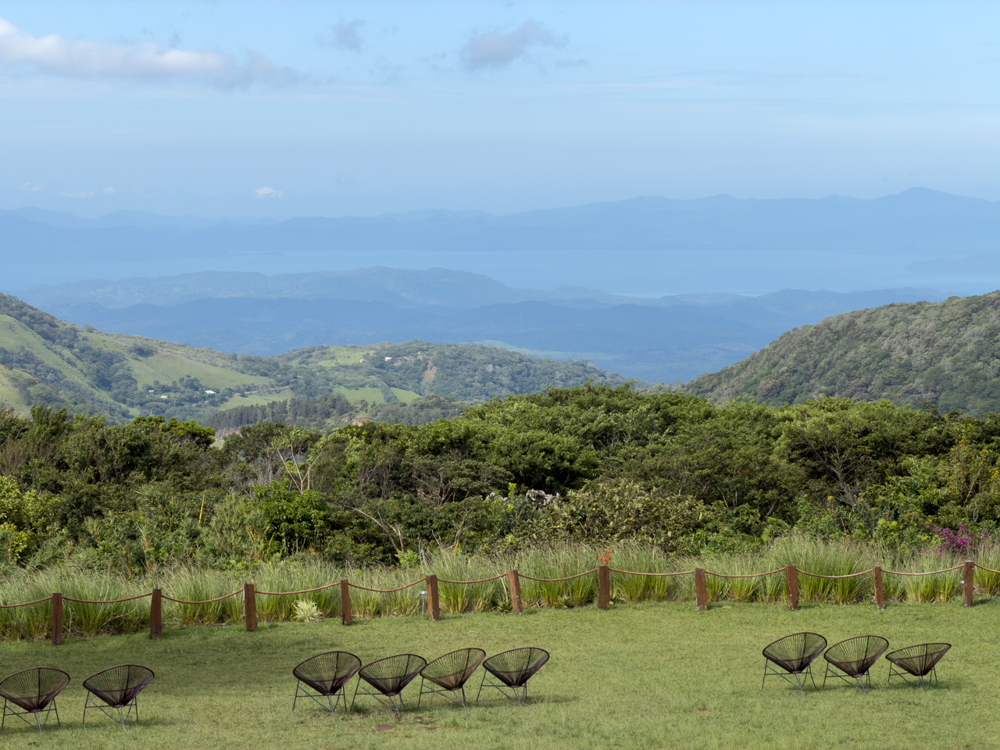
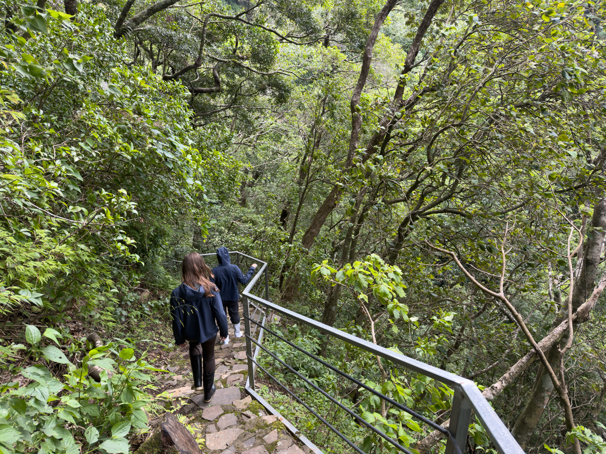
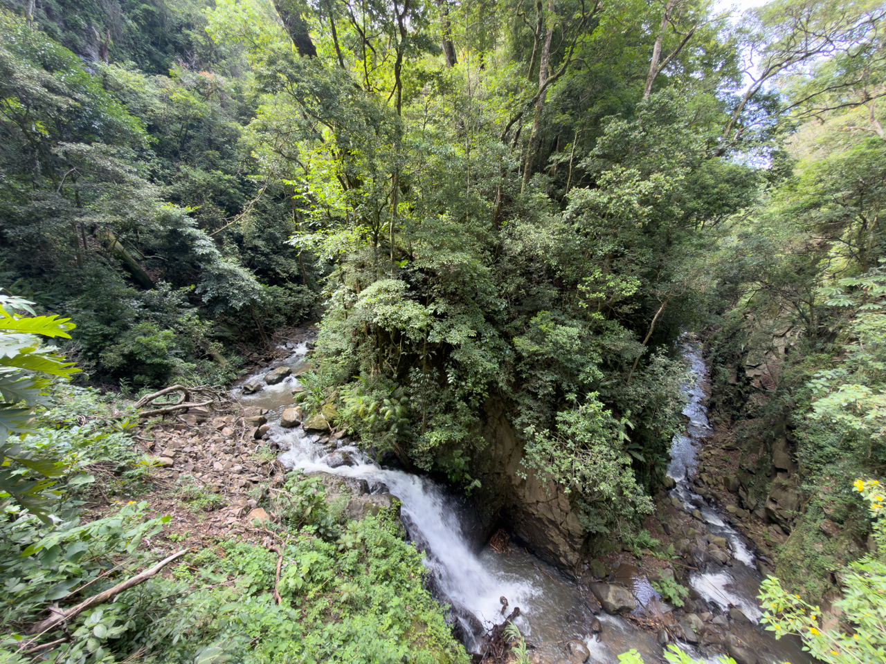
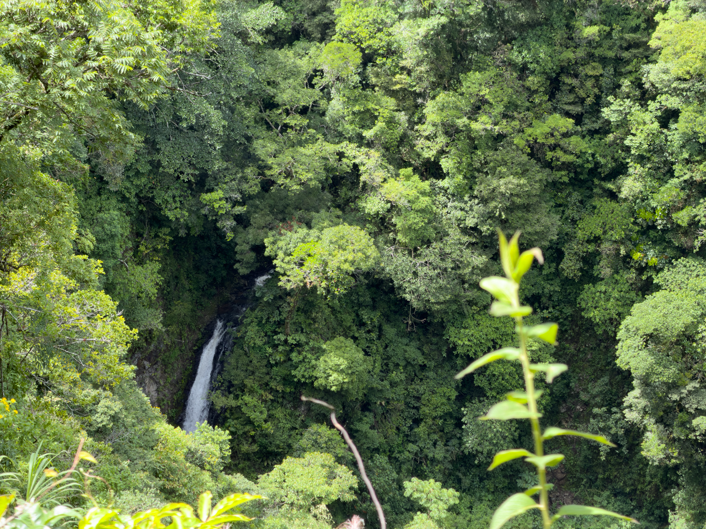
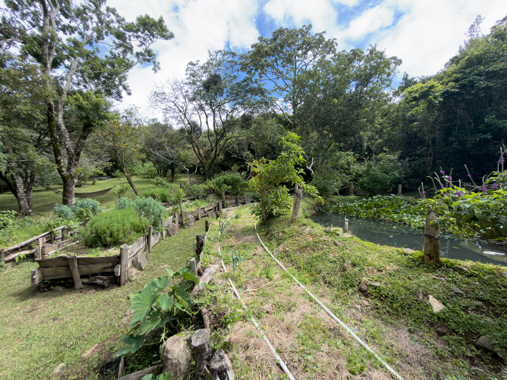
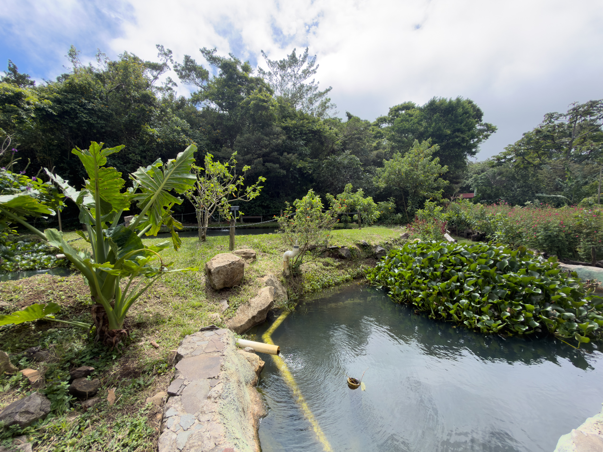

L'hôtel est à flanc de montagne, avec une belle vue sur le Pacifique au loin.

{.center}

Le domaine de l’hôtel est immense, constitué essentiellement de forêt tropicale à flanc de montagne, et d’une belle rivière avec cascades.

{.center}

{.center}

{.center}

Une zone contient des aménagements pour cultiver des plantes pour les repas, et d’autres pour traiter les eaux usées.

{.center}

{.center}
