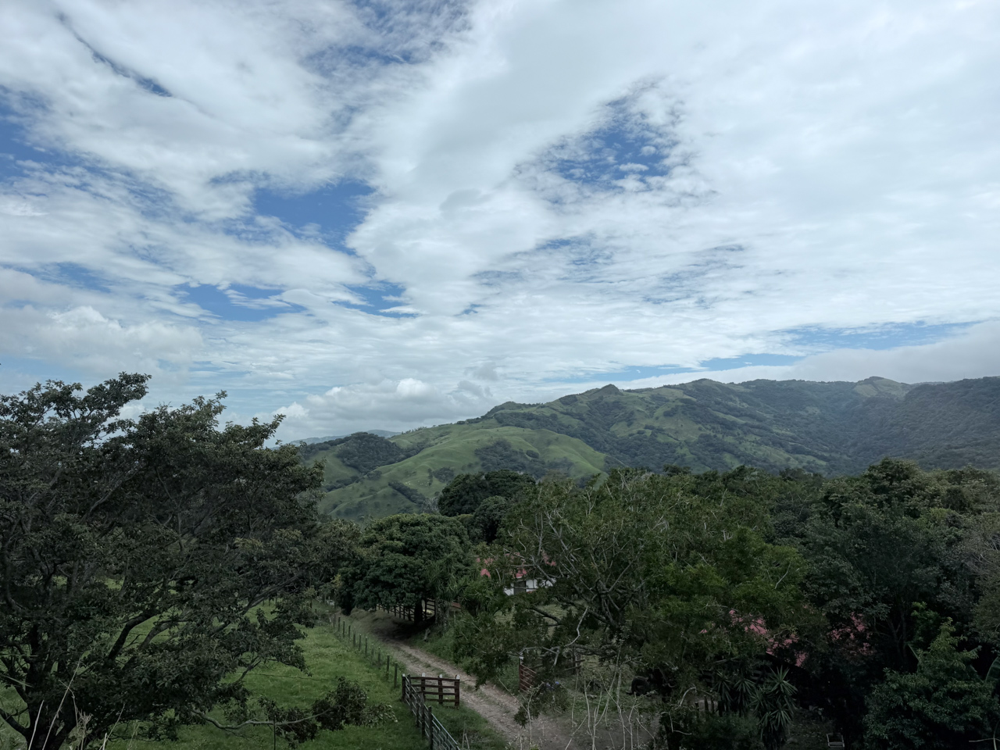
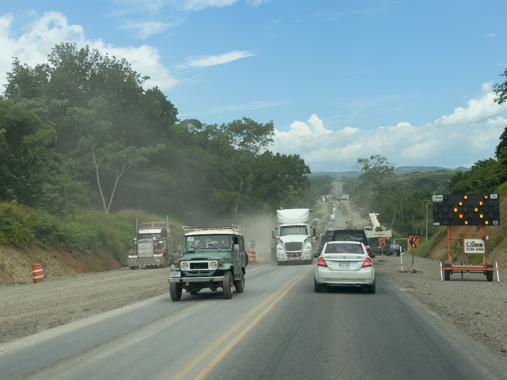
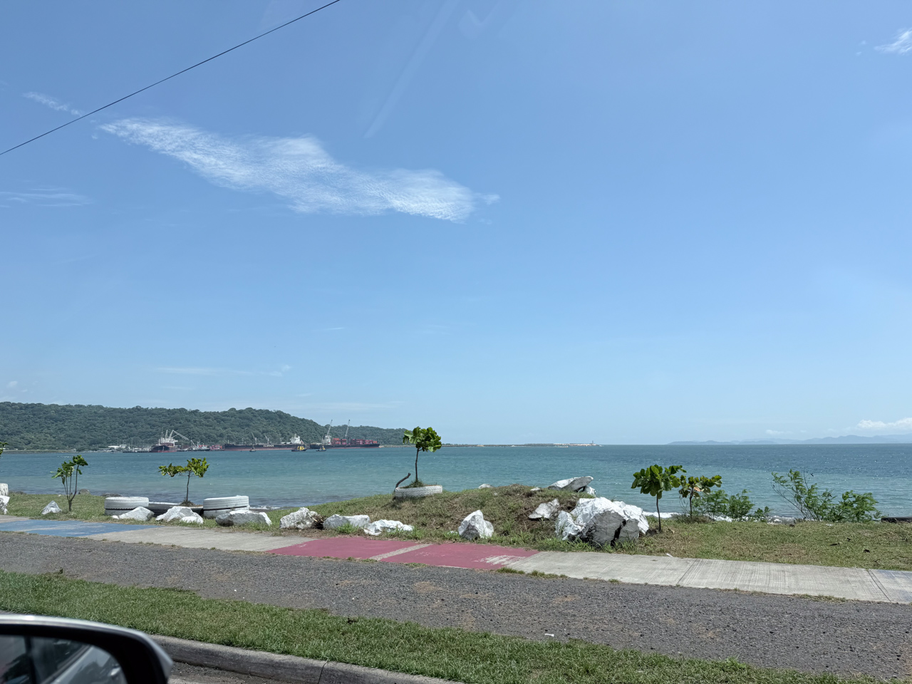

Nous reprenons la route, en direction du Pacifique et pour commencer du rio Tárcoles pour observer des grands crocodiles américains.

{.center}

Un immense bouchon dû à des travaux sur un des rares ponts de la région nous stresse un peu pour l'horaire d'arrivée, mais au final tout se passe bien.

{.center}

{.center}
